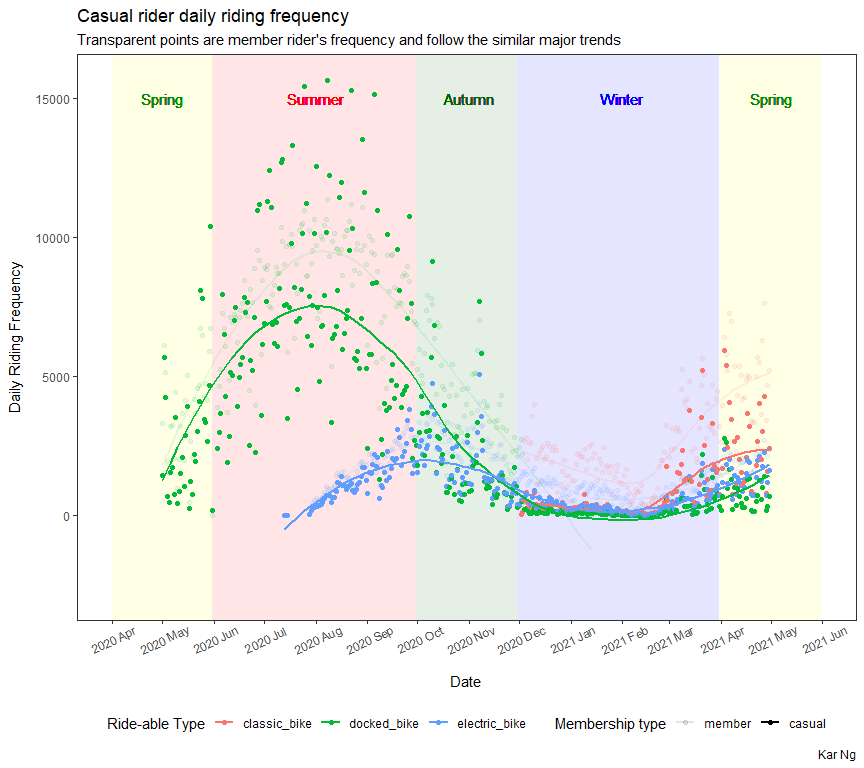

Bike-Share: How to convert more casual riders into annual members?
================
Kar Ng
2021

-   [1 PROJECT SUMMARY](#1-project-summary)
-   [2 R PACKAGES](#2-r-packages)
-   [3 SCENARIO AND BUSINESS TASKS](#3-scenario-and-business-tasks)
-   [4 DATA PREPARATION](#4-data-preparation)
    -   [4.1 Data sources](#41-data-sources)
    -   [4.2 Data import](#42-data-import)
    -   [4.3 Data description](#43-data-description)
    -   [4.4 Data exploration](#44-data-exploration)
-   [5 DATA INTEGRITY ASSESSMENT](#5-data-integrity-assessment)
-   [6 DATA CLEANING AND
    MANIPULATION](#6-data-cleaning-and-manipulation)
    -   [6.1 Data type conversion](#61-data-type-conversion)
    -   [6.2 Handling the missing
        values](#62-handling-the-missing-values)
    -   [6.3 Data manipulation](#63-data-manipulation)
    -   [6.4 Data processing
        documentation](#64-data-processing-documentation)
-   [7 SUMMARY STATISTICS](#7-summary-statistics)
    -   [7.1 Casual riders ride the
        most!](#71-casual-riders-ride-the-most)
    -   [7.2 All riders love Summer](#72-all-riders-love-summer)
    -   [7.3 Statistics of the three ride-able
        types](#73-statistics-of-the-three-ride-able-types)
    -   [7.4 Casual riders ride the most in non-working
        days](#74-casual-riders-ride-the-most-in-non-working-days)
    -   [7.5 Top 10 most frequently visited riding
        station](#75-top-10-most-frequently-visited-riding-station)
-   [8 EXPLORATORY DATA ANALYSIS
    (EDA)](#8-exploratory-data-analysis-eda)
    -   [8.1 Which stations have most casual
        riders?](#81-which-stations-have-most-casual-riders)
    -   [8.2 Riding frequency of casual
        riders](#82-riding-frequency-of-casual-riders)
    -   [8.3 Daily total riding hours of casual
        riders](#83-daily-total-riding-hours-of-casual-riders)
    -   [8.4 What is the best time on a day to advertise casual
        rider?](#84-what-is-the-best-time-on-a-day-to-advertise-casual-rider)
    -   [8.5 Casual riders love
        Saturday](#85-casual-riders-love-saturday)
-   [9 CONCLUSION AND RECOMMENDATION](#9-conclusion-and-recommendation)
-   [10 LEGALITY](#10-legality)
-   [11 REFERENCES](#11-references)

------------------------------------------------------------------------


------------------------------------------------------------------------

Reading time: 28 minutes

## 1 PROJECT SUMMARY

This is one of the two capstone projects of the 6-month extensive Google
Data Analytics Professional Certificate program. This project was about
analysing big data for a fictional bike-sharing company in Chicago on
how best to convert casual riders into annual members.

1 multi-layers interactive map, 4 multi-layers ggplots (scatter, line,
and bar plots), 1 interactive table, and 7 basic statistics tables were
coded and achieved insightful results. 12 data sets that hosting the
total of 3.7 millions of rows and 13 variables were combined, cleaned,
manipulated and analysed using R programming language. Data integrity of
this project was assessed. Data processing steps were documented.

Results revealed that casual riders contributed 51% of the total riding
duration in the given 12 months data to analyse. Casual riders rided the
most on Saturday (23%), doubling the size in week days (11%), however, 4
days in a week has 11% indicating a steady demand of rides and targeting
casual riders on these days may actually achieve higher conversion rate.
Casual riders love spring and summer but decreased dramatically during
months in Autumn and achieve near-zero ride per day in winter. Winter
has temperatures below zero degrees Celsius. Casual riders concentrate
in regions near coasts and city center. They have adoped 2 newly
introduced ride-able bikes and has replaced the usual docked bike in
2021 as their primary and secondary bikes.

<center>


</center>

## 2 R PACKAGES

R Packages loaded to perform functions required in this project:
tidyverse series (ggplot2, dplyr, tidyr, readr, purrr, tibble, stringr,
and forcats), skimr, kableExtra, lubridate, leaflet, scales, hms,
ggrepel and DT.

``` r
library(tidyverse)
library(skimr)
library(kableExtra)
library(lubridate)
library(leaflet)
library(scales)
library(hms)
library(ggrepel)
library(DT)
```

## 3 SCENARIO AND BUSINESS TASKS

Cyclistic, is a fictional bike-share company designed by this Google
data analytic certification course. In the scenario, the company
features more than 5824 bicycles and 692 docking stations. The company
also offers many types of bicycle to account for different group of
riders, including standard two-wheeled bikes, reclining bikes, hand
tricycles, and cargo bikes. Cyclistic also offers two types of
memberships, a casual and an annual type. Casual type is designed for
single-ride and full-day passes.

<center>


</center>

Cyclistic recently found that converting more casual riders into annual
members is more profitable. Therefore, they will need a tailored
marketing strategy for casual riders, supported data analysis. My task
is to analyse the available data to answer following business questions
with compelling data insights and professional data visualisation.

-   How are casual riders use Cyclistic bikes differently?  
-   Why would casual riders buy Cyclistic annual memberships?  
-   How can Cyclistic use digital media to influence casual riders to
    become members?

## 4 DATA PREPARATION

### 4.1 Data sources

I have been provided with Cyclistic’s previous 12 months trip data,
starting from May 2020 to April 2021. These data were stored in 12
spreadsheets in a monthly basis. Thus, they are additive to each other
by date. All of them have the same number of columns and column names.

### 4.2 Data import

The course introduced that a data set is considered small if it has less
than 100k rows and spreadsheet could be used for analysis and basic
analysis. However, after inspecting the first of the twelve
spreadsheets, it has already 200k rows of data. I am expecting after
combining all the 12 spreadsheets, I would have a data frame exceeding 1
million rows of data and beyond the scale a spreadsheet can handle.
Therefore, I am using R for this data analysis project.

``` r
# Import individual csv spreadsheet
may20 <- read_csv("202005-divvy-tripdata.csv") # 200,274 rows | 13 columns
jun20 <- read_csv("202006-divvy-tripdata.csv") # 343,005 rows | 13 columns
jul20 <- read_csv("202007-divvy-tripdata.csv") # 551,480 rows | 13 columns
aug20 <- read_csv("202008-divvy-tripdata.csv") # 622,361 rows | 13 columns
sep20 <- read_csv("202009-divvy-tripdata.csv") # 532,958 rows | 13 columns
oct20 <- read_csv("202010-divvy-tripdata.csv") # 388,653 rows | 13 columns
nov20 <- read_csv("202011-divvy-tripdata.csv") # 259,716 rows | 13 columns
dec20 <- read_csv("202012-divvy-tripdata.csv") # 131,573 rows | 13 columns
jan21 <- read_csv("202101-divvy-tripdata.csv") # 96,834 rows | 13 columns
feb21 <- read_csv("202102-divvy-tripdata.csv") # 49,622 rows | 13 columns
mar21 <- read_csv("202103-divvy-tripdata.csv") # 228,496 rows | 13 columns
apr21 <- read_csv("202104-divvy-tripdata.csv") # 337,230 rows | 13 columns

# combine all csv files into one table
mydata <- rbind(may20, jun20, jul20, aug20, sep20, oct20, nov20, dec20, jan21, feb21, mar21, apr21) 
```

As expected, after importing all the spreadsheets and combining them
into one, the overall data set has nearly 3.7 millions of rows. A
specialized data analysis software such as R is needed to process the
data effectively.

### 4.3 Data description

This table describes the basic details of the data set.

``` r
Variables <- names(mydata)
Description <- c("ID of individual ride", 
                 "There are 3 types of rideable bike which are classic bike, docked bike, and eletric bike",
                 "Date and time that the individual riding starting at",
                 "Date and time that the individual riding ended at",
                 "Associated starting station of this riding",
                 "Station id of the starting station",
                 "Associated ending station of this riding",
                 "Station id of this ending station",
                 "Ride starting latitude",
                 "Ride starting longitude",
                 "Ride ending latitude",
                 "Ride ending latitude",
                 "Membership status of the rider, classified into annual membership or casual membership")

des <- data.frame(Variables, Description)

des %>% 
  kbl(align = "l",
      caption = "Table 4.3 Data set description") %>% 
  kable_styling(bootstrap_options = c("bordered",
                                      "striped",
                                      "hover",
                                      "condensed"))  
```

<table class="table table-bordered table-striped table-hover table-condensed" style="margin-left: auto; margin-right: auto;">
<caption>
Table 4.3 Data set description
</caption>
<thead>
<tr>
<th style="text-align:left;">
Variables
</th>
<th style="text-align:left;">
Description
</th>
</tr>
</thead>
<tbody>
<tr>
<td style="text-align:left;">
ride\_id
</td>
<td style="text-align:left;">
ID of individual ride
</td>
</tr>
<tr>
<td style="text-align:left;">
rideable\_type
</td>
<td style="text-align:left;">
There are 3 types of rideable bike which are classic bike, docked bike,
and eletric bike
</td>
</tr>
<tr>
<td style="text-align:left;">
started\_at
</td>
<td style="text-align:left;">
Date and time that the individual riding starting at
</td>
</tr>
<tr>
<td style="text-align:left;">
ended\_at
</td>
<td style="text-align:left;">
Date and time that the individual riding ended at
</td>
</tr>
<tr>
<td style="text-align:left;">
start\_station\_name
</td>
<td style="text-align:left;">
Associated starting station of this riding
</td>
</tr>
<tr>
<td style="text-align:left;">
start\_station\_id
</td>
<td style="text-align:left;">
Station id of the starting station
</td>
</tr>
<tr>
<td style="text-align:left;">
end\_station\_name
</td>
<td style="text-align:left;">
Associated ending station of this riding
</td>
</tr>
<tr>
<td style="text-align:left;">
end\_station\_id
</td>
<td style="text-align:left;">
Station id of this ending station
</td>
</tr>
<tr>
<td style="text-align:left;">
start\_lat
</td>
<td style="text-align:left;">
Ride starting latitude
</td>
</tr>
<tr>
<td style="text-align:left;">
start\_lng
</td>
<td style="text-align:left;">
Ride starting longitude
</td>
</tr>
<tr>
<td style="text-align:left;">
end\_lat
</td>
<td style="text-align:left;">
Ride ending latitude
</td>
</tr>
<tr>
<td style="text-align:left;">
end\_lng
</td>
<td style="text-align:left;">
Ride ending latitude
</td>
</tr>
<tr>
<td style="text-align:left;">
member\_casual
</td>
<td style="text-align:left;">
Membership status of the rider, classified into annual membership or
casual membership
</td>
</tr>
</tbody>
</table>

### 4.4 Data exploration

Following tables show that this combined data set has 3,742,202 rows of
observations and 13 variables. 7 out of the 13 variables are in
character type, 4 columns are numeric, and the remaining 2 are date-time
(or known as POSIXct format in R).

The **complete\_rate** tells us the completeness of each variable, or
how many they have missing values in their column, which is associated
with the **n\_missing** before it. We can clearly see that there are 6
variables have missing data:

-   start\_station\_name  
-   start\_station\_id  
-   end\_station\_name  
-   end\_station\_id  
-   end\_late  
-   end\_lng

------------------------------------------------------------------------

<table style="width: auto;" class="table table-condensed">
<caption>
Data summary
</caption>
<thead>
<tr>
<th style="text-align:left;">
</th>
<th style="text-align:left;">
</th>
</tr>
</thead>
<tbody>
<tr>
<td style="text-align:left;">
Name
</td>
<td style="text-align:left;">
Piped data
</td>
</tr>
<tr>
<td style="text-align:left;">
Number of rows
</td>
<td style="text-align:left;">
3742202
</td>
</tr>
<tr>
<td style="text-align:left;">
Number of columns
</td>
<td style="text-align:left;">
13
</td>
</tr>
<tr>
<td style="text-align:left;">
\_\_\_\_\_\_\_\_\_\_\_\_\_\_\_\_\_\_\_\_\_\_\_
</td>
<td style="text-align:left;">
</td>
</tr>
<tr>
<td style="text-align:left;">
Column type frequency:
</td>
<td style="text-align:left;">
</td>
</tr>
<tr>
<td style="text-align:left;">
character
</td>
<td style="text-align:left;">
7
</td>
</tr>
<tr>
<td style="text-align:left;">
numeric
</td>
<td style="text-align:left;">
4
</td>
</tr>
<tr>
<td style="text-align:left;">
POSIXct
</td>
<td style="text-align:left;">
2
</td>
</tr>
<tr>
<td style="text-align:left;">
\_\_\_\_\_\_\_\_\_\_\_\_\_\_\_\_\_\_\_\_\_\_\_\_
</td>
<td style="text-align:left;">
</td>
</tr>
<tr>
<td style="text-align:left;">
Group variables
</td>
<td style="text-align:left;">
None
</td>
</tr>
</tbody>
</table>

**Variable type: character**

<table>
<thead>
<tr>
<th style="text-align:left;">
skim\_variable
</th>
<th style="text-align:right;">
n\_missing
</th>
<th style="text-align:right;">
complete\_rate
</th>
<th style="text-align:right;">
min
</th>
<th style="text-align:right;">
max
</th>
<th style="text-align:right;">
empty
</th>
<th style="text-align:right;">
n\_unique
</th>
<th style="text-align:right;">
whitespace
</th>
</tr>
</thead>
<tbody>
<tr>
<td style="text-align:left;">
ride\_id
</td>
<td style="text-align:right;">
0
</td>
<td style="text-align:right;">
1.00
</td>
<td style="text-align:right;">
16
</td>
<td style="text-align:right;">
16
</td>
<td style="text-align:right;">
0
</td>
<td style="text-align:right;">
3741993
</td>
<td style="text-align:right;">
0
</td>
</tr>
<tr>
<td style="text-align:left;">
rideable\_type
</td>
<td style="text-align:right;">
0
</td>
<td style="text-align:right;">
1.00
</td>
<td style="text-align:right;">
11
</td>
<td style="text-align:right;">
13
</td>
<td style="text-align:right;">
0
</td>
<td style="text-align:right;">
3
</td>
<td style="text-align:right;">
0
</td>
</tr>
<tr>
<td style="text-align:left;">
start\_station\_name
</td>
<td style="text-align:right;">
148231
</td>
<td style="text-align:right;">
0.96
</td>
<td style="text-align:right;">
10
</td>
<td style="text-align:right;">
53
</td>
<td style="text-align:right;">
0
</td>
<td style="text-align:right;">
711
</td>
<td style="text-align:right;">
0
</td>
</tr>
<tr>
<td style="text-align:left;">
start\_station\_id
</td>
<td style="text-align:right;">
148857
</td>
<td style="text-align:right;">
0.96
</td>
<td style="text-align:right;">
1
</td>
<td style="text-align:right;">
35
</td>
<td style="text-align:right;">
0
</td>
<td style="text-align:right;">
1265
</td>
<td style="text-align:right;">
0
</td>
</tr>
<tr>
<td style="text-align:left;">
end\_station\_name
</td>
<td style="text-align:right;">
171317
</td>
<td style="text-align:right;">
0.95
</td>
<td style="text-align:right;">
10
</td>
<td style="text-align:right;">
53
</td>
<td style="text-align:right;">
0
</td>
<td style="text-align:right;">
712
</td>
<td style="text-align:right;">
0
</td>
</tr>
<tr>
<td style="text-align:left;">
end\_station\_id
</td>
<td style="text-align:right;">
171778
</td>
<td style="text-align:right;">
0.95
</td>
<td style="text-align:right;">
1
</td>
<td style="text-align:right;">
35
</td>
<td style="text-align:right;">
0
</td>
<td style="text-align:right;">
1266
</td>
<td style="text-align:right;">
0
</td>
</tr>
<tr>
<td style="text-align:left;">
member\_casual
</td>
<td style="text-align:right;">
0
</td>
<td style="text-align:right;">
1.00
</td>
<td style="text-align:right;">
6
</td>
<td style="text-align:right;">
6
</td>
<td style="text-align:right;">
0
</td>
<td style="text-align:right;">
2
</td>
<td style="text-align:right;">
0
</td>
</tr>
</tbody>
</table>

**Variable type: numeric**

<table>
<thead>
<tr>
<th style="text-align:left;">
skim\_variable
</th>
<th style="text-align:right;">
n\_missing
</th>
<th style="text-align:right;">
complete\_rate
</th>
<th style="text-align:right;">
mean
</th>
<th style="text-align:right;">
sd
</th>
<th style="text-align:right;">
p0
</th>
<th style="text-align:right;">
p25
</th>
<th style="text-align:right;">
p50
</th>
<th style="text-align:right;">
p75
</th>
<th style="text-align:right;">
p100
</th>
</tr>
</thead>
<tbody>
<tr>
<td style="text-align:left;">
start\_lat
</td>
<td style="text-align:right;">
0
</td>
<td style="text-align:right;">
1
</td>
<td style="text-align:right;">
41.90
</td>
<td style="text-align:right;">
0.04
</td>
<td style="text-align:right;">
41.64
</td>
<td style="text-align:right;">
41.88
</td>
<td style="text-align:right;">
41.90
</td>
<td style="text-align:right;">
41.93
</td>
<td style="text-align:right;">
42.08
</td>
</tr>
<tr>
<td style="text-align:left;">
start\_lng
</td>
<td style="text-align:right;">
0
</td>
<td style="text-align:right;">
1
</td>
<td style="text-align:right;">
-87.64
</td>
<td style="text-align:right;">
0.03
</td>
<td style="text-align:right;">
-87.87
</td>
<td style="text-align:right;">
-87.66
</td>
<td style="text-align:right;">
-87.64
</td>
<td style="text-align:right;">
-87.63
</td>
<td style="text-align:right;">
-87.52
</td>
</tr>
<tr>
<td style="text-align:left;">
end\_lat
</td>
<td style="text-align:right;">
4906
</td>
<td style="text-align:right;">
1
</td>
<td style="text-align:right;">
41.90
</td>
<td style="text-align:right;">
0.04
</td>
<td style="text-align:right;">
41.54
</td>
<td style="text-align:right;">
41.88
</td>
<td style="text-align:right;">
41.90
</td>
<td style="text-align:right;">
41.93
</td>
<td style="text-align:right;">
42.16
</td>
</tr>
<tr>
<td style="text-align:left;">
end\_lng
</td>
<td style="text-align:right;">
4906
</td>
<td style="text-align:right;">
1
</td>
<td style="text-align:right;">
-87.65
</td>
<td style="text-align:right;">
0.03
</td>
<td style="text-align:right;">
-88.07
</td>
<td style="text-align:right;">
-87.66
</td>
<td style="text-align:right;">
-87.64
</td>
<td style="text-align:right;">
-87.63
</td>
<td style="text-align:right;">
-87.44
</td>
</tr>
</tbody>
</table>

**Variable type: POSIXct**

<table>
<thead>
<tr>
<th style="text-align:left;">
skim\_variable
</th>
<th style="text-align:right;">
n\_missing
</th>
<th style="text-align:right;">
complete\_rate
</th>
<th style="text-align:left;">
min
</th>
<th style="text-align:left;">
max
</th>
<th style="text-align:left;">
median
</th>
<th style="text-align:right;">
n\_unique
</th>
</tr>
</thead>
<tbody>
<tr>
<td style="text-align:left;">
started\_at
</td>
<td style="text-align:right;">
0
</td>
<td style="text-align:right;">
1
</td>
<td style="text-align:left;">
2020-05-01 00:02:07
</td>
<td style="text-align:left;">
2021-04-30 23:59:53
</td>
<td style="text-align:left;">
2020-09-09 15:51:13
</td>
<td style="text-align:right;">
3257750
</td>
</tr>
<tr>
<td style="text-align:left;">
ended\_at
</td>
<td style="text-align:right;">
0
</td>
<td style="text-align:right;">
1
</td>
<td style="text-align:left;">
2020-05-01 00:13:03
</td>
<td style="text-align:left;">
2021-05-05 22:14:39
</td>
<td style="text-align:left;">
2020-09-09 16:08:31
</td>
<td style="text-align:right;">
3245372
</td>
</tr>
</tbody>
</table>

------------------------------------------------------------------------

I have also identified some *character* variables that can be used for
data grouping, which is helpful in later analysis. To use them in this
purpose, I will convert them into *factor* type in data manipulation
section. These variables are:

-   rideable\_type  
-   start\_station\_name  
-   end\_station\_name  
-   member\_casual

Another way to view how the type of our 13 variables are being assigned
by R:

``` r
glimpse(mydata)
```

    ## Rows: 3,742,202
    ## Columns: 13
    ## $ ride_id            <chr> "02668AD35674B983", "7A50CCAF1EDDB28F", "2FFCDFDB91~
    ## $ rideable_type      <chr> "docked_bike", "docked_bike", "docked_bike", "docke~
    ## $ started_at         <dttm> 2020-05-27 10:03:52, 2020-05-25 10:47:11, 2020-05-~
    ## $ ended_at           <dttm> 2020-05-27 10:16:49, 2020-05-25 11:05:40, 2020-05-~
    ## $ start_station_name <chr> "Franklin St & Jackson Blvd", "Clark St & Wrightwoo~
    ## $ start_station_id   <chr> "36", "340", "260", "251", "261", "206", "261", "18~
    ## $ end_station_name   <chr> "Wabash Ave & Grand Ave", "Clark St & Leland Ave", ~
    ## $ end_station_id     <chr> "199", "326", "260", "157", "206", "22", "261", "18~
    ## $ start_lat          <dbl> 41.8777, 41.9295, 41.9296, 41.9680, 41.8715, 41.847~
    ## $ start_lng          <dbl> -87.6353, -87.6431, -87.7079, -87.6500, -87.6699, -~
    ## $ end_lat            <dbl> 41.8915, 41.9671, 41.9296, 41.9367, 41.8472, 41.869~
    ## $ end_lng            <dbl> -87.6268, -87.6674, -87.7079, -87.6368, -87.6468, -~
    ## $ member_casual      <chr> "member", "casual", "casual", "casual", "member", "~

A helpful table describing some common R data type we would encounter in
this project.

``` r
Type <- c("<chr>", "<dbl>", "<fctr>", "<date>", "<dttm>")
Explanation <- c("Character, for text data.", 
                 "Double, for number with decimal places.",
                 "factor, also text data but are usually used to grouping.",
                 "date, as its name would suggest.",
                 "date-time, combination of date and time.")

r_datatype <- data.frame(Type, Explanation)

r_datatype %>% 
  kbl(table.attr = "style = 'width: 60%;'",
      caption = "Table 4.4 Common R data types in this project.") %>% 
  kable_styling(bootstrap_options = c("bordered",
                                      "striped",
                                      "hover",
                                      "condensed"))
```

<table style="width: 60%; margin-left: auto; margin-right: auto;" class="table table-bordered table-striped table-hover table-condensed">
<caption>
Table 4.4 Common R data types in this project.
</caption>
<thead>
<tr>
<th style="text-align:left;">
Type
</th>
<th style="text-align:left;">
Explanation
</th>
</tr>
</thead>
<tbody>
<tr>
<td style="text-align:left;">
&lt;chr&gt;
</td>
<td style="text-align:left;">
Character, for text data.
</td>
</tr>
<tr>
<td style="text-align:left;">
&lt;dbl&gt;
</td>
<td style="text-align:left;">
Double, for number with decimal places.
</td>
</tr>
<tr>
<td style="text-align:left;">
&lt;fctr&gt;
</td>
<td style="text-align:left;">
factor, also text data but are usually used to grouping.
</td>
</tr>
<tr>
<td style="text-align:left;">
&lt;date&gt;
</td>
<td style="text-align:left;">
date, as its name would suggest.
</td>
</tr>
<tr>
<td style="text-align:left;">
&lt;dttm&gt;
</td>
<td style="text-align:left;">
date-time, combination of date and time.
</td>
</tr>
</tbody>
</table>

## 5 DATA INTEGRITY ASSESSMENT

**Negatives**

-   I was introduced that Cyclistic has standard two-wheeled bikes,
    reclining bikes, hand tricycles, and cargo bikes. However, only 1
    column named “rideable\_type” was provided in the data sets and
    showing 3 different type of bikes that were not mentioned in the
    introduction - classic bike, docked-bike and electric bike. No
    further details were provided to help clarifying what these new type
    of bikes are and the relationship between them and previously
    mentioned 4 type of bikes.

-   I was provided with a column classifying each ride into casual and
    annual membership, which is good. However, it would be better if the
    two types of the casual membership, single-ride and full-day passes,
    introduced in the introduction section are also being included in
    the data set, for a better complete analysis.

-   Some other useful variables were also not included in the data set
    such as weather of the day, seasons, public holidays, temperatures,
    wind speed, and if available, rider ages and gender can also be
    helpful in designing marketing strategy.

**Positives**

-   Fairness - The data was system-generated, base on its size of being
    millions rows with individual ride IDs. The data should be quite
    fair and free from collection biases and erroneous.

-   Inclusivity: Apart from lacking some variables, the data was quite
    inclusive. The Data was in the range of 24 hours and was provided to
    me as a whole. It is the entire population data of the requested
    12-month period, instead of sub-set data sampled from the mother
    data set. This eliminate the issue of sampling bias.

-   All data was collected by the original company, Cyclistic, instead
    of from second- or third party sources. Cyclistic has to proper
    system to collect the big data. All provided data were also
    up-to-date and current. Comprehensiveness can be argued for lacking
    some useful variables, but the data set still have many other
    important variables to synthese desired outcome. In real world case,
    stakeholders will be approached about this issue and be informed.

## 6 DATA CLEANING AND MANIPULATION

### 6.1 Data type conversion

#### 6.1.1 Character to factor

In this section, following variables are being converted from character
to factor. They are string variables with distinctive levels that are
useful for data grouping and analysis. Please note that numerical
variables can also have distinctive levels and be converted to factor,
but it is not in this case.

-   rideable\_type  
-   start\_station\_name  
-   end\_station\_name  
-   member\_casual

``` r
chr_to_fct_variables <- c("rideable_type", 
                          "start_station_name", 
                          "end_station_name", 
                          "member_casual")

mydata_cleaned <- mydata

mydata_cleaned[,chr_to_fct_variables] <- lapply(mydata_cleaned[,chr_to_fct_variables], factor)
```

After conversion, we are able to use R to identify their distinctive
levels and how many are there.

``` r
#---- to find level information of these variables----#

# rideable_type
nlevels(mydata_cleaned$rideable_type)
levels(mydata_cleaned$rideable_type) # Explore it as the number of levels is small and suitable for grouping

# start_station_name
nlevels(mydata_cleaned$start_station_name)

# end_station_name
nlevels(mydata_cleaned$end_station_name)

# member_casual
nlevels(mydata_cleaned$member_casual) # Explore it as the number of levels is small and suitable for grouping
levels(mydata_cleaned$member_casual)

head(levels(mydata_cleaned$start_station_name)) # to find the first 6 station names
head(levels(mydata_cleaned$end_station_name)) # to find the first 6 station names
```

``` r
#---- Creating the table ----#

Variable <- c("rideable_type", "start_station_name", "end_station_name", "member_casual")
Level_count <- c("3", "711", "712", "2")
Levels <- c("classic_bike, docked_bike, electric_bike",
            "2112 W Peterson Ave, 63rd St Beach, 900 W Harrison St, Aberdeen St & Jackson Blvd...",
            "2112 W Peterson Ave, 63rd St Beach, 900 W Harrison St, Aberdeen St & Jackson Blvd...",
            "Casual, member")

data.frame(Variable, Level_count, Levels) %>% 
  kbl(caption = "Table 6.1.1 Distinctive levels of grouping variables") %>% 
  kable_classic()
```

<table class=" lightable-classic" style="font-family: &quot;Arial Narrow&quot;, &quot;Source Sans Pro&quot;, sans-serif; margin-left: auto; margin-right: auto;">
<caption>
Table 6.1.1 Distinctive levels of grouping variables
</caption>
<thead>
<tr>
<th style="text-align:left;">
Variable
</th>
<th style="text-align:left;">
Level\_count
</th>
<th style="text-align:left;">
Levels
</th>
</tr>
</thead>
<tbody>
<tr>
<td style="text-align:left;">
rideable\_type
</td>
<td style="text-align:left;">
3
</td>
<td style="text-align:left;">
classic\_bike, docked\_bike, electric\_bike
</td>
</tr>
<tr>
<td style="text-align:left;">
start\_station\_name
</td>
<td style="text-align:left;">
711
</td>
<td style="text-align:left;">
2112 W Peterson Ave, 63rd St Beach, 900 W Harrison St, Aberdeen St &
Jackson Blvd…
</td>
</tr>
<tr>
<td style="text-align:left;">
end\_station\_name
</td>
<td style="text-align:left;">
712
</td>
<td style="text-align:left;">
2112 W Peterson Ave, 63rd St Beach, 900 W Harrison St, Aberdeen St &
Jackson Blvd…
</td>
</tr>
<tr>
<td style="text-align:left;">
member\_casual
</td>
<td style="text-align:left;">
2
</td>
<td style="text-align:left;">
Casual, member
</td>
</tr>
</tbody>
</table>

#### 6.1.2 Date

We shall only start using date or date-time for our analysis when they
are in the correct format, as being recognized and labeled as “date” or
“date-time”. Date or date-time are commonly labelled as a “character”
variable if their arrangement of year, month, date, hour, minute, and
second do not match with the date format of R in the form of
year-month-date\_hour-minute-second.

However, the date in our dataset is perfectly to go. They match the date
format of R and have been recognised as date-time (<dttm>) by R.

Our date-time variables: **started\_at** and **ended\_at**:

``` r
glimpse(mydata_cleaned)
```

    ## Rows: 3,742,202
    ## Columns: 13
    ## $ ride_id            <chr> "02668AD35674B983", "7A50CCAF1EDDB28F", "2FFCDFDB91~
    ## $ rideable_type      <fct> docked_bike, docked_bike, docked_bike, docked_bike,~
    ## $ started_at         <dttm> 2020-05-27 10:03:52, 2020-05-25 10:47:11, 2020-05-~
    ## $ ended_at           <dttm> 2020-05-27 10:16:49, 2020-05-25 11:05:40, 2020-05-~
    ## $ start_station_name <fct> Franklin St & Jackson Blvd, Clark St & Wrightwood A~
    ## $ start_station_id   <chr> "36", "340", "260", "251", "261", "206", "261", "18~
    ## $ end_station_name   <fct> Wabash Ave & Grand Ave, Clark St & Leland Ave, Kedz~
    ## $ end_station_id     <chr> "199", "326", "260", "157", "206", "22", "261", "18~
    ## $ start_lat          <dbl> 41.8777, 41.9295, 41.9296, 41.9680, 41.8715, 41.847~
    ## $ start_lng          <dbl> -87.6353, -87.6431, -87.7079, -87.6500, -87.6699, -~
    ## $ end_lat            <dbl> 41.8915, 41.9671, 41.9296, 41.9367, 41.8472, 41.869~
    ## $ end_lng            <dbl> -87.6268, -87.6674, -87.7079, -87.6368, -87.6468, -~
    ## $ member_casual      <fct> member, casual, casual, casual, member, member, mem~

### 6.2 Handling the missing values

There are not much values missing in this data set but only a small
proportion (compared to overall data set) in these variables:

-   Start station name (**start\_station\_name**) - 148231 missing,
    accounts for 4% (0.96)  
-   Start station id (**start\_station\_id**) - 148857 missing, accounts
    for 4% (0.96)  
-   End station name (**end\_station\_name**) - 171317 missing, accounts
    for 4.6% (0.954)
-   End station id (**end\_station\_id**) - 171778 missing, accounts for
    4.6% (0.954)

``` r
skim_without_charts(mydata_cleaned)
```

<table style="width: auto;" class="table table-condensed">
<caption>
Data summary
</caption>
<thead>
<tr>
<th style="text-align:left;">
</th>
<th style="text-align:left;">
</th>
</tr>
</thead>
<tbody>
<tr>
<td style="text-align:left;">
Name
</td>
<td style="text-align:left;">
mydata\_cleaned
</td>
</tr>
<tr>
<td style="text-align:left;">
Number of rows
</td>
<td style="text-align:left;">
3742202
</td>
</tr>
<tr>
<td style="text-align:left;">
Number of columns
</td>
<td style="text-align:left;">
13
</td>
</tr>
<tr>
<td style="text-align:left;">
\_\_\_\_\_\_\_\_\_\_\_\_\_\_\_\_\_\_\_\_\_\_\_
</td>
<td style="text-align:left;">
</td>
</tr>
<tr>
<td style="text-align:left;">
Column type frequency:
</td>
<td style="text-align:left;">
</td>
</tr>
<tr>
<td style="text-align:left;">
character
</td>
<td style="text-align:left;">
3
</td>
</tr>
<tr>
<td style="text-align:left;">
factor
</td>
<td style="text-align:left;">
4
</td>
</tr>
<tr>
<td style="text-align:left;">
numeric
</td>
<td style="text-align:left;">
4
</td>
</tr>
<tr>
<td style="text-align:left;">
POSIXct
</td>
<td style="text-align:left;">
2
</td>
</tr>
<tr>
<td style="text-align:left;">
\_\_\_\_\_\_\_\_\_\_\_\_\_\_\_\_\_\_\_\_\_\_\_\_
</td>
<td style="text-align:left;">
</td>
</tr>
<tr>
<td style="text-align:left;">
Group variables
</td>
<td style="text-align:left;">
None
</td>
</tr>
</tbody>
</table>

**Variable type: character**

<table>
<thead>
<tr>
<th style="text-align:left;">
skim\_variable
</th>
<th style="text-align:right;">
n\_missing
</th>
<th style="text-align:right;">
complete\_rate
</th>
<th style="text-align:right;">
min
</th>
<th style="text-align:right;">
max
</th>
<th style="text-align:right;">
empty
</th>
<th style="text-align:right;">
n\_unique
</th>
<th style="text-align:right;">
whitespace
</th>
</tr>
</thead>
<tbody>
<tr>
<td style="text-align:left;">
ride\_id
</td>
<td style="text-align:right;">
0
</td>
<td style="text-align:right;">
1.00
</td>
<td style="text-align:right;">
16
</td>
<td style="text-align:right;">
16
</td>
<td style="text-align:right;">
0
</td>
<td style="text-align:right;">
3741993
</td>
<td style="text-align:right;">
0
</td>
</tr>
<tr>
<td style="text-align:left;">
start\_station\_id
</td>
<td style="text-align:right;">
148857
</td>
<td style="text-align:right;">
0.96
</td>
<td style="text-align:right;">
1
</td>
<td style="text-align:right;">
35
</td>
<td style="text-align:right;">
0
</td>
<td style="text-align:right;">
1265
</td>
<td style="text-align:right;">
0
</td>
</tr>
<tr>
<td style="text-align:left;">
end\_station\_id
</td>
<td style="text-align:right;">
171778
</td>
<td style="text-align:right;">
0.95
</td>
<td style="text-align:right;">
1
</td>
<td style="text-align:right;">
35
</td>
<td style="text-align:right;">
0
</td>
<td style="text-align:right;">
1266
</td>
<td style="text-align:right;">
0
</td>
</tr>
</tbody>
</table>

**Variable type: factor**

<table>
<thead>
<tr>
<th style="text-align:left;">
skim\_variable
</th>
<th style="text-align:right;">
n\_missing
</th>
<th style="text-align:right;">
complete\_rate
</th>
<th style="text-align:left;">
ordered
</th>
<th style="text-align:right;">
n\_unique
</th>
<th style="text-align:left;">
top\_counts
</th>
</tr>
</thead>
<tbody>
<tr>
<td style="text-align:left;">
rideable\_type
</td>
<td style="text-align:right;">
0
</td>
<td style="text-align:right;">
1.00
</td>
<td style="text-align:left;">
FALSE
</td>
<td style="text-align:right;">
3
</td>
<td style="text-align:left;">
doc: 2498407, ele: 709303, cla: 534492
</td>
</tr>
<tr>
<td style="text-align:left;">
start\_station\_name
</td>
<td style="text-align:right;">
148231
</td>
<td style="text-align:right;">
0.96
</td>
<td style="text-align:left;">
FALSE
</td>
<td style="text-align:right;">
711
</td>
<td style="text-align:left;">
Str: 38524, Cla: 34227, Lak: 33560, The: 32243
</td>
</tr>
<tr>
<td style="text-align:left;">
end\_station\_name
</td>
<td style="text-align:right;">
171317
</td>
<td style="text-align:right;">
0.95
</td>
<td style="text-align:left;">
FALSE
</td>
<td style="text-align:right;">
712
</td>
<td style="text-align:left;">
Str: 40552, Cla: 34022, The: 33725, Lak: 32733
</td>
</tr>
<tr>
<td style="text-align:left;">
member\_casual
</td>
<td style="text-align:right;">
0
</td>
<td style="text-align:right;">
1.00
</td>
<td style="text-align:left;">
FALSE
</td>
<td style="text-align:right;">
2
</td>
<td style="text-align:left;">
mem: 2198853, cas: 1543349
</td>
</tr>
</tbody>
</table>

**Variable type: numeric**

<table>
<thead>
<tr>
<th style="text-align:left;">
skim\_variable
</th>
<th style="text-align:right;">
n\_missing
</th>
<th style="text-align:right;">
complete\_rate
</th>
<th style="text-align:right;">
mean
</th>
<th style="text-align:right;">
sd
</th>
<th style="text-align:right;">
p0
</th>
<th style="text-align:right;">
p25
</th>
<th style="text-align:right;">
p50
</th>
<th style="text-align:right;">
p75
</th>
<th style="text-align:right;">
p100
</th>
</tr>
</thead>
<tbody>
<tr>
<td style="text-align:left;">
start\_lat
</td>
<td style="text-align:right;">
0
</td>
<td style="text-align:right;">
1
</td>
<td style="text-align:right;">
41.90
</td>
<td style="text-align:right;">
0.04
</td>
<td style="text-align:right;">
41.64
</td>
<td style="text-align:right;">
41.88
</td>
<td style="text-align:right;">
41.90
</td>
<td style="text-align:right;">
41.93
</td>
<td style="text-align:right;">
42.08
</td>
</tr>
<tr>
<td style="text-align:left;">
start\_lng
</td>
<td style="text-align:right;">
0
</td>
<td style="text-align:right;">
1
</td>
<td style="text-align:right;">
-87.64
</td>
<td style="text-align:right;">
0.03
</td>
<td style="text-align:right;">
-87.87
</td>
<td style="text-align:right;">
-87.66
</td>
<td style="text-align:right;">
-87.64
</td>
<td style="text-align:right;">
-87.63
</td>
<td style="text-align:right;">
-87.52
</td>
</tr>
<tr>
<td style="text-align:left;">
end\_lat
</td>
<td style="text-align:right;">
4906
</td>
<td style="text-align:right;">
1
</td>
<td style="text-align:right;">
41.90
</td>
<td style="text-align:right;">
0.04
</td>
<td style="text-align:right;">
41.54
</td>
<td style="text-align:right;">
41.88
</td>
<td style="text-align:right;">
41.90
</td>
<td style="text-align:right;">
41.93
</td>
<td style="text-align:right;">
42.16
</td>
</tr>
<tr>
<td style="text-align:left;">
end\_lng
</td>
<td style="text-align:right;">
4906
</td>
<td style="text-align:right;">
1
</td>
<td style="text-align:right;">
-87.65
</td>
<td style="text-align:right;">
0.03
</td>
<td style="text-align:right;">
-88.07
</td>
<td style="text-align:right;">
-87.66
</td>
<td style="text-align:right;">
-87.64
</td>
<td style="text-align:right;">
-87.63
</td>
<td style="text-align:right;">
-87.44
</td>
</tr>
</tbody>
</table>

**Variable type: POSIXct**

<table>
<thead>
<tr>
<th style="text-align:left;">
skim\_variable
</th>
<th style="text-align:right;">
n\_missing
</th>
<th style="text-align:right;">
complete\_rate
</th>
<th style="text-align:left;">
min
</th>
<th style="text-align:left;">
max
</th>
<th style="text-align:left;">
median
</th>
<th style="text-align:right;">
n\_unique
</th>
</tr>
</thead>
<tbody>
<tr>
<td style="text-align:left;">
started\_at
</td>
<td style="text-align:right;">
0
</td>
<td style="text-align:right;">
1
</td>
<td style="text-align:left;">
2020-05-01 00:02:07
</td>
<td style="text-align:left;">
2021-04-30 23:59:53
</td>
<td style="text-align:left;">
2020-09-09 15:51:13
</td>
<td style="text-align:right;">
3257750
</td>
</tr>
<tr>
<td style="text-align:left;">
ended\_at
</td>
<td style="text-align:right;">
0
</td>
<td style="text-align:right;">
1
</td>
<td style="text-align:left;">
2020-05-01 00:13:03
</td>
<td style="text-align:left;">
2021-05-05 22:14:39
</td>
<td style="text-align:left;">
2020-09-09 16:08:31
</td>
<td style="text-align:right;">
3245372
</td>
</tr>
</tbody>
</table>

------------------------------------------------------------------------

Missing values can usually be filled up with valid values that is either
retrieved by adjacent related variables, or looking for median or mean,
or getting inputs from authorised stakeholders. However, the nature of
these missing values in these locational variables could not be retried
by these methods.

Since these missing values only contribute less than 5% of the data set,
I will drop them in this project.

### 6.3 Data manipulation

This section synthesise new variables base on current data set and
internet sources.

#### 6.3.1 Create “duration”

I calculate the traveling times of each trip and stored it in a column
named **duration.min**. The “min” stands for “minute”, and the column is
relocated after the column **ended\_at**.

``` r
mydata_cleaned <- mydata_cleaned %>% 
  mutate(duration.min = ended_at - started_at) %>% 
  relocate(duration.min, .after = ended_at) %>% 
  mutate(duration.min = minute(seconds_to_period(duration.min)))
```

#### 6.3.2 Create “year, month, day, hour, minute, date, weekday, season, workingday”

This section will synthesise these new variables to help achieve better
insights.

``` r
New_variables <- c("year",
                   "month",
                   "day", 
                   "hour",
                   "minute",
                   "date",
                   "weekday",
                   "season", 
                   "workingday")
Levels <- c("Based on the date-time column - started_at.",
            "Based on the date-time column - started_at.",
            "Based on the date-time column - started_at.",
            "Based on the date-time column - started_at.",
            "Based on the date-time column - started_at.",
            "A combination of the year-month-day.",
            "Monday, tuesday, wednesday, thursday, friday, saturday and sunday.",
            "Spring, summer, fall, winter. ",
            "Yes: include Monday, Tuesday, Wednesday, Thursday and Friday. \n No: include Saturday, Sunday, and public holidays.")
Reasons <- c("To aid data grouping during analysis.",
             "To aid data grouping during analysis.",
             "To aid data grouping during analysis.",
             "To aid data grouping during analysis.",
             "To aid data grouping during analysis.",
             "Prepare in advance for whenever needed.",
             "To account for differences between individual weekday.",
             "As temperature may affect ridering experience, particularly as a casual rider.",
             "Interesting to see how are riders count differs between working day and non-working day.")

df_newvar <- data.frame(New_variables, Levels, Reasons)

df_newvar %>% kbl(caption = "Table 6.3.2.1 New variables adding to the existing table.") %>% 
  kable_styling(bootstrap_options = c("border", "hover", "condensed"))
```

<table class="table table-bordered table-hover table-condensed" style="margin-left: auto; margin-right: auto;">
<caption>
Table 6.3.2.1 New variables adding to the existing table.
</caption>
<thead>
<tr>
<th style="text-align:left;">
New\_variables
</th>
<th style="text-align:left;">
Levels
</th>
<th style="text-align:left;">
Reasons
</th>
</tr>
</thead>
<tbody>
<tr>
<td style="text-align:left;">
year
</td>
<td style="text-align:left;">
Based on the date-time column - started\_at.
</td>
<td style="text-align:left;">
To aid data grouping during analysis.
</td>
</tr>
<tr>
<td style="text-align:left;">
month
</td>
<td style="text-align:left;">
Based on the date-time column - started\_at.
</td>
<td style="text-align:left;">
To aid data grouping during analysis.
</td>
</tr>
<tr>
<td style="text-align:left;">
day
</td>
<td style="text-align:left;">
Based on the date-time column - started\_at.
</td>
<td style="text-align:left;">
To aid data grouping during analysis.
</td>
</tr>
<tr>
<td style="text-align:left;">
hour
</td>
<td style="text-align:left;">
Based on the date-time column - started\_at.
</td>
<td style="text-align:left;">
To aid data grouping during analysis.
</td>
</tr>
<tr>
<td style="text-align:left;">
minute
</td>
<td style="text-align:left;">
Based on the date-time column - started\_at.
</td>
<td style="text-align:left;">
To aid data grouping during analysis.
</td>
</tr>
<tr>
<td style="text-align:left;">
date
</td>
<td style="text-align:left;">
A combination of the year-month-day.
</td>
<td style="text-align:left;">
Prepare in advance for whenever needed.
</td>
</tr>
<tr>
<td style="text-align:left;">
weekday
</td>
<td style="text-align:left;">
Monday, tuesday, wednesday, thursday, friday, saturday and sunday.
</td>
<td style="text-align:left;">
To account for differences between individual weekday.
</td>
</tr>
<tr>
<td style="text-align:left;">
season
</td>
<td style="text-align:left;">
Spring, summer, fall, winter.
</td>
<td style="text-align:left;">
As temperature may affect ridering experience, particularly as a casual
rider.
</td>
</tr>
<tr>
<td style="text-align:left;">
workingday
</td>
<td style="text-align:left;">
Yes: include Monday, Tuesday, Wednesday, Thursday and Friday. No:
include Saturday, Sunday, and public holidays.
</td>
<td style="text-align:left;">
Interesting to see how are riders count differs between working day and
non-working day.
</td>
</tr>
</tbody>
</table>

**Creating year, month, day, hour, minute and weekday**

*Important note*: variables - “year”, “month”, and “day” are created
using data from the “started\_at” column. Click the right side *code* to
view my codes.

``` r
mydata_cleaned <- mydata_cleaned %>% 
  mutate(year = year(started_at),          
         month = month(started_at),
         day = day(started_at),
         hour = hour(started_at),
         minute = minute(started_at),
         date = make_date(year, month, day),
         weekday = weekdays(started_at)) 
```

**Creating monthly average temperature (Celsius) and seasons**

Following information are extracted from Chicago climatic table on
[Wikipedia](https://en.wikipedia.org/wiki/Chicago). Note that Chicago
has shorter spring and autumn but longer winter and summer.

``` r
month <- 1:12
mean_temp_oC <- c(-3.2, -1.2, 4.4, 10.5, 16.6, 22.2, 24.8, 23.9,
                         19.9, 12.9, 5.8, -0.3)
season <- c(rep("winter", 3),
            rep("spring", 2),
            rep("summer", 4),
            rep("autumn", 2),
            "winter"
            )

data.frame(month, mean_temp_oC, season) %>% 
  kbl(alig = "l",
      table.attr = "style  ='width: 60%;'",
      caption = "Table 6.3.2.2 Monthly average temperature (Celsius) with seasons") %>% 
  kable_styling(bootstrap_options = c("bordered",
                                      "hover",
                                      "striped"))
```

<table style="width: 60%; margin-left: auto; margin-right: auto;" class="table table-bordered table-hover table-striped">
<caption>
Table 6.3.2.2 Monthly average temperature (Celsius) with seasons
</caption>
<thead>
<tr>
<th style="text-align:left;">
month
</th>
<th style="text-align:left;">
mean\_temp\_oC
</th>
<th style="text-align:left;">
season
</th>
</tr>
</thead>
<tbody>
<tr>
<td style="text-align:left;">
1
</td>
<td style="text-align:left;">
-3.2
</td>
<td style="text-align:left;">
winter
</td>
</tr>
<tr>
<td style="text-align:left;">
2
</td>
<td style="text-align:left;">
-1.2
</td>
<td style="text-align:left;">
winter
</td>
</tr>
<tr>
<td style="text-align:left;">
3
</td>
<td style="text-align:left;">
4.4
</td>
<td style="text-align:left;">
winter
</td>
</tr>
<tr>
<td style="text-align:left;">
4
</td>
<td style="text-align:left;">
10.5
</td>
<td style="text-align:left;">
spring
</td>
</tr>
<tr>
<td style="text-align:left;">
5
</td>
<td style="text-align:left;">
16.6
</td>
<td style="text-align:left;">
spring
</td>
</tr>
<tr>
<td style="text-align:left;">
6
</td>
<td style="text-align:left;">
22.2
</td>
<td style="text-align:left;">
summer
</td>
</tr>
<tr>
<td style="text-align:left;">
7
</td>
<td style="text-align:left;">
24.8
</td>
<td style="text-align:left;">
summer
</td>
</tr>
<tr>
<td style="text-align:left;">
8
</td>
<td style="text-align:left;">
23.9
</td>
<td style="text-align:left;">
summer
</td>
</tr>
<tr>
<td style="text-align:left;">
9
</td>
<td style="text-align:left;">
19.9
</td>
<td style="text-align:left;">
summer
</td>
</tr>
<tr>
<td style="text-align:left;">
10
</td>
<td style="text-align:left;">
12.9
</td>
<td style="text-align:left;">
autumn
</td>
</tr>
<tr>
<td style="text-align:left;">
11
</td>
<td style="text-align:left;">
5.8
</td>
<td style="text-align:left;">
autumn
</td>
</tr>
<tr>
<td style="text-align:left;">
12
</td>
<td style="text-align:left;">
-0.3
</td>
<td style="text-align:left;">
winter
</td>
</tr>
</tbody>
</table>

Adding this table to our cleaned data set by right-hand *Code* .

``` r
season_table <- data.frame(month, mean_temp_oC, season)
mydata_cleaned <- merge(mydata_cleaned, season_table, by = "month") %>% 
  relocate(month, .after = year)
```

**Creating workingday**

Working day, or “workingday” in the data set has 2 values, either “yes”
or “no”. The “no” meaning it is not a working day which will include
Saturday, Sunday and public holidays. Following public holiday days data
are extracted from [Chicago Government
Website](https://www.chicago.gov/city/en/narr/misc/city-holidays.html).

``` r
month <- c(1, 1, 2, 2, 3, 5, 7, 9, 10, 11, 11, 12, 12)
day <- c(1, 18, 12, 15, 1, 31, 5, 6, 11, 11, 25, 24, 31)
festival <- c("New Year's Day",
              "Dr. Martin Luther King, Jr.'s Birthday",
              "Lincoln's Birthday",
              "President's Day",
              "Pulaski Day",
              "Memorial Day", 
              "Independence Day",
              " Labor Day",
              "Columbus Day",
              "Veteran's Day",
              "Thanksgiving Day",
              "Christmas Day",
              "New Year's Day"
              )

data.frame(month, day, festival) %>% 
  kbl(align = "l",
      table.attr = "style = 'width: 60%;'",
      caption = "Table 6.3.2.4 Chicago public holidays") %>% 
  kable_styling(bootstrap_options = c("bordered",
                                      "striped",
                                      "hover"))
```

<table style="width: 60%; margin-left: auto; margin-right: auto;" class="table table-bordered table-striped table-hover">
<caption>
Table 6.3.2.4 Chicago public holidays
</caption>
<thead>
<tr>
<th style="text-align:left;">
month
</th>
<th style="text-align:left;">
day
</th>
<th style="text-align:left;">
festival
</th>
</tr>
</thead>
<tbody>
<tr>
<td style="text-align:left;">
1
</td>
<td style="text-align:left;">
1
</td>
<td style="text-align:left;">
New Year’s Day
</td>
</tr>
<tr>
<td style="text-align:left;">
1
</td>
<td style="text-align:left;">
18
</td>
<td style="text-align:left;">
Dr. Martin Luther King, Jr.’s Birthday
</td>
</tr>
<tr>
<td style="text-align:left;">
2
</td>
<td style="text-align:left;">
12
</td>
<td style="text-align:left;">
Lincoln’s Birthday
</td>
</tr>
<tr>
<td style="text-align:left;">
2
</td>
<td style="text-align:left;">
15
</td>
<td style="text-align:left;">
President’s Day
</td>
</tr>
<tr>
<td style="text-align:left;">
3
</td>
<td style="text-align:left;">
1
</td>
<td style="text-align:left;">
Pulaski Day
</td>
</tr>
<tr>
<td style="text-align:left;">
5
</td>
<td style="text-align:left;">
31
</td>
<td style="text-align:left;">
Memorial Day
</td>
</tr>
<tr>
<td style="text-align:left;">
7
</td>
<td style="text-align:left;">
5
</td>
<td style="text-align:left;">
Independence Day
</td>
</tr>
<tr>
<td style="text-align:left;">
9
</td>
<td style="text-align:left;">
6
</td>
<td style="text-align:left;">
Labor Day
</td>
</tr>
<tr>
<td style="text-align:left;">
10
</td>
<td style="text-align:left;">
11
</td>
<td style="text-align:left;">
Columbus Day
</td>
</tr>
<tr>
<td style="text-align:left;">
11
</td>
<td style="text-align:left;">
11
</td>
<td style="text-align:left;">
Veteran’s Day
</td>
</tr>
<tr>
<td style="text-align:left;">
11
</td>
<td style="text-align:left;">
25
</td>
<td style="text-align:left;">
Thanksgiving Day
</td>
</tr>
<tr>
<td style="text-align:left;">
12
</td>
<td style="text-align:left;">
24
</td>
<td style="text-align:left;">
Christmas Day
</td>
</tr>
<tr>
<td style="text-align:left;">
12
</td>
<td style="text-align:left;">
31
</td>
<td style="text-align:left;">
New Year’s Day
</td>
</tr>
</tbody>
</table>

Adding this table to our cleaned data set by right-hand *Code* .

``` r
mydata_cleaned <- mydata_cleaned %>%
  mutate(workingday = case_when(
    weekday == "Sunday" ~ "No",
    weekday == "Saturday" ~ "No",
    month == 1 & day == 1 ~ "No",
    month == 1 & day == 18 ~ "No",
    month == 2 & day == 12 ~ "No",
    month == 2 & day == 15 ~ "No",
    month == 3 & day == 1 ~ "No",
    month == 5 & day == 31 ~ "No",
    month == 7 & day == 5 ~ "No",
    month == 9 & day == 6 ~ "No",
    month == 10 & day == 11 ~ "No",
    month == 11 & day == 11 ~ "No",
    month == 11 & day == 25 ~ "No",
    month == 12 & day == 24 ~ "No",
    month == 12 & day == 31 ~ "No",
    TRUE ~ "Yes"
  )) 
```

### 6.4 Data processing documentation

The name of original data set in R is called “mydata”. The data set is
now called “mydata\_cleaned” and stored in a different R object.

Summary of cleaning and processing I have done to the original dataset:

-   Converted variables **rideable\_type**, **start\_station\_name **,
    **end\_station\_name**, and **member\_casual** from character to
    factor.  
-   11 new variables (columns) were added to the original data set. They
    are:

``` r
head(mydata_cleaned[,c(5, 15:24)]) %>%  # showing only top 6 observations of these new variables
  kbl(align = "c",
      caption = "The first 6 rows of the data set") %>% 
  kable_styling(bootstrap_options = c("bordered",
                                      "hover",
                                      "striped"))
```

<table class="table table-bordered table-hover table-striped" style="margin-left: auto; margin-right: auto;">
<caption>
The first 6 rows of the data set
</caption>
<thead>
<tr>
<th style="text-align:center;">
duration.min
</th>
<th style="text-align:center;">
year
</th>
<th style="text-align:center;">
month
</th>
<th style="text-align:center;">
day
</th>
<th style="text-align:center;">
hour
</th>
<th style="text-align:center;">
minute
</th>
<th style="text-align:center;">
date
</th>
<th style="text-align:center;">
weekday
</th>
<th style="text-align:center;">
mean\_temp\_oC
</th>
<th style="text-align:center;">
season
</th>
<th style="text-align:center;">
workingday
</th>
</tr>
</thead>
<tbody>
<tr>
<td style="text-align:center;">
10
</td>
<td style="text-align:center;">
2021
</td>
<td style="text-align:center;">
1
</td>
<td style="text-align:center;">
23
</td>
<td style="text-align:center;">
16
</td>
<td style="text-align:center;">
14
</td>
<td style="text-align:center;">
2021-01-23
</td>
<td style="text-align:center;">
Saturday
</td>
<td style="text-align:center;">
-3.2
</td>
<td style="text-align:center;">
winter
</td>
<td style="text-align:center;">
No
</td>
</tr>
<tr>
<td style="text-align:center;">
4
</td>
<td style="text-align:center;">
2021
</td>
<td style="text-align:center;">
1
</td>
<td style="text-align:center;">
27
</td>
<td style="text-align:center;">
18
</td>
<td style="text-align:center;">
43
</td>
<td style="text-align:center;">
2021-01-27
</td>
<td style="text-align:center;">
Wednesday
</td>
<td style="text-align:center;">
-3.2
</td>
<td style="text-align:center;">
winter
</td>
<td style="text-align:center;">
Yes
</td>
</tr>
<tr>
<td style="text-align:center;">
1
</td>
<td style="text-align:center;">
2021
</td>
<td style="text-align:center;">
1
</td>
<td style="text-align:center;">
21
</td>
<td style="text-align:center;">
22
</td>
<td style="text-align:center;">
35
</td>
<td style="text-align:center;">
2021-01-21
</td>
<td style="text-align:center;">
Thursday
</td>
<td style="text-align:center;">
-3.2
</td>
<td style="text-align:center;">
winter
</td>
<td style="text-align:center;">
Yes
</td>
</tr>
<tr>
<td style="text-align:center;">
11
</td>
<td style="text-align:center;">
2021
</td>
<td style="text-align:center;">
1
</td>
<td style="text-align:center;">
7
</td>
<td style="text-align:center;">
13
</td>
<td style="text-align:center;">
31
</td>
<td style="text-align:center;">
2021-01-07
</td>
<td style="text-align:center;">
Thursday
</td>
<td style="text-align:center;">
-3.2
</td>
<td style="text-align:center;">
winter
</td>
<td style="text-align:center;">
Yes
</td>
</tr>
<tr>
<td style="text-align:center;">
0
</td>
<td style="text-align:center;">
2021
</td>
<td style="text-align:center;">
1
</td>
<td style="text-align:center;">
23
</td>
<td style="text-align:center;">
2
</td>
<td style="text-align:center;">
24
</td>
<td style="text-align:center;">
2021-01-23
</td>
<td style="text-align:center;">
Saturday
</td>
<td style="text-align:center;">
-3.2
</td>
<td style="text-align:center;">
winter
</td>
<td style="text-align:center;">
No
</td>
</tr>
<tr>
<td style="text-align:center;">
53
</td>
<td style="text-align:center;">
2021
</td>
<td style="text-align:center;">
1
</td>
<td style="text-align:center;">
9
</td>
<td style="text-align:center;">
14
</td>
<td style="text-align:center;">
24
</td>
<td style="text-align:center;">
2021-01-09
</td>
<td style="text-align:center;">
Saturday
</td>
<td style="text-align:center;">
-3.2
</td>
<td style="text-align:center;">
winter
</td>
<td style="text-align:center;">
No
</td>
</tr>
</tbody>
</table>

## 7 SUMMARY STATISTICS

Summarizing some introductory statistics of our data set to quick
familiarising ourselves with some of the patterns in the data.

### 7.1 Casual riders ride the most!

We have annual members 15% higher than casual riders, the proportion of
casual riders is larger than I thought (Table 7.1.1). More importantly,
casual riders that has a 15% lower in the population even ride slightly
longer than annual members at a 2% different in the total duration
(minutes) in the 12 month period (Table 7.1.2).

On average riding minute per person, casual rider ride 7 minutes more
than the annual members, it is a 20% higher riding duration than the
annual members (Table 7.1.3).

``` r
mydata_cleaned %>% 
  group_by(member_casual) %>% 
  summarise(Riding_frequency = n()) %>% 
  mutate(Percentage = paste0(round(Riding_frequency/sum(Riding_frequency)*100), '%')) %>% 
  relocate(Percentage, .after = Riding_frequency) %>% 
  kbl(align = "l",
      table.attr = "style = 'width: 40%;'",
      caption = "Table 7.1.1 Casual vs member Frequency") %>% 
    kable_styling(bootstrap_options = c("bordered",
                                      "hover")) %>% 
  row_spec(2, color = "red")
```

<table style="width: 40%; margin-left: auto; margin-right: auto;" class="table table-bordered table-hover">
<caption>
Table 7.1.1 Casual vs member Frequency
</caption>
<thead>
<tr>
<th style="text-align:left;">
member\_casual
</th>
<th style="text-align:left;">
Riding\_frequency
</th>
<th style="text-align:left;">
Percentage
</th>
</tr>
</thead>
<tbody>
<tr>
<td style="text-align:left;">
casual
</td>
<td style="text-align:left;">
1543349
</td>
<td style="text-align:left;">
41%
</td>
</tr>
<tr>
<td style="text-align:left;color: red !important;">
member
</td>
<td style="text-align:left;color: red !important;">
2198853
</td>
<td style="text-align:left;color: red !important;">
59%
</td>
</tr>
</tbody>
</table>

``` r
mydata_cleaned %>% 
  group_by(member_casual) %>% 
  summarise(total_riding_duration_min = sum(duration.min)) %>%  
  mutate(Percentage = total_riding_duration_min / sum(total_riding_duration_min),
         Percentage = paste0(round(Percentage*100), "%") ) %>% 
  kbl(align = "l",
      table.attr = "style = 'width: 40%;'",
      caption = "Table 7.1.2 Casual vs member total riding duration in minutes") %>% 
    kable_styling(bootstrap_options = c("bordered",
                                      "hover")) %>% 
  row_spec(1, color = "red")
```

<table style="width: 40%; margin-left: auto; margin-right: auto;" class="table table-bordered table-hover">
<caption>
Table 7.1.2 Casual vs member total riding duration in minutes
</caption>
<thead>
<tr>
<th style="text-align:left;">
member\_casual
</th>
<th style="text-align:left;">
total\_riding\_duration\_min
</th>
<th style="text-align:left;">
Percentage
</th>
</tr>
</thead>
<tbody>
<tr>
<td style="text-align:left;color: red !important;">
casual
</td>
<td style="text-align:left;color: red !important;">
31976253
</td>
<td style="text-align:left;color: red !important;">
51%
</td>
</tr>
<tr>
<td style="text-align:left;">
member
</td>
<td style="text-align:left;">
30323629
</td>
<td style="text-align:left;">
49%
</td>
</tr>
</tbody>
</table>

``` r
mydata_cleaned %>% 
  group_by(member_casual) %>% 
  summarise(average_riding_duration_min = mean(duration.min)) %>%  
  mutate(Percentage = average_riding_duration_min / sum(average_riding_duration_min),
         Percentage = paste0(round(Percentage*100), "%") ) %>% 
  kbl(align = "l",
      table.attr = "style = 'width: 40%;'",
      caption = "Table 7.1.3 Casual vs member average riding duration in minutes") %>% 
    kable_styling(bootstrap_options = c("bordered",
                                      "hover")) %>% 
  row_spec(1, color = "red")
```

<table style="width: 40%; margin-left: auto; margin-right: auto;" class="table table-bordered table-hover">
<caption>
Table 7.1.3 Casual vs member average riding duration in minutes
</caption>
<thead>
<tr>
<th style="text-align:left;">
member\_casual
</th>
<th style="text-align:left;">
average\_riding\_duration\_min
</th>
<th style="text-align:left;">
Percentage
</th>
</tr>
</thead>
<tbody>
<tr>
<td style="text-align:left;color: red !important;">
casual
</td>
<td style="text-align:left;color: red !important;">
20.71874
</td>
<td style="text-align:left;color: red !important;">
60%
</td>
</tr>
<tr>
<td style="text-align:left;">
member
</td>
<td style="text-align:left;">
13.79066
</td>
<td style="text-align:left;">
40%
</td>
</tr>
</tbody>
</table>

These statistics suggest that casual riders are very important group of
riders and they have a great demand of our bikes.

### 7.2 All riders love Summer

This section incorporate years, months, seasons, and temperatures with
the member types. A visualisation in EDA section will better explain
this table.

However, I have highlighted the top 5 rows that has the highest numbers
of riders in following table (Table 7.2). The table suggest that riders
love riding in the summer, which might be the best season for our
marketing activities.

``` r
mydata_cleaned %>% 
  group_by(year, month, season, mean_temp_oC, member_casual) %>% 
    summarise(riding_frequency = n(),
            total_riding_duration_min = sum(duration.min),
            average_riding_duration_min = round(mean(duration.min),2)) %>% 
  kbl(align = "c",
      table.attr = "style = 'width: 100%;'",
      caption = "Table 7.2 Year + Month + Season + Average temp (oC) + Membership type") %>% 
  kable_styling(bootstrap_options = c("bordered",
                                      "hover",
                                      "striped")) %>% 
  row_spec(5:8, color = "red", background = "yellow") %>% 
  row_spec(10, color = "red", background = "yellow")
```

<table style="width: 100%; margin-left: auto; margin-right: auto;" class="table table-bordered table-hover table-striped">
<caption>
Table 7.2 Year + Month + Season + Average temp (oC) + Membership type
</caption>
<thead>
<tr>
<th style="text-align:center;">
year
</th>
<th style="text-align:center;">
month
</th>
<th style="text-align:center;">
season
</th>
<th style="text-align:center;">
mean\_temp\_oC
</th>
<th style="text-align:center;">
member\_casual
</th>
<th style="text-align:center;">
riding\_frequency
</th>
<th style="text-align:center;">
total\_riding\_duration\_min
</th>
<th style="text-align:center;">
average\_riding\_duration\_min
</th>
</tr>
</thead>
<tbody>
<tr>
<td style="text-align:center;">
2020
</td>
<td style="text-align:center;">
5
</td>
<td style="text-align:center;">
spring
</td>
<td style="text-align:center;">
16.6
</td>
<td style="text-align:center;">
casual
</td>
<td style="text-align:center;">
86909
</td>
<td style="text-align:center;">
2053309
</td>
<td style="text-align:center;">
23.63
</td>
</tr>
<tr>
<td style="text-align:center;">
2020
</td>
<td style="text-align:center;">
5
</td>
<td style="text-align:center;">
spring
</td>
<td style="text-align:center;">
16.6
</td>
<td style="text-align:center;">
member
</td>
<td style="text-align:center;">
113365
</td>
<td style="text-align:center;">
1940318
</td>
<td style="text-align:center;">
17.12
</td>
</tr>
<tr>
<td style="text-align:center;">
2020
</td>
<td style="text-align:center;">
6
</td>
<td style="text-align:center;">
summer
</td>
<td style="text-align:center;">
22.2
</td>
<td style="text-align:center;">
casual
</td>
<td style="text-align:center;">
154718
</td>
<td style="text-align:center;">
3524288
</td>
<td style="text-align:center;">
22.78
</td>
</tr>
<tr>
<td style="text-align:center;">
2020
</td>
<td style="text-align:center;">
6
</td>
<td style="text-align:center;">
summer
</td>
<td style="text-align:center;">
22.2
</td>
<td style="text-align:center;">
member
</td>
<td style="text-align:center;">
188287
</td>
<td style="text-align:center;">
3068354
</td>
<td style="text-align:center;">
16.30
</td>
</tr>
<tr>
<td style="text-align:center;color: red !important;background-color: yellow !important;">
2020
</td>
<td style="text-align:center;color: red !important;background-color: yellow !important;">
7
</td>
<td style="text-align:center;color: red !important;background-color: yellow !important;">
summer
</td>
<td style="text-align:center;color: red !important;background-color: yellow !important;">
24.8
</td>
<td style="text-align:center;color: red !important;background-color: yellow !important;">
casual
</td>
<td style="text-align:center;color: red !important;background-color: yellow !important;">
269296
</td>
<td style="text-align:center;color: red !important;background-color: yellow !important;">
6138007
</td>
<td style="text-align:center;color: red !important;background-color: yellow !important;">
22.79
</td>
</tr>
<tr>
<td style="text-align:center;color: red !important;background-color: yellow !important;">
2020
</td>
<td style="text-align:center;color: red !important;background-color: yellow !important;">
7
</td>
<td style="text-align:center;color: red !important;background-color: yellow !important;">
summer
</td>
<td style="text-align:center;color: red !important;background-color: yellow !important;">
24.8
</td>
<td style="text-align:center;color: red !important;background-color: yellow !important;">
member
</td>
<td style="text-align:center;color: red !important;background-color: yellow !important;">
282184
</td>
<td style="text-align:center;color: red !important;background-color: yellow !important;">
4372428
</td>
<td style="text-align:center;color: red !important;background-color: yellow !important;">
15.49
</td>
</tr>
<tr>
<td style="text-align:center;color: red !important;background-color: yellow !important;">
2020
</td>
<td style="text-align:center;color: red !important;background-color: yellow !important;">
8
</td>
<td style="text-align:center;color: red !important;background-color: yellow !important;">
summer
</td>
<td style="text-align:center;color: red !important;background-color: yellow !important;">
23.9
</td>
<td style="text-align:center;color: red !important;background-color: yellow !important;">
casual
</td>
<td style="text-align:center;color: red !important;background-color: yellow !important;">
289661
</td>
<td style="text-align:center;color: red !important;background-color: yellow !important;">
6190766
</td>
<td style="text-align:center;color: red !important;background-color: yellow !important;">
21.37
</td>
</tr>
<tr>
<td style="text-align:center;color: red !important;background-color: yellow !important;">
2020
</td>
<td style="text-align:center;color: red !important;background-color: yellow !important;">
8
</td>
<td style="text-align:center;color: red !important;background-color: yellow !important;">
summer
</td>
<td style="text-align:center;color: red !important;background-color: yellow !important;">
23.9
</td>
<td style="text-align:center;color: red !important;background-color: yellow !important;">
member
</td>
<td style="text-align:center;color: red !important;background-color: yellow !important;">
332700
</td>
<td style="text-align:center;color: red !important;background-color: yellow !important;">
4856986
</td>
<td style="text-align:center;color: red !important;background-color: yellow !important;">
14.60
</td>
</tr>
<tr>
<td style="text-align:center;">
2020
</td>
<td style="text-align:center;">
9
</td>
<td style="text-align:center;">
summer
</td>
<td style="text-align:center;">
19.9
</td>
<td style="text-align:center;">
casual
</td>
<td style="text-align:center;">
230692
</td>
<td style="text-align:center;">
4599016
</td>
<td style="text-align:center;">
19.94
</td>
</tr>
<tr>
<td style="text-align:center;color: red !important;background-color: yellow !important;">
2020
</td>
<td style="text-align:center;color: red !important;background-color: yellow !important;">
9
</td>
<td style="text-align:center;color: red !important;background-color: yellow !important;">
summer
</td>
<td style="text-align:center;color: red !important;background-color: yellow !important;">
19.9
</td>
<td style="text-align:center;color: red !important;background-color: yellow !important;">
member
</td>
<td style="text-align:center;color: red !important;background-color: yellow !important;">
302266
</td>
<td style="text-align:center;color: red !important;background-color: yellow !important;">
4095711
</td>
<td style="text-align:center;color: red !important;background-color: yellow !important;">
13.55
</td>
</tr>
<tr>
<td style="text-align:center;">
2020
</td>
<td style="text-align:center;">
10
</td>
<td style="text-align:center;">
autumn
</td>
<td style="text-align:center;">
12.9
</td>
<td style="text-align:center;">
casual
</td>
<td style="text-align:center;">
145012
</td>
<td style="text-align:center;">
2616028
</td>
<td style="text-align:center;">
18.04
</td>
</tr>
<tr>
<td style="text-align:center;">
2020
</td>
<td style="text-align:center;">
10
</td>
<td style="text-align:center;">
autumn
</td>
<td style="text-align:center;">
12.9
</td>
<td style="text-align:center;">
member
</td>
<td style="text-align:center;">
243641
</td>
<td style="text-align:center;">
2986650
</td>
<td style="text-align:center;">
12.26
</td>
</tr>
<tr>
<td style="text-align:center;">
2020
</td>
<td style="text-align:center;">
11
</td>
<td style="text-align:center;">
autumn
</td>
<td style="text-align:center;">
5.8
</td>
<td style="text-align:center;">
casual
</td>
<td style="text-align:center;">
88099
</td>
<td style="text-align:center;">
1614182
</td>
<td style="text-align:center;">
18.32
</td>
</tr>
<tr>
<td style="text-align:center;">
2020
</td>
<td style="text-align:center;">
11
</td>
<td style="text-align:center;">
autumn
</td>
<td style="text-align:center;">
5.8
</td>
<td style="text-align:center;">
member
</td>
<td style="text-align:center;">
171617
</td>
<td style="text-align:center;">
2095926
</td>
<td style="text-align:center;">
12.21
</td>
</tr>
<tr>
<td style="text-align:center;">
2020
</td>
<td style="text-align:center;">
12
</td>
<td style="text-align:center;">
winter
</td>
<td style="text-align:center;">
-0.3
</td>
<td style="text-align:center;">
casual
</td>
<td style="text-align:center;">
30080
</td>
<td style="text-align:center;">
483810
</td>
<td style="text-align:center;">
16.08
</td>
</tr>
<tr>
<td style="text-align:center;">
2020
</td>
<td style="text-align:center;">
12
</td>
<td style="text-align:center;">
winter
</td>
<td style="text-align:center;">
-0.3
</td>
<td style="text-align:center;">
member
</td>
<td style="text-align:center;">
101493
</td>
<td style="text-align:center;">
1144087
</td>
<td style="text-align:center;">
11.27
</td>
</tr>
<tr>
<td style="text-align:center;">
2021
</td>
<td style="text-align:center;">
1
</td>
<td style="text-align:center;">
winter
</td>
<td style="text-align:center;">
-3.2
</td>
<td style="text-align:center;">
casual
</td>
<td style="text-align:center;">
18117
</td>
<td style="text-align:center;">
275598
</td>
<td style="text-align:center;">
15.21
</td>
</tr>
<tr>
<td style="text-align:center;">
2021
</td>
<td style="text-align:center;">
1
</td>
<td style="text-align:center;">
winter
</td>
<td style="text-align:center;">
-3.2
</td>
<td style="text-align:center;">
member
</td>
<td style="text-align:center;">
78717
</td>
<td style="text-align:center;">
875103
</td>
<td style="text-align:center;">
11.12
</td>
</tr>
<tr>
<td style="text-align:center;">
2021
</td>
<td style="text-align:center;">
2
</td>
<td style="text-align:center;">
winter
</td>
<td style="text-align:center;">
-1.2
</td>
<td style="text-align:center;">
casual
</td>
<td style="text-align:center;">
10131
</td>
<td style="text-align:center;">
184282
</td>
<td style="text-align:center;">
18.19
</td>
</tr>
<tr>
<td style="text-align:center;">
2021
</td>
<td style="text-align:center;">
2
</td>
<td style="text-align:center;">
winter
</td>
<td style="text-align:center;">
-1.2
</td>
<td style="text-align:center;">
member
</td>
<td style="text-align:center;">
39491
</td>
<td style="text-align:center;">
502914
</td>
<td style="text-align:center;">
12.73
</td>
</tr>
<tr>
<td style="text-align:center;">
2021
</td>
<td style="text-align:center;">
3
</td>
<td style="text-align:center;">
winter
</td>
<td style="text-align:center;">
4.4
</td>
<td style="text-align:center;">
casual
</td>
<td style="text-align:center;">
84033
</td>
<td style="text-align:center;">
1654605
</td>
<td style="text-align:center;">
19.69
</td>
</tr>
<tr>
<td style="text-align:center;">
2021
</td>
<td style="text-align:center;">
3
</td>
<td style="text-align:center;">
winter
</td>
<td style="text-align:center;">
4.4
</td>
<td style="text-align:center;">
member
</td>
<td style="text-align:center;">
144463
</td>
<td style="text-align:center;">
1805391
</td>
<td style="text-align:center;">
12.50
</td>
</tr>
<tr>
<td style="text-align:center;">
2021
</td>
<td style="text-align:center;">
4
</td>
<td style="text-align:center;">
spring
</td>
<td style="text-align:center;">
10.5
</td>
<td style="text-align:center;">
casual
</td>
<td style="text-align:center;">
136601
</td>
<td style="text-align:center;">
2642362
</td>
<td style="text-align:center;">
19.34
</td>
</tr>
<tr>
<td style="text-align:center;">
2021
</td>
<td style="text-align:center;">
4
</td>
<td style="text-align:center;">
spring
</td>
<td style="text-align:center;">
10.5
</td>
<td style="text-align:center;">
member
</td>
<td style="text-align:center;">
200629
</td>
<td style="text-align:center;">
2579761
</td>
<td style="text-align:center;">
12.86
</td>
</tr>
</tbody>
</table>

### 7.3 Statistics of the three ride-able types

I wanted to compare which of the “classic\_bike” “docked\_bike” and
“electric\_bike” are the most popular bike by simply looking at numbers
of riders for each bike. However, this approach ceased because 3 of
these different bikes are initiated by Cyclistic in different dates (see
blue highlighted in following table 7.3).

It will be a unfair comparison if simply looking at proportion of riders
in each bike category. I will visualise it in the EDA section, and it
will tell a very good story!

``` r
mydata_cleaned %>% 
  group_by(year, month, rideable_type) %>% 
  summarise(riding_frequency = n(),
            total_riding_duration_min = sum(duration.min),
            average_riding_duration_min = round(mean(duration.min),2)) %>% 
  kbl(align = "l",
      table.attr = "style = 'width: 70%;'",
      caption = "Table 7.3 Blue strips are when a rideable type was first introduced") %>% 
  kable_styling(bootstrap_options = c("bordered",
                                      "hover",
                                      "striped")) %>% 
  row_spec(c(1, 4, 13), color = "white", background = "blue") 
```

<table style="width: 70%; margin-left: auto; margin-right: auto;" class="table table-bordered table-hover table-striped">
<caption>
Table 7.3 Blue strips are when a rideable type was first introduced
</caption>
<thead>
<tr>
<th style="text-align:left;">
year
</th>
<th style="text-align:left;">
month
</th>
<th style="text-align:left;">
rideable\_type
</th>
<th style="text-align:left;">
riding\_frequency
</th>
<th style="text-align:left;">
total\_riding\_duration\_min
</th>
<th style="text-align:left;">
average\_riding\_duration\_min
</th>
</tr>
</thead>
<tbody>
<tr>
<td style="text-align:left;color: white !important;background-color: blue !important;">
2020
</td>
<td style="text-align:left;color: white !important;background-color: blue !important;">
5
</td>
<td style="text-align:left;color: white !important;background-color: blue !important;">
docked\_bike
</td>
<td style="text-align:left;color: white !important;background-color: blue !important;">
200274
</td>
<td style="text-align:left;color: white !important;background-color: blue !important;">
3993627
</td>
<td style="text-align:left;color: white !important;background-color: blue !important;">
19.94
</td>
</tr>
<tr>
<td style="text-align:left;">
2020
</td>
<td style="text-align:left;">
6
</td>
<td style="text-align:left;">
docked\_bike
</td>
<td style="text-align:left;">
343005
</td>
<td style="text-align:left;">
6592642
</td>
<td style="text-align:left;">
19.22
</td>
</tr>
<tr>
<td style="text-align:left;">
2020
</td>
<td style="text-align:left;">
7
</td>
<td style="text-align:left;">
docked\_bike
</td>
<td style="text-align:left;">
549545
</td>
<td style="text-align:left;">
10479497
</td>
<td style="text-align:left;">
19.07
</td>
</tr>
<tr>
<td style="text-align:left;color: white !important;background-color: blue !important;">
2020
</td>
<td style="text-align:left;color: white !important;background-color: blue !important;">
7
</td>
<td style="text-align:left;color: white !important;background-color: blue !important;">
electric\_bike
</td>
<td style="text-align:left;color: white !important;background-color: blue !important;">
1935
</td>
<td style="text-align:left;color: white !important;background-color: blue !important;">
30938
</td>
<td style="text-align:left;color: white !important;background-color: blue !important;">
15.99
</td>
</tr>
<tr>
<td style="text-align:left;">
2020
</td>
<td style="text-align:left;">
8
</td>
<td style="text-align:left;">
docked\_bike
</td>
<td style="text-align:left;">
556166
</td>
<td style="text-align:left;">
9970464
</td>
<td style="text-align:left;">
17.93
</td>
</tr>
<tr>
<td style="text-align:left;">
2020
</td>
<td style="text-align:left;">
8
</td>
<td style="text-align:left;">
electric\_bike
</td>
<td style="text-align:left;">
66195
</td>
<td style="text-align:left;">
1077288
</td>
<td style="text-align:left;">
16.27
</td>
</tr>
<tr>
<td style="text-align:left;">
2020
</td>
<td style="text-align:left;">
9
</td>
<td style="text-align:left;">
docked\_bike
</td>
<td style="text-align:left;">
404606
</td>
<td style="text-align:left;">
6771325
</td>
<td style="text-align:left;">
16.74
</td>
</tr>
<tr>
<td style="text-align:left;">
2020
</td>
<td style="text-align:left;">
9
</td>
<td style="text-align:left;">
electric\_bike
</td>
<td style="text-align:left;">
128352
</td>
<td style="text-align:left;">
1923402
</td>
<td style="text-align:left;">
14.99
</td>
</tr>
<tr>
<td style="text-align:left;">
2020
</td>
<td style="text-align:left;">
10
</td>
<td style="text-align:left;">
docked\_bike
</td>
<td style="text-align:left;">
236477
</td>
<td style="text-align:left;">
3593983
</td>
<td style="text-align:left;">
15.20
</td>
</tr>
<tr>
<td style="text-align:left;">
2020
</td>
<td style="text-align:left;">
10
</td>
<td style="text-align:left;">
electric\_bike
</td>
<td style="text-align:left;">
152176
</td>
<td style="text-align:left;">
2008695
</td>
<td style="text-align:left;">
13.20
</td>
</tr>
<tr>
<td style="text-align:left;">
2020
</td>
<td style="text-align:left;">
11
</td>
<td style="text-align:left;">
docked\_bike
</td>
<td style="text-align:left;">
151582
</td>
<td style="text-align:left;">
2295337
</td>
<td style="text-align:left;">
15.14
</td>
</tr>
<tr>
<td style="text-align:left;">
2020
</td>
<td style="text-align:left;">
11
</td>
<td style="text-align:left;">
electric\_bike
</td>
<td style="text-align:left;">
108134
</td>
<td style="text-align:left;">
1414771
</td>
<td style="text-align:left;">
13.08
</td>
</tr>
<tr>
<td style="text-align:left;color: white !important;background-color: blue !important;">
2020
</td>
<td style="text-align:left;color: white !important;background-color: blue !important;">
12
</td>
<td style="text-align:left;color: white !important;background-color: blue !important;">
classic\_bike
</td>
<td style="text-align:left;color: white !important;background-color: blue !important;">
70616
</td>
<td style="text-align:left;color: white !important;background-color: blue !important;">
886180
</td>
<td style="text-align:left;color: white !important;background-color: blue !important;">
12.55
</td>
</tr>
<tr>
<td style="text-align:left;">
2020
</td>
<td style="text-align:left;">
12
</td>
<td style="text-align:left;">
docked\_bike
</td>
<td style="text-align:left;">
13004
</td>
<td style="text-align:left;">
185868
</td>
<td style="text-align:left;">
14.29
</td>
</tr>
<tr>
<td style="text-align:left;">
2020
</td>
<td style="text-align:left;">
12
</td>
<td style="text-align:left;">
electric\_bike
</td>
<td style="text-align:left;">
47953
</td>
<td style="text-align:left;">
555849
</td>
<td style="text-align:left;">
11.59
</td>
</tr>
<tr>
<td style="text-align:left;">
2021
</td>
<td style="text-align:left;">
1
</td>
<td style="text-align:left;">
classic\_bike
</td>
<td style="text-align:left;">
61700
</td>
<td style="text-align:left;">
740644
</td>
<td style="text-align:left;">
12.00
</td>
</tr>
<tr>
<td style="text-align:left;">
2021
</td>
<td style="text-align:left;">
1
</td>
<td style="text-align:left;">
docked\_bike
</td>
<td style="text-align:left;">
2106
</td>
<td style="text-align:left;">
45543
</td>
<td style="text-align:left;">
21.63
</td>
</tr>
<tr>
<td style="text-align:left;">
2021
</td>
<td style="text-align:left;">
1
</td>
<td style="text-align:left;">
electric\_bike
</td>
<td style="text-align:left;">
33028
</td>
<td style="text-align:left;">
364514
</td>
<td style="text-align:left;">
11.04
</td>
</tr>
<tr>
<td style="text-align:left;">
2021
</td>
<td style="text-align:left;">
2
</td>
<td style="text-align:left;">
classic\_bike
</td>
<td style="text-align:left;">
35012
</td>
<td style="text-align:left;">
493072
</td>
<td style="text-align:left;">
14.08
</td>
</tr>
<tr>
<td style="text-align:left;">
2021
</td>
<td style="text-align:left;">
2
</td>
<td style="text-align:left;">
docked\_bike
</td>
<td style="text-align:left;">
1271
</td>
<td style="text-align:left;">
30458
</td>
<td style="text-align:left;">
23.96
</td>
</tr>
<tr>
<td style="text-align:left;">
2021
</td>
<td style="text-align:left;">
2
</td>
<td style="text-align:left;">
electric\_bike
</td>
<td style="text-align:left;">
13339
</td>
<td style="text-align:left;">
163666
</td>
<td style="text-align:left;">
12.27
</td>
</tr>
<tr>
<td style="text-align:left;">
2021
</td>
<td style="text-align:left;">
3
</td>
<td style="text-align:left;">
classic\_bike
</td>
<td style="text-align:left;">
152545
</td>
<td style="text-align:left;">
2248432
</td>
<td style="text-align:left;">
14.74
</td>
</tr>
<tr>
<td style="text-align:left;">
2021
</td>
<td style="text-align:left;">
3
</td>
<td style="text-align:left;">
docked\_bike
</td>
<td style="text-align:left;">
15657
</td>
<td style="text-align:left;">
395910
</td>
<td style="text-align:left;">
25.29
</td>
</tr>
<tr>
<td style="text-align:left;">
2021
</td>
<td style="text-align:left;">
3
</td>
<td style="text-align:left;">
electric\_bike
</td>
<td style="text-align:left;">
60294
</td>
<td style="text-align:left;">
815654
</td>
<td style="text-align:left;">
13.53
</td>
</tr>
<tr>
<td style="text-align:left;">
2021
</td>
<td style="text-align:left;">
4
</td>
<td style="text-align:left;">
classic\_bike
</td>
<td style="text-align:left;">
214619
</td>
<td style="text-align:left;">
3235106
</td>
<td style="text-align:left;">
15.07
</td>
</tr>
<tr>
<td style="text-align:left;">
2021
</td>
<td style="text-align:left;">
4
</td>
<td style="text-align:left;">
docked\_bike
</td>
<td style="text-align:left;">
24714
</td>
<td style="text-align:left;">
624303
</td>
<td style="text-align:left;">
25.26
</td>
</tr>
<tr>
<td style="text-align:left;">
2021
</td>
<td style="text-align:left;">
4
</td>
<td style="text-align:left;">
electric\_bike
</td>
<td style="text-align:left;">
97897
</td>
<td style="text-align:left;">
1362714
</td>
<td style="text-align:left;">
13.92
</td>
</tr>
</tbody>
</table>

### 7.4 Casual riders ride the most in non-working days

53% of casual riders love riding in non-working day that include public
holiday, Saturday and Sunday, and 47% of casual riders love riding
during working day.

Base on the data, it clearly suggest that nearly half of the casual
riders ride during working day, it would imply a steady demand, and they
need to write our bike constantly. Targeting these riders would have
high casual-annual membership conversion.

<table style="width: 70%; margin-left: auto; margin-right: auto;" class="table table-bordered table-hover table-striped">
<caption>
Table 7.4 Non-working day (Sat + Sun + Pub.Holi) vs working day
</caption>
<thead>
<tr>
<th style="text-align:left;">
member\_casual
</th>
<th style="text-align:left;">
workingday
</th>
<th style="text-align:left;">
riding\_frequency
</th>
<th style="text-align:left;">
total\_riding\_duration\_min
</th>
<th style="text-align:left;">
average\_riding\_duration\_min
</th>
<th style="text-align:left;">
average\_riding\_duration\_percentage
</th>
</tr>
</thead>
<tbody>
<tr>
<td style="text-align:left;color: red !important;">
casual
</td>
<td style="text-align:left;color: red !important;">
No
</td>
<td style="text-align:left;color: red !important;">
646691
</td>
<td style="text-align:left;color: red !important;">
14202547
</td>
<td style="text-align:left;color: red !important;">
21.96
</td>
<td style="text-align:left;color: red !important;">
53%
</td>
</tr>
<tr>
<td style="text-align:left;color: red !important;">
casual
</td>
<td style="text-align:left;color: red !important;">
Yes
</td>
<td style="text-align:left;color: red !important;">
896658
</td>
<td style="text-align:left;color: red !important;">
17773706
</td>
<td style="text-align:left;color: red !important;">
19.82
</td>
<td style="text-align:left;color: red !important;">
47%
</td>
</tr>
<tr>
<td style="text-align:left;">
member
</td>
<td style="text-align:left;">
No
</td>
<td style="text-align:left;">
643214
</td>
<td style="text-align:left;">
9665673
</td>
<td style="text-align:left;">
15.03
</td>
<td style="text-align:left;">
53%
</td>
</tr>
<tr>
<td style="text-align:left;">
member
</td>
<td style="text-align:left;">
Yes
</td>
<td style="text-align:left;">
1555639
</td>
<td style="text-align:left;">
20657956
</td>
<td style="text-align:left;">
13.28
</td>
<td style="text-align:left;">
47%
</td>
</tr>
</tbody>
</table>

### 7.5 Top 10 most frequently visited riding station

There are total of 712 riding station in the data set for 3,742,262
times of riding over the given 12-month period from May-2020 to
April-2020. It would be more practical just to quick viewing the **top
10** most frequently visited riding station. So, we can target marketing
in these areas. Following statistics are based on the variable
**start\_station\_name**, the column recording stations that riders
started their rides.

``` r
mydata_cleaned %>% 
  group_by(member_casual, start_station_name) %>% 
  summarise(count = n()) %>% 
  filter(!is.na(start_station_name)) %>% 
  arrange(member_casual, desc(count)) %>% 
    top_n(10) %>% 
  kbl(align = "c",
      table.attr = "style = 'width: 40%'",
      caption = "Table 7.5.1 Top 10 most frequently visited stations among 712 stations, by casual riders and annual members.") %>% 
  kable_styling(bootstrap_options = c("hover", "striped", "bordered"))
```

<table style="width: 40% margin-left: auto; margin-right: auto;" class="table table-hover table-striped table-bordered">
<caption>
Table 7.5.1 Top 10 most frequently visited stations among 712 stations,
by casual riders and annual members.
</caption>
<thead>
<tr>
<th style="text-align:center;">
member\_casual
</th>
<th style="text-align:center;">
start\_station\_name
</th>
<th style="text-align:center;">
count
</th>
</tr>
</thead>
<tbody>
<tr>
<td style="text-align:center;">
casual
</td>
<td style="text-align:center;">
Streeter Dr & Grand Ave
</td>
<td style="text-align:center;">
28562
</td>
</tr>
<tr>
<td style="text-align:center;">
casual
</td>
<td style="text-align:center;">
Lake Shore Dr & Monroe St
</td>
<td style="text-align:center;">
23593
</td>
</tr>
<tr>
<td style="text-align:center;">
casual
</td>
<td style="text-align:center;">
Millennium Park
</td>
<td style="text-align:center;">
21554
</td>
</tr>
<tr>
<td style="text-align:center;">
casual
</td>
<td style="text-align:center;">
Theater on the Lake
</td>
<td style="text-align:center;">
16346
</td>
</tr>
<tr>
<td style="text-align:center;">
casual
</td>
<td style="text-align:center;">
Michigan Ave & Oak St
</td>
<td style="text-align:center;">
15326
</td>
</tr>
<tr>
<td style="text-align:center;">
casual
</td>
<td style="text-align:center;">
Indiana Ave & Roosevelt Rd
</td>
<td style="text-align:center;">
14700
</td>
</tr>
<tr>
<td style="text-align:center;">
casual
</td>
<td style="text-align:center;">
Lake Shore Dr & North Blvd
</td>
<td style="text-align:center;">
14518
</td>
</tr>
<tr>
<td style="text-align:center;">
casual
</td>
<td style="text-align:center;">
Michigan Ave & Lake St
</td>
<td style="text-align:center;">
12791
</td>
</tr>
<tr>
<td style="text-align:center;">
casual
</td>
<td style="text-align:center;">
Clark St & Elm St
</td>
<td style="text-align:center;">
12718
</td>
</tr>
<tr>
<td style="text-align:center;">
casual
</td>
<td style="text-align:center;">
Michigan Ave & Washington St
</td>
<td style="text-align:center;">
11709
</td>
</tr>
<tr>
<td style="text-align:center;">
member
</td>
<td style="text-align:center;">
Clark St & Elm St
</td>
<td style="text-align:center;">
21509
</td>
</tr>
<tr>
<td style="text-align:center;">
member
</td>
<td style="text-align:center;">
Broadway & Barry Ave
</td>
<td style="text-align:center;">
16648
</td>
</tr>
<tr>
<td style="text-align:center;">
member
</td>
<td style="text-align:center;">
Wells St & Concord Ln
</td>
<td style="text-align:center;">
16354
</td>
</tr>
<tr>
<td style="text-align:center;">
member
</td>
<td style="text-align:center;">
Dearborn St & Erie St
</td>
<td style="text-align:center;">
16351
</td>
</tr>
<tr>
<td style="text-align:center;">
member
</td>
<td style="text-align:center;">
St. Clair St & Erie St
</td>
<td style="text-align:center;">
16235
</td>
</tr>
<tr>
<td style="text-align:center;">
member
</td>
<td style="text-align:center;">
Theater on the Lake
</td>
<td style="text-align:center;">
15897
</td>
</tr>
<tr>
<td style="text-align:center;">
member
</td>
<td style="text-align:center;">
Kingsbury St & Kinzie St
</td>
<td style="text-align:center;">
15525
</td>
</tr>
<tr>
<td style="text-align:center;">
member
</td>
<td style="text-align:center;">
Wells St & Elm St
</td>
<td style="text-align:center;">
15286
</td>
</tr>
<tr>
<td style="text-align:center;">
member
</td>
<td style="text-align:center;">
Wells St & Huron St
</td>
<td style="text-align:center;">
15156
</td>
</tr>
<tr>
<td style="text-align:center;">
member
</td>
<td style="text-align:center;">
Clark St & Armitage Ave
</td>
<td style="text-align:center;">
14606
</td>
</tr>
</tbody>
</table>

## 8 EXPLORATORY DATA ANALYSIS (EDA)

Since *casual rider* is the only group of interest, my EDA will mainly
focus on studying and understanding this group of riders in order to
design a specific recommendation for marketing purposes. However, annual
riders would occasionally appear in the graphs when found that it is
useful for comparison.

### 8.1 Which stations have most casual riders?

Since we have Geo-tagged data (with longitude and latitude), we are able
to view them on a map to explore how are popular stations distributed.

``` r
temp1 <- mydata_cleaned %>% 
  filter(member_casual == "casual") %>%  # 3.7 mil riders to 1.5 mil of casual riders
  group_by(start_station_name) %>% 
  summarise(frequency = n()) 

temp2 <- mydata_cleaned %>% 
  filter(member_casual == "casual") %>% 
  group_by(start_station_name, start_lat, start_lng) %>% 
  summarise(frequency = n()) %>% 
  group_by(start_station_name) %>% 
  filter(row_number() == 1) 

df8.1 <- merge(temp1, temp2, by = "start_station_name") %>% 
  select(-frequency.y) %>% 
  rename("frequency" = "frequency.x")    

# df for the map - create "lab", "pop-up-info" and "category"

df8.1 <- df8.1 %>% 
  mutate(lab = paste0(start_station_name, " (", frequency, ")"),
         pop_up_info = paste0(start_station_name, "<br/>",
                              "Casual rider counts: ", frequency, "<br/>",
                              "Lat: ", round(start_lat, 5), "<br/>",
                              "Lat: ", round(start_lng, 5), "<br/>"
                              )) %>% 
  filter(!is.na(start_station_name)) %>%      #remove NA
  mutate(category = cut(frequency,
                        c(0, 500, 1000, 5000, 10000, 20000, 30000),
                        labels = c("0-500", "500-1000", "1000-5000", "5000-10000", "10000-20000", ">20000")))

# define a color to each group of the "category"

palette <- colorFactor(palette = c("yellow", "green", "orange", "red", "black"), domain = df8.1$category)

# Creating 6 layers for each of the category.

Layer1 <- df8.1 %>% filter(frequency < 500)

Layer2 <- df8.1 %>% filter(frequency > 500, frequency < 1000)

Layer3 <- df8.1 %>% filter(frequency > 1000, frequency < 5000)

Layer4 <- df8.1 %>% filter(frequency > 5000, frequency < 10000)

Layer5 <- df8.1 %>% filter(frequency > 10000, frequency < 20000)

Layer6 <- df8.1 %>% filter(frequency > 20000)


leaflet() %>% 
  addTiles(group = "OpenStreetMap (Default)") %>% 
  addProviderTiles(providers$Esri.WorldImagery, group = "Esri") %>%
  addProviderTiles(providers$Stamen.TonerLite, group = "Toner Lite") %>% 
  setView(lng = -87.6298, lat = 41.8781, zoom = 12) %>%  
  addCircleMarkers(group = "Yellow: 0-500",
                   data = Layer1,
                   lat = ~ start_lat,
                   lng = ~ start_lng,
                   label = ~ lab,
                   popup = ~ pop_up_info,
                   color = ~ "Yellow",
                   radius = 5,
                   stroke = T,
                   weight = 1,
                   opacity = 1) %>% 
  addCircleMarkers(group = "Gold: 500 - 1000",
                   data = Layer2, 
                   lat = ~ start_lat,
                   lng = ~ start_lng,
                   label = ~ lab,
                   popup = ~ pop_up_info,
                   color = ~"Gold",
                   radius = 10,
                   stroke = T,
                   weight = 1,
                   opacity = 1) %>% 
  addCircleMarkers(group = "Green: 1000-5000",
                   data = Layer3,
                   lat = ~ start_lat,
                   lng = ~ start_lng,
                   label = ~ lab,
                   popup = ~ pop_up_info,
                   color = ~"Green",
                   radius = 15,
                   stroke = T,
                   weight = 1,
                   opacity = 1) %>% 
  addCircleMarkers(group = "Orange: 5000 - 10000",
                   data = Layer4, 
                   lat = ~ start_lat,
                   lng = ~ start_lng,
                   label = ~ lab,
                   popup = ~ pop_up_info,
                   color = ~"Orange",
                   radius = 20 ,
                   stroke = T,
                   weight = 1,
                   opacity = 1) %>%
  addCircleMarkers(group = "Red: 10000-20000",
                   data = Layer5,
                   lat = ~ start_lat,
                   lng = ~ start_lng,
                   label = ~ lab,
                   popup = ~ pop_up_info,
                   color = ~"Red",
                   radius = 25 ,
                   stroke = T,
                   weight = 1,
                   opacity = 1) %>% 
  addCircleMarkers(group = "Black: >20000",
                   data = Layer6,
                   lat = ~ start_lat,
                   lng = ~ start_lng,
                   label = ~ lab,
                   popup = ~ pop_up_info,
                   color = ~ "Black",
                   radius = 30,
                   stroke = T,
                   weight = 1,
                   opacity = 1) %>% 
  addLabelOnlyMarkers(group = "Casual-rider count",
                      data = df8.1,
                      lat = ~ start_lat,
                      lng = ~ start_lng,
                      label = ~ as.character(frequency),
                      labelOptions = labelOptions(noHide = T, textOnly = F, textsize = 20, alpha = 0.5)) %>% 
  addLayersControl(
    baseGroups = c("Esri", "OpenStreetMap", "Toner Lite"), 
    overlayGroups = c("Yellow: 0-500", "Gold: 500 - 1000", "Green: 1000-5000", 
                      "Orange: 5000 - 10000", "Red: 10000-20000", "Black: >20000", "Casual-rider count"),
    options = layersControlOptions(collapsed = F)
  )
```

<div id="htmlwidget-db2ba5535e3f2493818f" style="width:672px;height:480px;" class="leaflet html-widget"></div>
<script type="application/json" data-for="htmlwidget-db2ba5535e3f2493818f">{"x":{"options":{"crs":{"crsClass":"L.CRS.EPSG3857","code":null,"proj4def":null,"projectedBounds":null,"options":{}}},"calls":[{"method":"addTiles","args":["//{s}.tile.openstreetmap.org/{z}/{x}/{y}.png",null,"OpenStreetMap (Default)",{"minZoom":0,"maxZoom":18,"tileSize":256,"subdomains":"abc","errorTileUrl":"","tms":false,"noWrap":false,"zoomOffset":0,"zoomReverse":false,"opacity":1,"zIndex":1,"detectRetina":false,"attribution":"&copy; <a href=\"http://openstreetmap.org\">OpenStreetMap<\/a> contributors, <a href=\"http://creativecommons.org/licenses/by-sa/2.0/\">CC-BY-SA<\/a>"}]},{"method":"addProviderTiles","args":["Esri.WorldImagery",null,"Esri",{"errorTileUrl":"","noWrap":false,"detectRetina":false}]},{"method":"addProviderTiles","args":["Stamen.TonerLite",null,"Toner Lite",{"errorTileUrl":"","noWrap":false,"detectRetina":false}]},{"method":"addCircleMarkers","args":[[41.9911048333333,41.6875248333333,41.8444138333333,41.6570855,41.8266725,41.889465,41.8029706666667,41.7792858333333,41.7740455,41.7686638333333,41.761225,41.7591736666667,41.7521916666667,41.8389608333333,41.7928,41.8087948333333,41.8234221666667,41.8948336666667,41.8878748333333,41.8802338333333,41.69,41.681001,41.651867,41.737313,41.7517746666667,41.949865,41.6858165,42.0193851666667,41.717841,41.9650816666667,41.704575,41.8537276666667,41.849053,41.8439646666667,41.8843941666667,41.7654205,41.7136661666667,41.77987,41.8949033333333,41.8729531666667,41.887603,41.8800896666667,41.848074,41.8537611666667,41.8756228333333,42.063598,41.9071875,41.718938,41.8721,41.8867803333333,41.8775948333333,42.0159325,42.0124695,41.871353,41.737151,41.7132835,41.6591011666667,41.7445933333333,41.8854223333333,41.7219885,41.7805531666667,41.6915851666667,41.7805435,41.7737,41.7657,41.7531668333333,41.743374,41.8008775,41.78477,41.8491096666667,41.8231198333333,41.91,41.70725,41.7363883333333,42.0482775,42.0346318516159,42.023463,41.9473,41.9610928333333,41.7914766666667,41.7367003333333,41.657873,41.7839656666667,41.7292238333333,41.768894,41.7275596666667,41.80839,41.786691,41.726776,41.7440738333333,42.0256873333333,41.7584278333333,41.7126216666667,41.7515891666667,41.8665968333333,41.7512035,41.728264,41.7186385,41.6991903333333,41.779381,41.7049888333333,41.6922496666667,41.8533825,41.827014,41.808099,41.8017115,41.7929,41.7875,41.7793273333333,41.7690143333333,41.761604,41.7524315,41.7196885,41.847088,41.6485007626641,41.6845351666667,41.7281591666667,41.8081783333333,41.9798103333333,41.8898723333333,41.89,41.7071331666667,41.8215841666667,41.7571,41.729705,41.88079,41.7,41.692374,41.8534601666667,41.8481538333333,41.8954048333333,41.8735716666667,41.8844678333333,41.866437,41.8806646666667,41.9536608333333,41.9487456666667,41.9609958333333,41.9606,41.877883,41.8859,41.8757435,41.8877943333333,41.8801858333333,41.8946845,41.6912611666667,41.8286775,42.0646966666667,41.741486,41.841559,41.684926,41.668696,41.8775345,41.8774996666667,41.9901635,41.7335528333333,41.8139813333333,41.7867526666667,41.7688706666667,41.6869841666667,41.765224,41.8444823333333,41.9543885,41.7934,41.780041,41.7430473333333,41.8236,41.89,41.9,41.89,41.94,41.94,41.94,41.8494658333333,42.0122905,41.8749368333333,41.7132421666667,41.7692246666667,41.7517893333333,41.7444876666667,41.7947733333333,41.8092695,41.7948998333333,41.7278816666667,41.8742895,41.9461728333333,41.8852458333333,41.864978,41.8301993333333,41.783179,41.7753256666667,41.7941716666667,41.757834,41.7659813333333,42.019121,42.0120488333333,41.68,41.69,41.8904198333333,41.794087,41.8382948333333,41.8160825,41.7438863333333,41.7473361666667,41.9246528333333,41.6706086666667,41.841667,41.7965085,41.756971,41.7507471666667,41.7215665,41.8229653333333,41.7798101666667,41.7436678333333,41.778831,41.766428,41.7585901666667,41.746518,41.7313103333333,41.7511173333333,41.7377428333333,41.7996398333333,41.8687105,41.7028,41.6662293333333,41.8190888333333,42.039621,41.700121,41.7582606666667,41.750878,41.7049061666667,41.7579345,41.92,41.94,41.88,41.7432553333333,41.7365531666667,41.7121585,41.8305218333333,41.8618683333333,41.7053079969982,41.8344876666667,41.8307093333333,41.7800518333333,41.853,41.8415051666667,41.704587,41.6911131666667,41.8483398333333,41.8414841666667,42.018846,41.805604,41.9797068333333,42.016869,41.830033,41.8690983333333,41.8692011666667,41.7591501666667,41.758649],[-87.6836041666667,-87.6553208333333,-87.7020441666667,-87.5988655,-87.6832451666667,-87.6882248333333,-87.6646753333333,-87.6649356666667,-87.66385,-87.6640951666667,-87.663361,-87.6634961666667,-87.6637638333333,-87.665529,-87.6644,-87.6645265,-87.6655983333333,-87.7743445,-87.7744296666667,-87.7744465,-87.54,-87.537931,-87.539671,-87.5484478333333,-87.578502,-87.7139115,-87.573764,-87.6693125,-87.5646281666667,-87.6583326666667,-87.528232,-87.6958911666667,-87.6952241666667,-87.6953971666667,-87.6962661666667,-87.6170421666667,-87.5308123333333,-87.650919,-87.7649743333333,-87.7645021666667,-87.7654286666667,-87.7632511666667,-87.7150758333333,-87.7151023333333,-87.7155506666667,-87.69873,-87.6556945,-87.6083945,-87.7466,-87.7455603333333,-87.7453966666667,-87.6749528333333,-87.6742651666667,-87.640902,-87.57274,-87.5511603333333,-87.5508238333333,-87.5512231666667,-87.7165946666667,-87.5789786666667,-87.585168,-87.6100061666667,-87.6061611666667,-87.6056,-87.605,-87.6049818333333,-87.604863,-87.6747475,-87.673907,-87.6756123333333,-87.6765951666667,-87.68,-87.607663,-87.6012211666667,-87.6983921666667,-87.6991876959801,-87.699595,-87.7176,-87.7165766666667,-87.6078793333333,-87.5828921666667,-87.6107823333333,-87.613215,-87.6117306666667,-87.6358768333333,-87.6348783333333,-87.656526,-87.655859,-87.6544031666667,-87.5990521666667,-87.6841191666667,-87.6064111666667,-87.5345395,-87.5530395,-87.694523,-87.5974756666667,-87.597299,-87.5970086666667,-87.6688341666667,-87.644621,-87.6423876666667,-87.642621,-87.6462583333333,-87.6456691666667,-87.6456865,-87.6452181666667,-87.645,-87.6449,-87.6447335,-87.6446325,-87.6441225,-87.6437518333333,-87.6428515,-87.6468941666667,-87.546089887619,-87.6708785,-87.5496185,-87.6772565,-87.6819913333333,-87.6804575,-87.68,-87.6183831666667,-87.6214846666667,-87.5758,-87.575744,-87.7279601666667,-87.7,-87.7009678333333,-87.7050736666667,-87.705442,-87.7061873333333,-87.7048965,-87.7063286666667,-87.7064936666667,-87.7410378333333,-87.7405346666667,-87.7398773333333,-87.7357116666667,-87.7454,-87.7361036666667,-87.7354,-87.7554328333333,-87.7556498333333,-87.7554303333333,-87.756932,-87.712737,-87.6807256666667,-87.7153121666667,-87.65841,-87.6575598333333,-87.6453206666667,-87.637113,-87.6738138333333,-87.6738898333333,-87.6933496666667,-87.558398,-87.6666483333333,-87.666177,-87.6530196666667,-87.6211458333333,-87.6216821666667,-87.7159285,-87.7496188333333,-87.6159,-87.6158851666667,-87.614813,-87.6509,-87.65,-87.63,-87.65,-87.67,-87.65,-87.66,-87.640584,-87.6882538333333,-87.6732551666667,-87.5658608333333,-87.6282265,-87.5651581666667,-87.5651,-87.6188006666667,-87.633489,-87.6331495,-87.6676118333333,-87.7259375,-87.7310526666667,-87.7266735,-87.657029,-87.6564395,-87.6543355,-87.6543133333333,-87.6551146666667,-87.5493166666667,-87.6117345,-87.6847693333333,-87.6829453333333,-87.62,-87.63,-87.7026681666667,-87.675478,-87.6353223333333,-87.634322,-87.5751793333333,-87.5800663333333,-87.7144026666667,-87.6228368333333,-87.6269611666667,-87.625949,-87.624621,-87.6244398333333,-87.6228445,-87.626582,-87.6347953333333,-87.6340973333333,-87.5866546666667,-87.5864685,-87.5869425,-87.5859918333333,-87.5858353333333,-87.585358,-87.6449791666667,-87.6572041666667,-87.6591468333333,-87.559726,-87.5571013333333,-87.6432018333333,-87.6994233333333,-87.61226,-87.6142156666667,-87.6137431666667,-87.6571176666667,-87.6312278333333,-87.65,-87.64,-87.65,-87.622784,-87.622591,-87.6677405,-87.6413235,-87.6935406666667,-87.6292169094086,-87.6317788333333,-87.6325845,-87.6297781666667,-87.6306,-87.6851648333333,-87.681203,-87.6813086666667,-87.6850833333333,-87.685113,-87.6899433333333,-87.6833555,-87.6774996666667,-87.67773,-87.670357,-87.6735166666667,-87.6737096666667,-87.5957403333333,-87.5664178333333],5,null,"Yellow: 0-500",{"interactive":true,"className":"","stroke":true,"color":"Yellow","weight":1,"opacity":1,"fill":true,"fillColor":"Yellow","fillOpacity":0.2},null,null,["2112 W Peterson Ave<br/>Casual rider counts: 336<br/>Lat: 41.9911<br/>Lat: -87.6836<br/>","Ada St & 113th St<br/>Casual rider counts: 24<br/>Lat: 41.68752<br/>Lat: -87.65532<br/>","Albany Ave & 26th St<br/>Casual rider counts: 201<br/>Lat: 41.84441<br/>Lat: -87.70204<br/>","Altgeld Gardens<br/>Casual rider counts: 2<br/>Lat: 41.65709<br/>Lat: -87.59887<br/>","Archer (Damen) Ave & 37th St<br/>Casual rider counts: 499<br/>Lat: 41.82667<br/>Lat: -87.68325<br/>","Artesian Ave & Hubbard St<br/>Casual rider counts: 450<br/>Lat: 41.88946<br/>Lat: -87.68822<br/>","Ashland Ave & 50th St<br/>Casual rider counts: 120<br/>Lat: 41.80297<br/>Lat: -87.66468<br/>","Ashland Ave & 63rd St<br/>Casual rider counts: 100<br/>Lat: 41.77929<br/>Lat: -87.66494<br/>","Ashland Ave & 66th St<br/>Casual rider counts: 66<br/>Lat: 41.77405<br/>Lat: -87.66385<br/>","Ashland Ave & 69th St<br/>Casual rider counts: 47<br/>Lat: 41.76866<br/>Lat: -87.6641<br/>","Ashland Ave & 73rd St<br/>Casual rider counts: 8<br/>Lat: 41.76123<br/>Lat: -87.66336<br/>","Ashland Ave & 74th St<br/>Casual rider counts: 28<br/>Lat: 41.75917<br/>Lat: -87.6635<br/>","Ashland Ave & 78th St<br/>Casual rider counts: 111<br/>Lat: 41.75219<br/>Lat: -87.66376<br/>","Ashland Ave & Archer Ave<br/>Casual rider counts: 371<br/>Lat: 41.83896<br/>Lat: -87.66553<br/>","Ashland Ave & Garfield Blvd<br/>Casual rider counts: 107<br/>Lat: 41.7928<br/>Lat: -87.6644<br/>","Ashland Ave & McDowell Ave<br/>Casual rider counts: 126<br/>Lat: 41.80879<br/>Lat: -87.66453<br/>","Ashland Ave & Pershing Rd<br/>Casual rider counts: 105<br/>Lat: 41.82342<br/>Lat: -87.6656<br/>","Austin Blvd & Chicago Ave<br/>Casual rider counts: 233<br/>Lat: 41.89483<br/>Lat: -87.77434<br/>","Austin Blvd & Lake St<br/>Casual rider counts: 358<br/>Lat: 41.88787<br/>Lat: -87.77443<br/>","Austin Blvd & Madison St<br/>Casual rider counts: 313<br/>Lat: 41.88023<br/>Lat: -87.77445<br/>","Avenue L & 114th St<br/>Casual rider counts: 2<br/>Lat: 41.69<br/>Lat: -87.54<br/>","Avenue O & 118th St<br/>Casual rider counts: 44<br/>Lat: 41.681<br/>Lat: -87.53793<br/>","Avenue O & 134th St<br/>Casual rider counts: 57<br/>Lat: 41.65187<br/>Lat: -87.53967<br/>","Baltimore Ave & 87th St<br/>Casual rider counts: 88<br/>Lat: 41.73731<br/>Lat: -87.54845<br/>","Bennett Ave & 79th St<br/>Casual rider counts: 98<br/>Lat: 41.75177<br/>Lat: -87.5785<br/>","Bernard St & Elston Ave<br/>Casual rider counts: 355<br/>Lat: 41.94987<br/>Lat: -87.71391<br/>","Big Marsh Park<br/>Casual rider counts: 112<br/>Lat: 41.68582<br/>Lat: -87.57376<br/>","Bosworth Ave & Howard St<br/>Casual rider counts: 214<br/>Lat: 42.01939<br/>Lat: -87.66931<br/>","Bradley Park<br/>Casual rider counts: 51<br/>Lat: 41.71784<br/>Lat: -87.56463<br/>","Broadway & Wilson - Truman College Vaccination Site<br/>Casual rider counts: 345<br/>Lat: 41.96508<br/>Lat: -87.65833<br/>","Burnham Greenway & 105th St<br/>Casual rider counts: 65<br/>Lat: 41.70458<br/>Lat: -87.52823<br/>","California Ave & 21st St<br/>Casual rider counts: 362<br/>Lat: 41.85373<br/>Lat: -87.69589<br/>","California Ave & 23rd Pl<br/>Casual rider counts: 299<br/>Lat: 41.84905<br/>Lat: -87.69522<br/>","California Ave & 26th St<br/>Casual rider counts: 61<br/>Lat: 41.84396<br/>Lat: -87.6954<br/>","California Ave & Lake St<br/>Casual rider counts: 304<br/>Lat: 41.88439<br/>Lat: -87.69627<br/>","Calumet Ave & 71st St<br/>Casual rider counts: 119<br/>Lat: 41.76542<br/>Lat: -87.61704<br/>","Calumet Park<br/>Casual rider counts: 29<br/>Lat: 41.71367<br/>Lat: -87.53081<br/>","Carpenter St & 63rd St<br/>Casual rider counts: 15<br/>Lat: 41.77987<br/>Lat: -87.65092<br/>","Central Ave & Chicago Ave<br/>Casual rider counts: 212<br/>Lat: 41.8949<br/>Lat: -87.76497<br/>","Central Ave & Harrison St<br/>Casual rider counts: 187<br/>Lat: 41.87295<br/>Lat: -87.7645<br/>","Central Ave & Lake St<br/>Casual rider counts: 190<br/>Lat: 41.8876<br/>Lat: -87.76543<br/>","Central Ave & Madison St<br/>Casual rider counts: 142<br/>Lat: 41.88009<br/>Lat: -87.76325<br/>","Central Park Ave & 24th St<br/>Casual rider counts: 162<br/>Lat: 41.84807<br/>Lat: -87.71508<br/>","Central Park Ave & Ogden Ave<br/>Casual rider counts: 347<br/>Lat: 41.85376<br/>Lat: -87.7151<br/>","Central Park Blvd & 5th Ave<br/>Casual rider counts: 240<br/>Lat: 41.87562<br/>Lat: -87.71555<br/>","Central St Metra<br/>Casual rider counts: 428<br/>Lat: 42.0636<br/>Lat: -87.69873<br/>","Cherry Ave & Blackhawk St<br/>Casual rider counts: 384<br/>Lat: 41.90719<br/>Lat: -87.65569<br/>","Chicago State University<br/>Casual rider counts: 58<br/>Lat: 41.71894<br/>Lat: -87.60839<br/>","Cicero Ave & Flournoy St<br/>Casual rider counts: 48<br/>Lat: 41.8721<br/>Lat: -87.7466<br/>","Cicero Ave & Lake St<br/>Casual rider counts: 143<br/>Lat: 41.88678<br/>Lat: -87.74556<br/>","Cicero Ave & Quincy St<br/>Casual rider counts: 184<br/>Lat: 41.87759<br/>Lat: -87.7454<br/>","Clark St & Jarvis Ave<br/>Casual rider counts: 358<br/>Lat: 42.01593<br/>Lat: -87.67495<br/>","Clark St & Touhy Ave<br/>Casual rider counts: 301<br/>Lat: 42.01247<br/>Lat: -87.67427<br/>","Clinton St & Polk St<br/>Casual rider counts: 325<br/>Lat: 41.87135<br/>Lat: -87.6409<br/>","Clyde Ave & 87th St<br/>Casual rider counts: 42<br/>Lat: 41.73715<br/>Lat: -87.57274<br/>","Commercial Ave & 100th St<br/>Casual rider counts: 5<br/>Lat: 41.71328<br/>Lat: -87.55116<br/>","Commercial Ave & 130th St<br/>Casual rider counts: 45<br/>Lat: 41.6591<br/>Lat: -87.55082<br/>","Commercial Ave & 83rd St<br/>Casual rider counts: 170<br/>Lat: 41.74459<br/>Lat: -87.55122<br/>","Conservatory Dr & Lake St<br/>Casual rider counts: 426<br/>Lat: 41.88542<br/>Lat: -87.71659<br/>","Constance Ave & 95th St<br/>Casual rider counts: 27<br/>Lat: 41.72199<br/>Lat: -87.57898<br/>","Cornell Dr & Hayes Dr<br/>Casual rider counts: 385<br/>Lat: 41.78055<br/>Lat: -87.58517<br/>","Cottage Grove Ave & 111th Pl<br/>Casual rider counts: 66<br/>Lat: 41.69159<br/>Lat: -87.61001<br/>","Cottage Grove Ave & 63rd St<br/>Casual rider counts: 379<br/>Lat: 41.78054<br/>Lat: -87.60616<br/>","Cottage Grove Ave & 67th St<br/>Casual rider counts: 194<br/>Lat: 41.7737<br/>Lat: -87.6056<br/>","Cottage Grove Ave & 71st St<br/>Casual rider counts: 94<br/>Lat: 41.7657<br/>Lat: -87.605<br/>","Cottage Grove Ave & 78th St<br/>Casual rider counts: 246<br/>Lat: 41.75317<br/>Lat: -87.60498<br/>","Cottage Grove Ave & 83rd St<br/>Casual rider counts: 240<br/>Lat: 41.74337<br/>Lat: -87.60486<br/>","Damen Ave & 51st St<br/>Casual rider counts: 98<br/>Lat: 41.80088<br/>Lat: -87.67475<br/>","Damen Ave & 59th St<br/>Casual rider counts: 139<br/>Lat: 41.78477<br/>Lat: -87.67391<br/>","Damen Ave & Coulter St<br/>Casual rider counts: 293<br/>Lat: 41.84911<br/>Lat: -87.67561<br/>","Damen Ave & Pershing Rd<br/>Casual rider counts: 475<br/>Lat: 41.82312<br/>Lat: -87.6766<br/>","Damen Ave & Wabansia Ave<br/>Casual rider counts: 35<br/>Lat: 41.91<br/>Lat: -87.68<br/>","Dauphin Ave & 103rd St<br/>Casual rider counts: 56<br/>Lat: 41.70725<br/>Lat: -87.60766<br/>","Dauphin Ave & 87th St<br/>Casual rider counts: 73<br/>Lat: 41.73639<br/>Lat: -87.60122<br/>","Dodge Ave & Church St<br/>Casual rider counts: 300<br/>Lat: 42.04828<br/>Lat: -87.69839<br/>","Dodge Ave & Main St<br/>Casual rider counts: 40<br/>Lat: 42.03463<br/>Lat: -87.69919<br/>","Dodge Ave & Mulford St<br/>Casual rider counts: 419<br/>Lat: 42.02346<br/>Lat: -87.6996<br/>","Drake Ave & Addison St<br/>Casual rider counts: 259<br/>Lat: 41.9473<br/>Lat: -87.7176<br/>","Drake Ave & Montrose Ave<br/>Casual rider counts: 446<br/>Lat: 41.96109<br/>Lat: -87.71658<br/>","DuSable Museum<br/>Casual rider counts: 276<br/>Lat: 41.79148<br/>Lat: -87.60788<br/>","East End Ave & 87th St<br/>Casual rider counts: 52<br/>Lat: 41.7367<br/>Lat: -87.58289<br/>","Eberhart Ave & 131st St<br/>Casual rider counts: 31<br/>Lat: 41.65787<br/>Lat: -87.61078<br/>","Eberhart Ave & 61st St<br/>Casual rider counts: 396<br/>Lat: 41.78397<br/>Lat: -87.61322<br/>","Eberhart Ave & 91st St<br/>Casual rider counts: 118<br/>Lat: 41.72922<br/>Lat: -87.61173<br/>","Eggleston Ave & 69th St<br/>Casual rider counts: 66<br/>Lat: 41.76889<br/>Lat: -87.63588<br/>","Eggleston Ave & 92nd St<br/>Casual rider counts: 54<br/>Lat: 41.72756<br/>Lat: -87.63488<br/>","Elizabeth St & 47th St<br/>Casual rider counts: 81<br/>Lat: 41.80839<br/>Lat: -87.65653<br/>","Elizabeth St & 59th St<br/>Casual rider counts: 31<br/>Lat: 41.78669<br/>Lat: -87.65586<br/>","Elizabeth St & 92nd St<br/>Casual rider counts: 201<br/>Lat: 41.72678<br/>Lat: -87.6544<br/>","Ellis Ave & 83rd St<br/>Casual rider counts: 151<br/>Lat: 41.74407<br/>Lat: -87.59905<br/>","Elmwood Ave & Austin St<br/>Casual rider counts: 355<br/>Lat: 42.02569<br/>Lat: -87.68412<br/>","Evans Ave & 75th St<br/>Casual rider counts: 135<br/>Lat: 41.75843<br/>Lat: -87.60641<br/>","Ewing Ave & Burnham Greenway<br/>Casual rider counts: 44<br/>Lat: 41.71262<br/>Lat: -87.53454<br/>","Exchange Ave & 79th St<br/>Casual rider counts: 159<br/>Lat: 41.75159<br/>Lat: -87.55304<br/>","Fairfield Ave & Roosevelt Rd<br/>Casual rider counts: 234<br/>Lat: 41.8666<br/>Lat: -87.69452<br/>","Greenwood Ave & 79th St<br/>Casual rider counts: 224<br/>Lat: 41.7512<br/>Lat: -87.59748<br/>","Greenwood Ave & 91st St<br/>Casual rider counts: 65<br/>Lat: 41.72826<br/>Lat: -87.5973<br/>","Greenwood Ave & 97th St<br/>Casual rider counts: 115<br/>Lat: 41.71864<br/>Lat: -87.59701<br/>","Hale Ave & 107th St<br/>Casual rider counts: 36<br/>Lat: 41.69919<br/>Lat: -87.66883<br/>","Halsted & 63rd - Kennedy-King Vaccination Site<br/>Casual rider counts: 16<br/>Lat: 41.77938<br/>Lat: -87.64462<br/>","Halsted St & 104th St<br/>Casual rider counts: 45<br/>Lat: 41.70499<br/>Lat: -87.64239<br/>","Halsted St & 111th St<br/>Casual rider counts: 69<br/>Lat: 41.69225<br/>Lat: -87.64262<br/>","Halsted St & 21st St<br/>Casual rider counts: 478<br/>Lat: 41.85338<br/>Lat: -87.64626<br/>","Halsted St & 37th St<br/>Casual rider counts: 255<br/>Lat: 41.82701<br/>Lat: -87.64567<br/>","Halsted St & 47th Pl<br/>Casual rider counts: 307<br/>Lat: 41.8081<br/>Lat: -87.64569<br/>","Halsted St & 51st St<br/>Casual rider counts: 71<br/>Lat: 41.80171<br/>Lat: -87.64522<br/>","Halsted St & 56th St<br/>Casual rider counts: 72<br/>Lat: 41.7929<br/>Lat: -87.645<br/>","Halsted St & 59th St<br/>Casual rider counts: 60<br/>Lat: 41.7875<br/>Lat: -87.6449<br/>","Halsted St & 63rd St<br/>Casual rider counts: 164<br/>Lat: 41.77933<br/>Lat: -87.64473<br/>","Halsted St & 69th St<br/>Casual rider counts: 56<br/>Lat: 41.76901<br/>Lat: -87.64463<br/>","Halsted St & 73rd St<br/>Casual rider counts: 48<br/>Lat: 41.7616<br/>Lat: -87.64412<br/>","Halsted St & 78th St<br/>Casual rider counts: 51<br/>Lat: 41.75243<br/>Lat: -87.64375<br/>","Halsted St & 96th St<br/>Casual rider counts: 47<br/>Lat: 41.71969<br/>Lat: -87.64285<br/>","Halsted St & Archer Ave<br/>Casual rider counts: 452<br/>Lat: 41.84709<br/>Lat: -87.64689<br/>","Hegewisch Metra Station<br/>Casual rider counts: 9<br/>Lat: 41.6485<br/>Lat: -87.54609<br/>","Homewood Ave & 115th St<br/>Casual rider counts: 32<br/>Lat: 41.68454<br/>Lat: -87.67088<br/>","Houston Ave & 92nd St<br/>Casual rider counts: 90<br/>Lat: 41.72816<br/>Lat: -87.54962<br/>","Hoyne Ave & 47th St<br/>Casual rider counts: 158<br/>Lat: 41.80818<br/>Lat: -87.67726<br/>","Hoyne Ave & Balmoral Ave<br/>Casual rider counts: 446<br/>Lat: 41.97981<br/>Lat: -87.68199<br/>","HUBBARD ST BIKE CHECKING (LBS-WH-TEST)<br/>Casual rider counts: 283<br/>Lat: 41.88987<br/>Lat: -87.68046<br/>","hubbard_test_lws<br/>Casual rider counts: 3<br/>Lat: 41.89<br/>Lat: -87.68<br/>","Indiana Ave & 103rd St<br/>Casual rider counts: 77<br/>Lat: 41.70713<br/>Lat: -87.61838<br/>","Indiana Ave & 40th St<br/>Casual rider counts: 347<br/>Lat: 41.82158<br/>Lat: -87.62148<br/>","Jeffery Blvd & 76th St<br/>Casual rider counts: 237<br/>Lat: 41.7571<br/>Lat: -87.5758<br/>","Jeffery Blvd & 91st St<br/>Casual rider counts: 12<br/>Lat: 41.72971<br/>Lat: -87.57574<br/>","Karlov Ave & Madison St<br/>Casual rider counts: 117<br/>Lat: 41.88079<br/>Lat: -87.72796<br/>","Kedzie Ave & 104th St<br/>Casual rider counts: 2<br/>Lat: 41.7<br/>Lat: -87.7<br/>","Kedzie Ave & 110th St<br/>Casual rider counts: 16<br/>Lat: 41.69237<br/>Lat: -87.70097<br/>","Kedzie Ave & 21st St<br/>Casual rider counts: 190<br/>Lat: 41.85346<br/>Lat: -87.70507<br/>","Kedzie Ave & 24th St<br/>Casual rider counts: 172<br/>Lat: 41.84815<br/>Lat: -87.70544<br/>","Kedzie Ave & Chicago Ave<br/>Casual rider counts: 402<br/>Lat: 41.8954<br/>Lat: -87.70619<br/>","Kedzie Ave & Harrison St<br/>Casual rider counts: 115<br/>Lat: 41.87357<br/>Lat: -87.7049<br/>","Kedzie Ave & Lake St<br/>Casual rider counts: 292<br/>Lat: 41.88447<br/>Lat: -87.70633<br/>","Kedzie Ave & Roosevelt Rd<br/>Casual rider counts: 189<br/>Lat: 41.86644<br/>Lat: -87.70649<br/>","Kenton Ave & Madison St<br/>Casual rider counts: 97<br/>Lat: 41.88066<br/>Lat: -87.74104<br/>","Kilbourn Ave & Irving Park Rd<br/>Casual rider counts: 269<br/>Lat: 41.95366<br/>Lat: -87.74053<br/>","Kilbourn Ave & Milwaukee Ave<br/>Casual rider counts: 291<br/>Lat: 41.94875<br/>Lat: -87.73988<br/>","Kildare Ave & Montrose Ave<br/>Casual rider counts: 348<br/>Lat: 41.961<br/>Lat: -87.73571<br/>","Knox Ave & Montrose Ave<br/>Casual rider counts: 318<br/>Lat: 41.9606<br/>Lat: -87.7454<br/>","Kostner Ave & Adams St<br/>Casual rider counts: 86<br/>Lat: 41.87788<br/>Lat: -87.7361<br/>","Kostner Ave & Lake St<br/>Casual rider counts: 42<br/>Lat: 41.8859<br/>Lat: -87.7354<br/>","Laramie Ave & Gladys Ave<br/>Casual rider counts: 57<br/>Lat: 41.87574<br/>Lat: -87.75543<br/>","Laramie Ave & Kinzie St<br/>Casual rider counts: 81<br/>Lat: 41.88779<br/>Lat: -87.75565<br/>","Laramie Ave & Madison St<br/>Casual rider counts: 168<br/>Lat: 41.88019<br/>Lat: -87.75543<br/>","Latrobe Ave & Chicago Ave<br/>Casual rider counts: 113<br/>Lat: 41.89468<br/>Lat: -87.75693<br/>","Lawndale Ave & 111th St<br/>Casual rider counts: 61<br/>Lat: 41.69126<br/>Lat: -87.71274<br/>","Leavitt St & Archer Ave<br/>Casual rider counts: 405<br/>Lat: 41.82868<br/>Lat: -87.68073<br/>","Lincolnwood Dr & Central St<br/>Casual rider counts: 229<br/>Lat: 42.0647<br/>Lat: -87.71531<br/>","Loomis Blvd & 84th St<br/>Casual rider counts: 111<br/>Lat: 41.74149<br/>Lat: -87.65841<br/>","Loomis St & Archer Ave<br/>Casual rider counts: 447<br/>Lat: 41.84156<br/>Lat: -87.65756<br/>","Major Taylor Trail & 115th St<br/>Casual rider counts: 67<br/>Lat: 41.68493<br/>Lat: -87.64532<br/>","Major Taylor Trail & 124th St<br/>Casual rider counts: 18<br/>Lat: 41.6687<br/>Lat: -87.63711<br/>","Malcolm X College<br/>Casual rider counts: 305<br/>Lat: 41.87753<br/>Lat: -87.67381<br/>","Malcolm X College Vaccination Site<br/>Casual rider counts: 54<br/>Lat: 41.8775<br/>Lat: -87.67389<br/>","Maplewood Ave & Peterson Ave<br/>Casual rider counts: 436<br/>Lat: 41.99016<br/>Lat: -87.69335<br/>","Marquette Ave & 89th St<br/>Casual rider counts: 64<br/>Lat: 41.73355<br/>Lat: -87.5584<br/>","Marshfield Ave & 44th St<br/>Casual rider counts: 107<br/>Lat: 41.81398<br/>Lat: -87.66665<br/>","Marshfield Ave & 59th St<br/>Casual rider counts: 41<br/>Lat: 41.78675<br/>Lat: -87.66618<br/>","May St & 69th St<br/>Casual rider counts: 45<br/>Lat: 41.76887<br/>Lat: -87.65302<br/>","Michigan Ave & 114th St<br/>Casual rider counts: 32<br/>Lat: 41.68698<br/>Lat: -87.62115<br/>","Michigan Ave & 71st St<br/>Casual rider counts: 58<br/>Lat: 41.76522<br/>Lat: -87.62168<br/>","Millard Ave & 26th St<br/>Casual rider counts: 311<br/>Lat: 41.84448<br/>Lat: -87.71593<br/>","Milwaukee Ave & Cuyler Ave<br/>Casual rider counts: 449<br/>Lat: 41.95439<br/>Lat: -87.74962<br/>","MLK Jr Dr & 56th St<br/>Casual rider counts: 296<br/>Lat: 41.7934<br/>Lat: -87.6159<br/>","MLK Jr Dr & 63rd St<br/>Casual rider counts: 208<br/>Lat: 41.78004<br/>Lat: -87.61589<br/>","MLK Jr Dr & 83rd St<br/>Casual rider counts: 61<br/>Lat: 41.74305<br/>Lat: -87.61481<br/>","Morgan St & Pershing Rd<br/>Casual rider counts: 55<br/>Lat: 41.8236<br/>Lat: -87.6509<br/>","N Carpenter St & W Lake St<br/>Casual rider counts: 3<br/>Lat: 41.89<br/>Lat: -87.65<br/>","N Clark St & W Elm St<br/>Casual rider counts: 1<br/>Lat: 41.9<br/>Lat: -87.63<br/>","N Green St & W Lake St<br/>Casual rider counts: 89<br/>Lat: 41.89<br/>Lat: -87.65<br/>","N Paulina St & Lincoln Ave<br/>Casual rider counts: 7<br/>Lat: 41.94<br/>Lat: -87.67<br/>","N Sheffield Ave & W Wellington Ave<br/>Casual rider counts: 21<br/>Lat: 41.94<br/>Lat: -87.65<br/>","N Southport Ave & W Newport Ave<br/>Casual rider counts: 17<br/>Lat: 41.94<br/>Lat: -87.66<br/>","Normal Ave & Archer Ave<br/>Casual rider counts: 233<br/>Lat: 41.84947<br/>Lat: -87.64058<br/>","Oakley Ave & Touhy Ave<br/>Casual rider counts: 430<br/>Lat: 42.01229<br/>Lat: -87.68825<br/>","Ogden Ave & Congress Pkwy<br/>Casual rider counts: 427<br/>Lat: 41.87494<br/>Lat: -87.67326<br/>","Oglesby Ave & 100th St<br/>Casual rider counts: 85<br/>Lat: 41.71324<br/>Lat: -87.56586<br/>","Perry Ave & 69th St<br/>Casual rider counts: 102<br/>Lat: 41.76922<br/>Lat: -87.62823<br/>","Phillips Ave & 79th St<br/>Casual rider counts: 256<br/>Lat: 41.75179<br/>Lat: -87.56516<br/>","Phillips Ave & 83rd St<br/>Casual rider counts: 146<br/>Lat: 41.74449<br/>Lat: -87.5651<br/>","Prairie Ave & Garfield Blvd<br/>Casual rider counts: 409<br/>Lat: 41.79477<br/>Lat: -87.6188<br/>","Princeton Ave & 47th St<br/>Casual rider counts: 146<br/>Lat: 41.80927<br/>Lat: -87.63349<br/>","Princeton Ave & Garfield Blvd<br/>Casual rider counts: 155<br/>Lat: 41.7949<br/>Lat: -87.63315<br/>","Prospect Sq & 91st St<br/>Casual rider counts: 162<br/>Lat: 41.72788<br/>Lat: -87.66761<br/>","Pulaski Rd & Congress Pkwy<br/>Casual rider counts: 149<br/>Lat: 41.87429<br/>Lat: -87.72594<br/>","Pulaski Rd & Eddy St (Temp)<br/>Casual rider counts: 419<br/>Lat: 41.94617<br/>Lat: -87.73105<br/>","Pulaski Rd & Lake St<br/>Casual rider counts: 129<br/>Lat: 41.88525<br/>Lat: -87.72667<br/>","Racine Ave & 13th St<br/>Casual rider counts: 432<br/>Lat: 41.86498<br/>Lat: -87.65703<br/>","Racine Ave & 35th St<br/>Casual rider counts: 375<br/>Lat: 41.8302<br/>Lat: -87.65644<br/>","Racine Ave & 61st St<br/>Casual rider counts: 31<br/>Lat: 41.78318<br/>Lat: -87.65434<br/>","Racine Ave & 65th St<br/>Casual rider counts: 65<br/>Lat: 41.77533<br/>Lat: -87.65431<br/>","Racine Ave & Garfield Blvd<br/>Casual rider counts: 230<br/>Lat: 41.79417<br/>Lat: -87.65511<br/>","Rainbow Beach<br/>Casual rider counts: 324<br/>Lat: 41.75783<br/>Lat: -87.54932<br/>","Rhodes Ave & 71st St<br/>Casual rider counts: 53<br/>Lat: 41.76598<br/>Lat: -87.61173<br/>","Ridge Blvd & Howard St<br/>Casual rider counts: 302<br/>Lat: 42.01912<br/>Lat: -87.68477<br/>","Ridge Blvd & Touhy Ave<br/>Casual rider counts: 330<br/>Lat: 42.01205<br/>Lat: -87.68295<br/>","S Michigan Ave & E 118th St<br/>Casual rider counts: 1<br/>Lat: 41.68<br/>Lat: -87.62<br/>","S Wentworth Ave & W 111th St<br/>Casual rider counts: 5<br/>Lat: 41.69<br/>Lat: -87.63<br/>","Sacramento Blvd & Franklin Blvd<br/>Casual rider counts: 122<br/>Lat: 41.89042<br/>Lat: -87.70267<br/>","Seeley Ave & Garfield Blvd<br/>Casual rider counts: 82<br/>Lat: 41.79409<br/>Lat: -87.67548<br/>","Shields Ave & 31st St<br/>Casual rider counts: 433<br/>Lat: 41.83829<br/>Lat: -87.63532<br/>","Shields Ave & 43rd St<br/>Casual rider counts: 36<br/>Lat: 41.81608<br/>Lat: -87.63432<br/>","South Chicago Ave & 83rd St<br/>Casual rider counts: 72<br/>Lat: 41.74389<br/>Lat: -87.57518<br/>","South Chicago Ave & Elliot Ave<br/>Casual rider counts: 20<br/>Lat: 41.74734<br/>Lat: -87.58007<br/>","St. Louis Ave & Fullerton Ave<br/>Casual rider counts: 412<br/>Lat: 41.92465<br/>Lat: -87.7144<br/>","State St & 123rd St<br/>Casual rider counts: 44<br/>Lat: 41.67061<br/>Lat: -87.62284<br/>","State St & 29th St<br/>Casual rider counts: 472<br/>Lat: 41.84167<br/>Lat: -87.62696<br/>","State St & 54th St<br/>Casual rider counts: 138<br/>Lat: 41.79651<br/>Lat: -87.62595<br/>","State St & 76th St<br/>Casual rider counts: 43<br/>Lat: 41.75697<br/>Lat: -87.62462<br/>","State St & 79th St<br/>Casual rider counts: 217<br/>Lat: 41.75075<br/>Lat: -87.62444<br/>","State St & 95th St<br/>Casual rider counts: 165<br/>Lat: 41.72157<br/>Lat: -87.62284<br/>","State St & Pershing Rd<br/>Casual rider counts: 189<br/>Lat: 41.82297<br/>Lat: -87.62658<br/>","Stewart Ave & 63rd St<br/>Casual rider counts: 79<br/>Lat: 41.77981<br/>Lat: -87.6348<br/>","Stewart Ave & 83rd St<br/>Casual rider counts: 79<br/>Lat: 41.74367<br/>Lat: -87.6341<br/>","Stony Island Ave & 64th St<br/>Casual rider counts: 375<br/>Lat: 41.77883<br/>Lat: -87.58665<br/>","Stony Island Ave & 71st St<br/>Casual rider counts: 415<br/>Lat: 41.76643<br/>Lat: -87.58647<br/>","Stony Island Ave & 75th St<br/>Casual rider counts: 207<br/>Lat: 41.75859<br/>Lat: -87.58694<br/>","Stony Island Ave & 82nd St<br/>Casual rider counts: 131<br/>Lat: 41.74652<br/>Lat: -87.58599<br/>","Stony Island Ave & 90th St<br/>Casual rider counts: 41<br/>Lat: 41.73131<br/>Lat: -87.58584<br/>","Stony Island Ave & South Chicago Ave<br/>Casual rider counts: 112<br/>Lat: 41.75112<br/>Lat: -87.58536<br/>","Summit Ave & 86th St<br/>Casual rider counts: 48<br/>Lat: 41.73774<br/>Lat: -87.64498<br/>","Throop St & 52nd St<br/>Casual rider counts: 67<br/>Lat: 41.79964<br/>Lat: -87.6572<br/>","Throop St & Taylor St<br/>Casual rider counts: 408<br/>Lat: 41.86871<br/>Lat: -87.65915<br/>","Torrence Ave & 106th St<br/>Casual rider counts: 48<br/>Lat: 41.7028<br/>Lat: -87.55973<br/>","Torrence Ave & 126th Pl<br/>Casual rider counts: 22<br/>Lat: 41.66623<br/>Lat: -87.5571<br/>","Union Ave & Root St<br/>Casual rider counts: 207<br/>Lat: 41.81909<br/>Lat: -87.6432<br/>","Valli Produce - Evanston Plaza<br/>Casual rider counts: 490<br/>Lat: 42.03962<br/>Lat: -87.69942<br/>","Vernon Ave & 107th St<br/>Casual rider counts: 105<br/>Lat: 41.70012<br/>Lat: -87.61226<br/>","Vernon Ave & 75th St<br/>Casual rider counts: 135<br/>Lat: 41.75826<br/>Lat: -87.61422<br/>","Vernon Ave & 79th St<br/>Casual rider counts: 126<br/>Lat: 41.75088<br/>Lat: -87.61374<br/>","Vincennes Ave & 104th St<br/>Casual rider counts: 14<br/>Lat: 41.70491<br/>Lat: -87.65712<br/>","Vincennes Ave & 75th St<br/>Casual rider counts: 53<br/>Lat: 41.75793<br/>Lat: -87.63123<br/>","W Armitage Ave & N Sheffield Ave<br/>Casual rider counts: 97<br/>Lat: 41.92<br/>Lat: -87.65<br/>","W Oakdale Ave & N Broadway<br/>Casual rider counts: 385<br/>Lat: 41.94<br/>Lat: -87.64<br/>","W Washington Blvd & N Peoria St<br/>Casual rider counts: 7<br/>Lat: 41.88<br/>Lat: -87.65<br/>","Wabash Ave & 83rd St<br/>Casual rider counts: 93<br/>Lat: 41.74326<br/>Lat: -87.62278<br/>","Wabash Ave & 87th St<br/>Casual rider counts: 193<br/>Lat: 41.73655<br/>Lat: -87.62259<br/>","Walden Pkwy & 100th St<br/>Casual rider counts: 77<br/>Lat: 41.71216<br/>Lat: -87.66774<br/>","Wallace St & 35th St<br/>Casual rider counts: 431<br/>Lat: 41.83052<br/>Lat: -87.64132<br/>","Washtenaw Ave & Ogden Ave<br/>Casual rider counts: 305<br/>Lat: 41.86187<br/>Lat: -87.69354<br/>","Wentworth Ave & 104th St<br/>Casual rider counts: 26<br/>Lat: 41.70531<br/>Lat: -87.62922<br/>","Wentworth Ave & 33rd St<br/>Casual rider counts: 394<br/>Lat: 41.83449<br/>Lat: -87.63178<br/>","Wentworth Ave & 35th St<br/>Casual rider counts: 289<br/>Lat: 41.83071<br/>Lat: -87.63258<br/>","Wentworth Ave & 63rd St<br/>Casual rider counts: 130<br/>Lat: 41.78005<br/>Lat: -87.62978<br/>","Wentworth Ave & Cermak Rd (Temp)<br/>Casual rider counts: 91<br/>Lat: 41.853<br/>Lat: -87.6306<br/>","Western & 28th - Velasquez Institute Vaccination Site<br/>Casual rider counts: 11<br/>Lat: 41.84151<br/>Lat: -87.68516<br/>","Western Ave & 104th St<br/>Casual rider counts: 17<br/>Lat: 41.70459<br/>Lat: -87.6812<br/>","Western Ave & 111th St<br/>Casual rider counts: 31<br/>Lat: 41.69111<br/>Lat: -87.68131<br/>","Western Ave & 24th St<br/>Casual rider counts: 373<br/>Lat: 41.84834<br/>Lat: -87.68508<br/>","Western Ave & 28th St<br/>Casual rider counts: 78<br/>Lat: 41.84148<br/>Lat: -87.68511<br/>","Western Ave & Howard St<br/>Casual rider counts: 380<br/>Lat: 42.01885<br/>Lat: -87.68994<br/>","Western Blvd & 48th Pl<br/>Casual rider counts: 282<br/>Lat: 41.8056<br/>Lat: -87.68336<br/>","Winchester (Ravenswood) Ave & Balmoral Ave<br/>Casual rider counts: 440<br/>Lat: 41.97971<br/>Lat: -87.6775<br/>","Wolcott Ave & Fargo Ave<br/>Casual rider counts: 243<br/>Lat: 42.01687<br/>Lat: -87.67773<br/>","Wood St & 35th St<br/>Casual rider counts: 429<br/>Lat: 41.83003<br/>Lat: -87.67036<br/>","Wood St & Taylor St<br/>Casual rider counts: 467<br/>Lat: 41.8691<br/>Lat: -87.67352<br/>","Wood St & Taylor St (Temp)<br/>Casual rider counts: 277<br/>Lat: 41.8692<br/>Lat: -87.67371<br/>","Woodlawn Ave & 75th St<br/>Casual rider counts: 46<br/>Lat: 41.75915<br/>Lat: -87.59574<br/>","Yates Blvd & 75th St<br/>Casual rider counts: 219<br/>Lat: 41.75865<br/>Lat: -87.56642<br/>"],null,["2112 W Peterson Ave (336)","Ada St &amp; 113th St (24)","Albany Ave &amp; 26th St (201)","Altgeld Gardens (2)","Archer (Damen) Ave &amp; 37th St (499)","Artesian Ave &amp; Hubbard St (450)","Ashland Ave &amp; 50th St (120)","Ashland Ave &amp; 63rd St (100)","Ashland Ave &amp; 66th St (66)","Ashland Ave &amp; 69th St (47)","Ashland Ave &amp; 73rd St (8)","Ashland Ave &amp; 74th St (28)","Ashland Ave &amp; 78th St (111)","Ashland Ave &amp; Archer Ave (371)","Ashland Ave &amp; Garfield Blvd (107)","Ashland Ave &amp; McDowell Ave (126)","Ashland Ave &amp; Pershing Rd (105)","Austin Blvd &amp; Chicago Ave (233)","Austin Blvd &amp; Lake St (358)","Austin Blvd &amp; Madison St (313)","Avenue L &amp; 114th St (2)","Avenue O &amp; 118th St (44)","Avenue O &amp; 134th St (57)","Baltimore Ave &amp; 87th St (88)","Bennett Ave &amp; 79th St (98)","Bernard St &amp; Elston Ave (355)","Big Marsh Park (112)","Bosworth Ave &amp; Howard St (214)","Bradley Park (51)","Broadway &amp; Wilson - Truman College Vaccination Site (345)","Burnham Greenway &amp; 105th St (65)","California Ave &amp; 21st St (362)","California Ave &amp; 23rd Pl (299)","California Ave &amp; 26th St (61)","California Ave &amp; Lake St (304)","Calumet Ave &amp; 71st St (119)","Calumet Park (29)","Carpenter St &amp; 63rd St (15)","Central Ave &amp; Chicago Ave (212)","Central Ave &amp; Harrison St (187)","Central Ave &amp; Lake St (190)","Central Ave &amp; Madison St (142)","Central Park Ave &amp; 24th St (162)","Central Park Ave &amp; Ogden Ave (347)","Central Park Blvd &amp; 5th Ave (240)","Central St Metra (428)","Cherry Ave &amp; Blackhawk St (384)","Chicago State University (58)","Cicero Ave &amp; Flournoy St (48)","Cicero Ave &amp; Lake St (143)","Cicero Ave &amp; Quincy St (184)","Clark St &amp; Jarvis Ave (358)","Clark St &amp; Touhy Ave (301)","Clinton St &amp; Polk St (325)","Clyde Ave &amp; 87th St (42)","Commercial Ave &amp; 100th St (5)","Commercial Ave &amp; 130th St (45)","Commercial Ave &amp; 83rd St (170)","Conservatory Dr &amp; Lake St (426)","Constance Ave &amp; 95th St (27)","Cornell Dr &amp; Hayes Dr (385)","Cottage Grove Ave &amp; 111th Pl (66)","Cottage Grove Ave &amp; 63rd St (379)","Cottage Grove Ave &amp; 67th St (194)","Cottage Grove Ave &amp; 71st St (94)","Cottage Grove Ave &amp; 78th St (246)","Cottage Grove Ave &amp; 83rd St (240)","Damen Ave &amp; 51st St (98)","Damen Ave &amp; 59th St (139)","Damen Ave &amp; Coulter St (293)","Damen Ave &amp; Pershing Rd (475)","Damen Ave &amp; Wabansia Ave (35)","Dauphin Ave &amp; 103rd St (56)","Dauphin Ave &amp; 87th St (73)","Dodge Ave &amp; Church St (300)","Dodge Ave &amp; Main St (40)","Dodge Ave &amp; Mulford St (419)","Drake Ave &amp; Addison St (259)","Drake Ave &amp; Montrose Ave (446)","DuSable Museum (276)","East End Ave &amp; 87th St (52)","Eberhart Ave &amp; 131st St (31)","Eberhart Ave &amp; 61st St (396)","Eberhart Ave &amp; 91st St (118)","Eggleston Ave &amp; 69th St (66)","Eggleston Ave &amp; 92nd St (54)","Elizabeth St &amp; 47th St (81)","Elizabeth St &amp; 59th St (31)","Elizabeth St &amp; 92nd St (201)","Ellis Ave &amp; 83rd St (151)","Elmwood Ave &amp; Austin St (355)","Evans Ave &amp; 75th St (135)","Ewing Ave &amp; Burnham Greenway (44)","Exchange Ave &amp; 79th St (159)","Fairfield Ave &amp; Roosevelt Rd (234)","Greenwood Ave &amp; 79th St (224)","Greenwood Ave &amp; 91st St (65)","Greenwood Ave &amp; 97th St (115)","Hale Ave &amp; 107th St (36)","Halsted &amp; 63rd - Kennedy-King Vaccination Site (16)","Halsted St &amp; 104th St (45)","Halsted St &amp; 111th St (69)","Halsted St &amp; 21st St (478)","Halsted St &amp; 37th St (255)","Halsted St &amp; 47th Pl (307)","Halsted St &amp; 51st St (71)","Halsted St &amp; 56th St (72)","Halsted St &amp; 59th St (60)","Halsted St &amp; 63rd St (164)","Halsted St &amp; 69th St (56)","Halsted St &amp; 73rd St (48)","Halsted St &amp; 78th St (51)","Halsted St &amp; 96th St (47)","Halsted St &amp; Archer Ave (452)","Hegewisch Metra Station (9)","Homewood Ave &amp; 115th St (32)","Houston Ave &amp; 92nd St (90)","Hoyne Ave &amp; 47th St (158)","Hoyne Ave &amp; Balmoral Ave (446)","HUBBARD ST BIKE CHECKING (LBS-WH-TEST) (283)","hubbard_test_lws (3)","Indiana Ave &amp; 103rd St (77)","Indiana Ave &amp; 40th St (347)","Jeffery Blvd &amp; 76th St (237)","Jeffery Blvd &amp; 91st St (12)","Karlov Ave &amp; Madison St (117)","Kedzie Ave &amp; 104th St (2)","Kedzie Ave &amp; 110th St (16)","Kedzie Ave &amp; 21st St (190)","Kedzie Ave &amp; 24th St (172)","Kedzie Ave &amp; Chicago Ave (402)","Kedzie Ave &amp; Harrison St (115)","Kedzie Ave &amp; Lake St (292)","Kedzie Ave &amp; Roosevelt Rd (189)","Kenton Ave &amp; Madison St (97)","Kilbourn Ave &amp; Irving Park Rd (269)","Kilbourn Ave &amp; Milwaukee Ave (291)","Kildare Ave &amp; Montrose Ave (348)","Knox Ave &amp; Montrose Ave (318)","Kostner Ave &amp; Adams St (86)","Kostner Ave &amp; Lake St (42)","Laramie Ave &amp; Gladys Ave (57)","Laramie Ave &amp; Kinzie St (81)","Laramie Ave &amp; Madison St (168)","Latrobe Ave &amp; Chicago Ave (113)","Lawndale Ave &amp; 111th St (61)","Leavitt St &amp; Archer Ave (405)","Lincolnwood Dr &amp; Central St (229)","Loomis Blvd &amp; 84th St (111)","Loomis St &amp; Archer Ave (447)","Major Taylor Trail &amp; 115th St (67)","Major Taylor Trail &amp; 124th St (18)","Malcolm X College (305)","Malcolm X College Vaccination Site (54)","Maplewood Ave &amp; Peterson Ave (436)","Marquette Ave &amp; 89th St (64)","Marshfield Ave &amp; 44th St (107)","Marshfield Ave &amp; 59th St (41)","May St &amp; 69th St (45)","Michigan Ave &amp; 114th St (32)","Michigan Ave &amp; 71st St (58)","Millard Ave &amp; 26th St (311)","Milwaukee Ave &amp; Cuyler Ave (449)","MLK Jr Dr &amp; 56th St (296)","MLK Jr Dr &amp; 63rd St (208)","MLK Jr Dr &amp; 83rd St (61)","Morgan St &amp; Pershing Rd (55)","N Carpenter St &amp; W Lake St (3)","N Clark St &amp; W Elm St (1)","N Green St &amp; W Lake St (89)","N Paulina St &amp; Lincoln Ave (7)","N Sheffield Ave &amp; W Wellington Ave (21)","N Southport Ave &amp; W Newport Ave (17)","Normal Ave &amp; Archer Ave (233)","Oakley Ave &amp; Touhy Ave (430)","Ogden Ave &amp; Congress Pkwy (427)","Oglesby Ave &amp; 100th St (85)","Perry Ave &amp; 69th St (102)","Phillips Ave &amp; 79th St (256)","Phillips Ave &amp; 83rd St (146)","Prairie Ave &amp; Garfield Blvd (409)","Princeton Ave &amp; 47th St (146)","Princeton Ave &amp; Garfield Blvd (155)","Prospect Sq &amp; 91st St (162)","Pulaski Rd &amp; Congress Pkwy (149)","Pulaski Rd &amp; Eddy St (Temp) (419)","Pulaski Rd &amp; Lake St (129)","Racine Ave &amp; 13th St (432)","Racine Ave &amp; 35th St (375)","Racine Ave &amp; 61st St (31)","Racine Ave &amp; 65th St (65)","Racine Ave &amp; Garfield Blvd (230)","Rainbow Beach (324)","Rhodes Ave &amp; 71st St (53)","Ridge Blvd &amp; Howard St (302)","Ridge Blvd &amp; Touhy Ave (330)","S Michigan Ave &amp; E 118th St (1)","S Wentworth Ave &amp; W 111th St (5)","Sacramento Blvd &amp; Franklin Blvd (122)","Seeley Ave &amp; Garfield Blvd (82)","Shields Ave &amp; 31st St (433)","Shields Ave &amp; 43rd St (36)","South Chicago Ave &amp; 83rd St (72)","South Chicago Ave &amp; Elliot Ave (20)","St. Louis Ave &amp; Fullerton Ave (412)","State St &amp; 123rd St (44)","State St &amp; 29th St (472)","State St &amp; 54th St (138)","State St &amp; 76th St (43)","State St &amp; 79th St (217)","State St &amp; 95th St (165)","State St &amp; Pershing Rd (189)","Stewart Ave &amp; 63rd St (79)","Stewart Ave &amp; 83rd St (79)","Stony Island Ave &amp; 64th St (375)","Stony Island Ave &amp; 71st St (415)","Stony Island Ave &amp; 75th St (207)","Stony Island Ave &amp; 82nd St (131)","Stony Island Ave &amp; 90th St (41)","Stony Island Ave &amp; South Chicago Ave (112)","Summit Ave &amp; 86th St (48)","Throop St &amp; 52nd St (67)","Throop St &amp; Taylor St (408)","Torrence Ave &amp; 106th St (48)","Torrence Ave &amp; 126th Pl (22)","Union Ave &amp; Root St (207)","Valli Produce - Evanston Plaza (490)","Vernon Ave &amp; 107th St (105)","Vernon Ave &amp; 75th St (135)","Vernon Ave &amp; 79th St (126)","Vincennes Ave &amp; 104th St (14)","Vincennes Ave &amp; 75th St (53)","W Armitage Ave &amp; N Sheffield Ave (97)","W Oakdale Ave &amp; N Broadway (385)","W Washington Blvd &amp; N Peoria St (7)","Wabash Ave &amp; 83rd St (93)","Wabash Ave &amp; 87th St (193)","Walden Pkwy &amp; 100th St (77)","Wallace St &amp; 35th St (431)","Washtenaw Ave &amp; Ogden Ave (305)","Wentworth Ave &amp; 104th St (26)","Wentworth Ave &amp; 33rd St (394)","Wentworth Ave &amp; 35th St (289)","Wentworth Ave &amp; 63rd St (130)","Wentworth Ave &amp; Cermak Rd (Temp) (91)","Western &amp; 28th - Velasquez Institute Vaccination Site (11)","Western Ave &amp; 104th St (17)","Western Ave &amp; 111th St (31)","Western Ave &amp; 24th St (373)","Western Ave &amp; 28th St (78)","Western Ave &amp; Howard St (380)","Western Blvd &amp; 48th Pl (282)","Winchester (Ravenswood) Ave &amp; Balmoral Ave (440)","Wolcott Ave &amp; Fargo Ave (243)","Wood St &amp; 35th St (429)","Wood St &amp; Taylor St (467)","Wood St &amp; Taylor St (Temp) (277)","Woodlawn Ave &amp; 75th St (46)","Yates Blvd &amp; 75th St (219)"],{"interactive":false,"permanent":false,"direction":"auto","opacity":1,"offset":[0,0],"textsize":"10px","textOnly":false,"className":"","sticky":true},null]},{"method":"addCircleMarkers","args":[[41.9609408333333,41.8651456666667,41.9392973333333,41.953236,41.9836246666667,41.8313241666667,41.8021601666667,41.9614721666667,41.8739831666667,41.876723,41.9352736666667,41.9095536666667,42.0641793333333,42.0415308333333,41.9683008333333,41.9076871666667,42.004397,42.0088691666667,41.9992111666667,41.8577781666667,41.8756976666667,41.816364,41.809763,41.8029418333333,41.8813635,41.8858685,41.8056978333333,41.7803615,41.924244,41.9128645,41.8434608333333,41.8381196666667,42.0569335,41.9755426666667,42.0126161666667,42.015892,41.8574288333333,41.8306056666667,41.8992926666667,41.871722,41.8673,41.7877938333333,41.8714015,41.8456196666667,41.8387151666667,41.7734383333333,41.7665075,41.9822111666667,41.9755855,41.9665623333333,41.9244535,41.9609561666667,41.9393346666667,41.8547371666667,41.9464611666667,41.9392163333333,41.9026921666667,41.9657575,41.8550313333333,41.851291,41.8097423333333,41.8244203333333,41.95383,41.8622978333333,41.837672,41.9541381666667,41.8664755,42.0190278333333,41.8166083333333,41.8610936666667,41.8745718333333,41.8830053333333,41.9578081666667,41.9318118333333,41.9657251666667,41.9535308333333,41.8427,41.891948,41.7621293333333,41.9570348333333,41.9026631666667,41.9802591666667,41.8309,41.7734118333333,41.946581,41.9451268333333,42.052769,42.0045,42.001728,41.8497036666667,41.8540035,41.8685541666667,41.9941325,42.0085283333333,41.8796026666667,41.9429406666667],[-87.7057001666667,-87.666474,-87.7235711666667,-87.7319325,-87.6964066666667,-87.618057,-87.6181505,-87.6912233333333,-87.6399533333333,-87.6398091666667,-87.7168301666667,-87.7165713333333,-87.6860975,-87.6805006666667,-87.7117808333333,-87.6858768333333,-87.6723466666667,-87.6744066666667,-87.6713011666667,-87.6408708333333,-87.6409141666667,-87.6065683333333,-87.6067245,-87.6065905,-87.6749396666667,-87.6770118333333,-87.5925633333333,-87.5913853333333,-87.7153503333333,-87.6642341666667,-87.645522,-87.6450176666667,-87.6866381666667,-87.7014226666667,-87.665963,-87.6686743333333,-87.6460113333333,-87.6470665,-87.6484355,-87.6466155,-87.6486,-87.5882665,-87.6699445,-87.6225575,-87.621834,-87.5774448333333,-87.5763058333333,-87.7089353333333,-87.7093748333333,-87.708064,-87.7280035,-87.728975,-87.71162,-87.6636585,-87.6833903333333,-87.6833181666667,-87.6837313333333,-87.7007821666667,-87.6542743333333,-87.6190055,-87.6164061666667,-87.6167775,-87.7189715,-87.6511756666667,-87.651111,-87.6860145,-87.6846321666667,-87.6736426666667,-87.6193668333333,-87.6564785,-87.6570231666667,-87.6571248333333,-87.6736226666667,-87.7013015,-87.693822,-87.709267,-87.6355,-87.689385,-87.5590201666667,-87.664163,-87.7092876666667,-87.7161578333333,-87.62803,-87.585341,-87.69463,-87.7065726666667,-87.6729605,-87.6807,-87.688837,-87.6322398333333,-87.6858461666667,-87.6862476666667,-87.6893905,-87.6904506666667,-87.6860271666667,-87.6873076666667],10,null,"Gold: 500 - 1000",{"interactive":true,"className":"","stroke":true,"color":"Gold","weight":1,"opacity":1,"fill":true,"fillColor":"Gold","fillOpacity":0.2},null,null,["Albany Ave & Montrose Ave<br/>Casual rider counts: 654<br/>Lat: 41.96094<br/>Lat: -87.7057<br/>","Ashland Ave & 13th St<br/>Casual rider counts: 557<br/>Lat: 41.86515<br/>Lat: -87.66647<br/>","Avers Ave & Belmont Ave<br/>Casual rider counts: 897<br/>Lat: 41.9393<br/>Lat: -87.72357<br/>","Avondale Ave & Irving Park Rd<br/>Casual rider counts: 546<br/>Lat: 41.95324<br/>Lat: -87.73193<br/>","Budlong Woods Library<br/>Casual rider counts: 602<br/>Lat: 41.98362<br/>Lat: -87.69641<br/>","Calumet Ave & 35th St<br/>Casual rider counts: 646<br/>Lat: 41.83132<br/>Lat: -87.61806<br/>","Calumet Ave & 51st St<br/>Casual rider counts: 666<br/>Lat: 41.80216<br/>Lat: -87.61815<br/>","Campbell Ave & Montrose Ave<br/>Casual rider counts: 633<br/>Lat: 41.96147<br/>Lat: -87.69122<br/>","Canal St & Harrison St<br/>Casual rider counts: 671<br/>Lat: 41.87398<br/>Lat: -87.63995<br/>","Canal St & Jackson Blvd<br/>Casual rider counts: 900<br/>Lat: 41.87672<br/>Lat: -87.63981<br/>","Central Park Ave & Elbridge Ave<br/>Casual rider counts: 896<br/>Lat: 41.93527<br/>Lat: -87.71683<br/>","Central Park Ave & North Ave<br/>Casual rider counts: 675<br/>Lat: 41.90955<br/>Lat: -87.71657<br/>","Central St & Girard Ave<br/>Casual rider counts: 507<br/>Lat: 42.06418<br/>Lat: -87.6861<br/>","Chicago Ave & Dempster St<br/>Casual rider counts: 927<br/>Lat: 42.04153<br/>Lat: -87.6805<br/>","Christiana Ave & Lawrence Ave<br/>Casual rider counts: 703<br/>Lat: 41.9683<br/>Lat: -87.71178<br/>","Claremont Ave & Hirsch St<br/>Casual rider counts: 699<br/>Lat: 41.90769<br/>Lat: -87.68588<br/>","Clark St & Columbia Ave<br/>Casual rider counts: 652<br/>Lat: 42.0044<br/>Lat: -87.67235<br/>","Clark St & Lunt Ave<br/>Casual rider counts: 627<br/>Lat: 42.00887<br/>Lat: -87.67441<br/>","Clark St & Schreiber Ave<br/>Casual rider counts: 880<br/>Lat: 41.99921<br/>Lat: -87.6713<br/>","Clinton St & 18th St<br/>Casual rider counts: 777<br/>Lat: 41.85778<br/>Lat: -87.64087<br/>","Clinton St & Tilden St<br/>Casual rider counts: 823<br/>Lat: 41.8757<br/>Lat: -87.64091<br/>","Cottage Grove Ave & 43rd St<br/>Casual rider counts: 770<br/>Lat: 41.81636<br/>Lat: -87.60657<br/>","Cottage Grove Ave & 47th St<br/>Casual rider counts: 854<br/>Lat: 41.80976<br/>Lat: -87.60672<br/>","Cottage Grove Ave & 51st St<br/>Casual rider counts: 973<br/>Lat: 41.80294<br/>Lat: -87.60659<br/>","Damen Ave & Madison St<br/>Casual rider counts: 894<br/>Lat: 41.88136<br/>Lat: -87.67494<br/>","Damen Ave & Walnut (Lake) St<br/>Casual rider counts: 516<br/>Lat: 41.88587<br/>Lat: -87.67701<br/>","Dorchester Ave & 49th St<br/>Casual rider counts: 646<br/>Lat: 41.8057<br/>Lat: -87.59256<br/>","Dorchester Ave & 63rd St<br/>Casual rider counts: 664<br/>Lat: 41.78036<br/>Lat: -87.59139<br/>","Drake Ave & Fullerton Ave<br/>Casual rider counts: 862<br/>Lat: 41.92424<br/>Lat: -87.71535<br/>","Elston Ave & Wabansia Ave<br/>Casual rider counts: 787<br/>Lat: 41.91286<br/>Lat: -87.66423<br/>","Emerald Ave & 28th St<br/>Casual rider counts: 590<br/>Lat: 41.84346<br/>Lat: -87.64552<br/>","Emerald Ave & 31st St<br/>Casual rider counts: 892<br/>Lat: 41.83812<br/>Lat: -87.64502<br/>","Evanston Civic Center<br/>Casual rider counts: 678<br/>Lat: 42.05693<br/>Lat: -87.68664<br/>","Francisco Ave & Foster Ave<br/>Casual rider counts: 977<br/>Lat: 41.97554<br/>Lat: -87.70142<br/>","Glenwood Ave & Touhy Ave<br/>Casual rider counts: 607<br/>Lat: 42.01262<br/>Lat: -87.66596<br/>","Greenview Ave & Jarvis Ave<br/>Casual rider counts: 882<br/>Lat: 42.01589<br/>Lat: -87.66867<br/>","Halsted St & 18th St<br/>Casual rider counts: 863<br/>Lat: 41.85743<br/>Lat: -87.64601<br/>","Halsted St & 35th St<br/>Casual rider counts: 513<br/>Lat: 41.83061<br/>Lat: -87.64707<br/>","Halsted St & North Branch St<br/>Casual rider counts: 597<br/>Lat: 41.89929<br/>Lat: -87.64844<br/>","Halsted St & Polk St<br/>Casual rider counts: 918<br/>Lat: 41.87172<br/>Lat: -87.64662<br/>","Halsted St & Roosevelt Rd<br/>Casual rider counts: 933<br/>Lat: 41.8673<br/>Lat: -87.6486<br/>","Harper Ave & 59th St<br/>Casual rider counts: 706<br/>Lat: 41.78779<br/>Lat: -87.58827<br/>","Hermitage Ave & Polk St<br/>Casual rider counts: 613<br/>Lat: 41.8714<br/>Lat: -87.66994<br/>","Indiana Ave & 26th St<br/>Casual rider counts: 988<br/>Lat: 41.84562<br/>Lat: -87.62256<br/>","Indiana Ave & 31st St<br/>Casual rider counts: 999<br/>Lat: 41.83872<br/>Lat: -87.62183<br/>","Jeffery Blvd & 67th St<br/>Casual rider counts: 803<br/>Lat: 41.77344<br/>Lat: -87.57744<br/>","Jeffery Blvd & 71st St<br/>Casual rider counts: 556<br/>Lat: 41.76651<br/>Lat: -87.57631<br/>","Kedzie Ave & Bryn Mawr Ave<br/>Casual rider counts: 557<br/>Lat: 41.98221<br/>Lat: -87.70894<br/>","Kedzie Ave & Foster Ave<br/>Casual rider counts: 690<br/>Lat: 41.97559<br/>Lat: -87.70937<br/>","Kedzie Ave & Leland Ave<br/>Casual rider counts: 790<br/>Lat: 41.96656<br/>Lat: -87.70806<br/>","Keystone Ave & Fullerton Ave<br/>Casual rider counts: 662<br/>Lat: 41.92445<br/>Lat: -87.728<br/>","Keystone Ave & Montrose Ave<br/>Casual rider counts: 636<br/>Lat: 41.96096<br/>Lat: -87.72898<br/>","Kimball Ave & Belmont Ave<br/>Casual rider counts: 797<br/>Lat: 41.93933<br/>Lat: -87.71162<br/>","Laflin St & Cullerton St<br/>Casual rider counts: 940<br/>Lat: 41.85474<br/>Lat: -87.66366<br/>","Leavitt St & Addison St<br/>Casual rider counts: 691<br/>Lat: 41.94646<br/>Lat: -87.68339<br/>","Leavitt St & Belmont Ave<br/>Casual rider counts: 949<br/>Lat: 41.93922<br/>Lat: -87.68332<br/>","Leavitt St & Division St<br/>Casual rider counts: 738<br/>Lat: 41.90269<br/>Lat: -87.68373<br/>","Manor Ave & Leland Ave<br/>Casual rider counts: 517<br/>Lat: 41.96576<br/>Lat: -87.70078<br/>","May St & Cullerton St<br/>Casual rider counts: 838<br/>Lat: 41.85503<br/>Lat: -87.65427<br/>","McCormick Place<br/>Casual rider counts: 918<br/>Lat: 41.85129<br/>Lat: -87.61901<br/>","MLK Jr Dr & 47th St<br/>Casual rider counts: 874<br/>Lat: 41.80974<br/>Lat: -87.61641<br/>","MLK Jr Dr & Pershing Rd<br/>Casual rider counts: 958<br/>Lat: 41.82442<br/>Lat: -87.61678<br/>","Monticello Ave & Irving Park Rd<br/>Casual rider counts: 641<br/>Lat: 41.95383<br/>Lat: -87.71897<br/>","Morgan Ave & 14th Pl<br/>Casual rider counts: 890<br/>Lat: 41.8623<br/>Lat: -87.65118<br/>","Morgan St & 31st St<br/>Casual rider counts: 865<br/>Lat: 41.83767<br/>Lat: -87.65111<br/>","Oakley Ave & Irving Park Rd<br/>Casual rider counts: 869<br/>Lat: 41.95414<br/>Lat: -87.68601<br/>","Ogden Ave & Roosevelt Rd<br/>Casual rider counts: 507<br/>Lat: 41.86648<br/>Lat: -87.68463<br/>","Paulina St & Howard St<br/>Casual rider counts: 546<br/>Lat: 42.01903<br/>Lat: -87.67364<br/>","Prairie Ave & 43rd St<br/>Casual rider counts: 762<br/>Lat: 41.81661<br/>Lat: -87.61937<br/>","Racine Ave & 15th St<br/>Casual rider counts: 635<br/>Lat: 41.86109<br/>Lat: -87.65648<br/>","Racine Ave & Congress Pkwy<br/>Casual rider counts: 725<br/>Lat: 41.87457<br/>Lat: -87.65702<br/>","Racine Ave & Washington Blvd<br/>Casual rider counts: 883<br/>Lat: 41.88301<br/>Lat: -87.65712<br/>","Ravenswood Ave & Berteau Ave<br/>Casual rider counts: 709<br/>Lat: 41.95781<br/>Lat: -87.67362<br/>","Richmond St & Diversey Ave<br/>Casual rider counts: 926<br/>Lat: 41.93181<br/>Lat: -87.7013<br/>","Rockwell St & Eastwood Ave<br/>Casual rider counts: 708<br/>Lat: 41.96573<br/>Lat: -87.69382<br/>","Sawyer Ave & Irving Park Rd<br/>Casual rider counts: 678<br/>Lat: 41.95353<br/>Lat: -87.70927<br/>","Shields Ave & 28th Pl<br/>Casual rider counts: 627<br/>Lat: 41.8427<br/>Lat: -87.6355<br/>","Smith Park<br/>Casual rider counts: 538<br/>Lat: 41.89195<br/>Lat: -87.68938<br/>","South Shore Dr & 74th St<br/>Casual rider counts: 571<br/>Lat: 41.76213<br/>Lat: -87.55902<br/>","Southport Ave & Clark St<br/>Casual rider counts: 918<br/>Lat: 41.95703<br/>Lat: -87.66416<br/>","Spaulding Ave & Division St<br/>Casual rider counts: 860<br/>Lat: 41.90266<br/>Lat: -87.70929<br/>","St. Louis Ave & Balmoral Ave<br/>Casual rider counts: 595<br/>Lat: 41.98026<br/>Lat: -87.71616<br/>","State St & 35th St<br/>Casual rider counts: 795<br/>Lat: 41.8309<br/>Lat: -87.62803<br/>","Stony Island Ave & 67th St<br/>Casual rider counts: 526<br/>Lat: 41.77341<br/>Lat: -87.58534<br/>","Talman Ave & Addison St<br/>Casual rider counts: 758<br/>Lat: 41.94658<br/>Lat: -87.69463<br/>","Troy St & Elston Ave<br/>Casual rider counts: 741<br/>Lat: 41.94513<br/>Lat: -87.70657<br/>","University Library (NU)<br/>Casual rider counts: 957<br/>Lat: 42.05277<br/>Lat: -87.67296<br/>","Warren Park East<br/>Casual rider counts: 529<br/>Lat: 42.0045<br/>Lat: -87.6807<br/>","Warren Park West<br/>Casual rider counts: 794<br/>Lat: 42.00173<br/>Lat: -87.68884<br/>","Wentworth Ave & 24th St (Temp)<br/>Casual rider counts: 663<br/>Lat: 41.8497<br/>Lat: -87.63224<br/>","Western Ave & 21st St<br/>Casual rider counts: 531<br/>Lat: 41.854<br/>Lat: -87.68585<br/>","Western Ave & Fillmore St<br/>Casual rider counts: 754<br/>Lat: 41.86855<br/>Lat: -87.68625<br/>","Western Ave & Granville Ave<br/>Casual rider counts: 668<br/>Lat: 41.99413<br/>Lat: -87.68939<br/>","Western Ave & Lunt Ave<br/>Casual rider counts: 512<br/>Lat: 42.00853<br/>Lat: -87.69045<br/>","Western Ave & Monroe St<br/>Casual rider counts: 780<br/>Lat: 41.8796<br/>Lat: -87.68603<br/>","Western Ave & Roscoe St<br/>Casual rider counts: 868<br/>Lat: 41.94294<br/>Lat: -87.68731<br/>"],null,["Albany Ave &amp; Montrose Ave (654)","Ashland Ave &amp; 13th St (557)","Avers Ave &amp; Belmont Ave (897)","Avondale Ave &amp; Irving Park Rd (546)","Budlong Woods Library (602)","Calumet Ave &amp; 35th St (646)","Calumet Ave &amp; 51st St (666)","Campbell Ave &amp; Montrose Ave (633)","Canal St &amp; Harrison St (671)","Canal St &amp; Jackson Blvd (900)","Central Park Ave &amp; Elbridge Ave (896)","Central Park Ave &amp; North Ave (675)","Central St &amp; Girard Ave (507)","Chicago Ave &amp; Dempster St (927)","Christiana Ave &amp; Lawrence Ave (703)","Claremont Ave &amp; Hirsch St (699)","Clark St &amp; Columbia Ave (652)","Clark St &amp; Lunt Ave (627)","Clark St &amp; Schreiber Ave (880)","Clinton St &amp; 18th St (777)","Clinton St &amp; Tilden St (823)","Cottage Grove Ave &amp; 43rd St (770)","Cottage Grove Ave &amp; 47th St (854)","Cottage Grove Ave &amp; 51st St (973)","Damen Ave &amp; Madison St (894)","Damen Ave &amp; Walnut (Lake) St (516)","Dorchester Ave &amp; 49th St (646)","Dorchester Ave &amp; 63rd St (664)","Drake Ave &amp; Fullerton Ave (862)","Elston Ave &amp; Wabansia Ave (787)","Emerald Ave &amp; 28th St (590)","Emerald Ave &amp; 31st St (892)","Evanston Civic Center (678)","Francisco Ave &amp; Foster Ave (977)","Glenwood Ave &amp; Touhy Ave (607)","Greenview Ave &amp; Jarvis Ave (882)","Halsted St &amp; 18th St (863)","Halsted St &amp; 35th St (513)","Halsted St &amp; North Branch St (597)","Halsted St &amp; Polk St (918)","Halsted St &amp; Roosevelt Rd (933)","Harper Ave &amp; 59th St (706)","Hermitage Ave &amp; Polk St (613)","Indiana Ave &amp; 26th St (988)","Indiana Ave &amp; 31st St (999)","Jeffery Blvd &amp; 67th St (803)","Jeffery Blvd &amp; 71st St (556)","Kedzie Ave &amp; Bryn Mawr Ave (557)","Kedzie Ave &amp; Foster Ave (690)","Kedzie Ave &amp; Leland Ave (790)","Keystone Ave &amp; Fullerton Ave (662)","Keystone Ave &amp; Montrose Ave (636)","Kimball Ave &amp; Belmont Ave (797)","Laflin St &amp; Cullerton St (940)","Leavitt St &amp; Addison St (691)","Leavitt St &amp; Belmont Ave (949)","Leavitt St &amp; Division St (738)","Manor Ave &amp; Leland Ave (517)","May St &amp; Cullerton St (838)","McCormick Place (918)","MLK Jr Dr &amp; 47th St (874)","MLK Jr Dr &amp; Pershing Rd (958)","Monticello Ave &amp; Irving Park Rd (641)","Morgan Ave &amp; 14th Pl (890)","Morgan St &amp; 31st St (865)","Oakley Ave &amp; Irving Park Rd (869)","Ogden Ave &amp; Roosevelt Rd (507)","Paulina St &amp; Howard St (546)","Prairie Ave &amp; 43rd St (762)","Racine Ave &amp; 15th St (635)","Racine Ave &amp; Congress Pkwy (725)","Racine Ave &amp; Washington Blvd (883)","Ravenswood Ave &amp; Berteau Ave (709)","Richmond St &amp; Diversey Ave (926)","Rockwell St &amp; Eastwood Ave (708)","Sawyer Ave &amp; Irving Park Rd (678)","Shields Ave &amp; 28th Pl (627)","Smith Park (538)","South Shore Dr &amp; 74th St (571)","Southport Ave &amp; Clark St (918)","Spaulding Ave &amp; Division St (860)","St. Louis Ave &amp; Balmoral Ave (595)","State St &amp; 35th St (795)","Stony Island Ave &amp; 67th St (526)","Talman Ave &amp; Addison St (758)","Troy St &amp; Elston Ave (741)","University Library (NU) (957)","Warren Park East (529)","Warren Park West (794)","Wentworth Ave &amp; 24th St (Temp) (663)","Western Ave &amp; 21st St (531)","Western Ave &amp; Fillmore St (754)","Western Ave &amp; Granville Ave (668)","Western Ave &amp; Lunt Ave (512)","Western Ave &amp; Monroe St (780)","Western Ave &amp; Roscoe St (868)"],{"interactive":false,"permanent":false,"direction":"auto","opacity":1,"offset":[0,0],"textsize":"10px","textOnly":false,"className":"","sticky":true},null]},{"method":"addCircleMarkers","args":[[41.781,41.8746716666667,41.8775786666667,41.8801838333333,41.8840001666667,41.8827358333333,41.9138828333333,41.899473,41.9558948333333,41.9069095,41.8958871666667,41.9505836666667,41.891035,41.8858075,41.9360308333333,41.9287711666667,42.0480635,41.8024283333333,41.8573513333333,41.9734156666667,41.9782613333333,41.994608,41.9839765,41.9525015,41.9896456666667,41.965032,41.9329736666667,41.9329455,41.8562085,41.9265925,41.9520455,41.9002266666667,41.9029053333333,41.9383085,41.9183783333333,41.9225451666667,41.9609663333333,41.9102405,41.8575545,41.8537808333333,41.8347168333333,41.9245496666667,41.9104473333333,41.8788453333333,41.8812296666667,41.8807076666667,41.8700643333333,41.8942946666667,41.9140678333333,42.0503598333333,42.0324345,41.9575725,41.9608221666667,41.9677933333333,41.8706235,41.9779275,41.983476,41.8957753333333,41.9903375,41.8756125,41.9669686666667,41.9614716666667,41.8824486666667,41.9731728333333,41.9178925,41.8767863333333,41.884457,41.8808996666667,41.8669028333333,41.882801,41.9043968333333,41.8019898333333,41.8228748333333,41.8833531666667,41.919843,41.8955041666667,41.931788,41.9158768333333,41.8548275,41.903077,41.975515,41.891164,41.9668725,41.9404448333333,41.9631981666667,41.9011888333333,41.9357998333333,41.9103153333333,41.877702,41.8800511666667,41.8755545,41.8673323333333,41.8777253333333,41.884108,42.0208105,41.8963005,41.8865215,41.7992093333333,41.7941213333333,41.7885076666667,41.7849906666667,41.8948043333333,41.8837588333333,41.8652378333333,41.8745535,41.8778941666667,41.8965668333333,41.890615,41.8768375,41.8844776666667,41.8781333333333,42.0077955,41.9324601666667,41.9253,41.8097223333333,41.9094638333333,41.919773,41.8647133333333,41.9137313333333,41.903058,41.9174558333333,41.8790443333333,41.9294458333333,41.921444,41.7993996666667,41.8935351666667,41.9304028333333,41.8310946666667,41.8093446666667,41.7994193333333,41.7931793333333,41.9657643333333,41.9179781666667,41.9033521666667,41.8972968333333,41.9146011666667,41.9100373333333,41.9001298333333,41.8940286666667,41.8783311666667,41.8766776666667,41.8815151666667,41.9176805,41.8952726666667,41.910012,41.946084,41.9558853333333,41.939171,41.931947,41.9431216666667,41.9629071666667,41.948717,41.9748381666667,41.9293321666667,41.8778301666667,41.8720848333333,41.9715451666667,41.9157463333333,41.8693261666667,41.863954,41.857743,41.8760743333333,41.880875,41.8962998333333,41.8913605,41.9201483333333,41.9125273333333,41.8419181666667,41.857938,41.8717,41.7916513333333,41.8898261666667,41.9005398333333,41.8961681666667,41.8917158333333,41.8977461666667,41.9027856666667,41.8887391666667,41.8853441666667,41.9102475,41.8576835,41.8726746666667,41.9614253333333,41.8773505,41.858095,41.939574,41.9254236666667,41.883851,41.9287601666667,41.9544883333333,41.9689805,41.8362,41.9064803333333,41.8892706666667,41.882674,41.8944118333333,41.9112015,41.907437,41.9219988333333,41.9432145,41.9254355,41.9104273333333,41.913557,41.9583895,42.0044233333333,42.0105096666667,41.954103,41.9693388333333,42.0009925,41.9614293333333,42.0581631666667,41.7735738333333,41.7663335,41.9388865,41.9205751666667,41.954028,41.9353871666667,41.9286853333333,41.9169963333333,41.8564408333333,41.8346628333333,41.8737556666667,41.8966641666667,41.8765968333333,41.9175408333333,41.8851691666667,41.8687181666667,41.9097655,41.7913915,41.8601061666667,41.8785855,41.8525033333333,41.8818446666667,41.914377,41.9686261666667,41.8946313333333,41.8566943333333,41.8721786666667,41.8998646666667,41.8530471666667,41.8744683333333,41.9028145,41.9662938333333,41.898331,41.9154176666667,41.923957,41.9687373333333,41.9612818333333,41.8710628333333,41.8990598333333,41.895489,41.8896736666667,41.9074678333333,41.7951528333333,41.8140016666667],[-87.5761,-87.6498365,-87.6547138333333,-87.6556588333333,-87.6543913333333,-87.6613263333333,-87.705144,-87.6683825,-87.6689233333333,-87.6672131666667,-87.6677393333333,-87.668693,-87.6667506666667,-87.6671528333333,-87.669898,-87.6685468333333,-87.6834476666667,-87.5903733333333,-87.6616018333333,-87.6597461666667,-87.6598398333333,-87.660485,-87.6602786666667,-87.649942,-87.6601211666667,-87.6583375,-87.647642,-87.6477698333333,-87.6134008333333,-87.6976916666667,-87.698098,-87.6967676666667,-87.6975861666667,-87.6980055,-87.6972968333333,-87.6971481666667,-87.6955088333333,-87.6971868333333,-87.6194958333333,-87.6194188333333,-87.6178708333333,-87.6892938333333,-87.6895803333333,-87.6404905,-87.640466,-87.6384918333333,-87.6394173333333,-87.6533866666667,-87.7166951666667,-87.6777121666667,-87.6791063333333,-87.6495495,-87.649466,-87.6500213333333,-87.6311253333333,-87.6681083333333,-87.6691498333333,-87.6311165,-87.6698473333333,-87.630879,-87.6673798333333,-87.6663428333333,-87.6304841666667,-87.6697206666667,-87.656909,-87.6401386666667,-87.6393683333333,-87.642939,-87.641091,-87.6413645,-87.6405941666667,-87.5866373333333,-87.6070595,-87.6294245,-87.6780885,-87.6770315,-87.6777883333333,-87.6772336666667,-87.6762258333333,-87.6784185,-87.6794298333333,-87.6769311666667,-87.6789821666667,-87.6785351666667,-87.679387,-87.6775061666667,-87.6784228333333,-87.6494663333333,-87.6295356666667,-87.6298286666667,-87.6309261666667,-87.6323185,-87.6443473333333,-87.6443411666667,-87.6650741666667,-87.6609718333333,-87.6583683333333,-87.6010363333333,-87.6014931666667,-87.6010995,-87.6011158333333,-87.6199381666667,-87.6170265,-87.6180645,-87.6328433333333,-87.6354301666667,-87.6358213333333,-87.6354913333333,-87.6346613333333,-87.6359511666667,-87.6364541666667,-87.6653936666667,-87.6659825,-87.6658,-87.5993555,-87.6481285,-87.6488315,-87.6470713333333,-87.6486273333333,-87.6739368333333,-87.701802,-87.6409936666667,-87.7078916666667,-87.7073125,-87.5946741666667,-87.6419181666667,-87.72381,-87.6087721666667,-87.5918865,-87.5865155,-87.5878596666667,-87.6455268333333,-87.6437601666667,-87.6430975,-87.643168,-87.6433538333333,-87.6434736666667,-87.6429966666667,-87.6322031666667,-87.6316643333333,-87.6315785,-87.6327245,-87.6825305,-87.6819501666667,-87.6823791666667,-87.6733588333333,-87.68032,-87.6683426666667,-87.6586773333333,-87.6706366666667,-87.684823,-87.6752963333333,-87.692691,-87.6841446666667,-87.6620161666667,-87.6613876666667,-87.6501868333333,-87.6691938333333,-87.655489,-87.6233261666667,-87.6246446666667,-87.6242695,-87.6256306666667,-87.6215111666667,-87.648067,-87.6927995,-87.6814425,-87.6168515,-87.6510653333333,-87.651,-87.5839381666667,-87.6180795,-87.6626508333333,-87.6539536666667,-87.6587958333333,-87.6376373333333,-87.6377115,-87.6365425,-87.6360673333333,-87.6702401666667,-87.6686743333333,-87.6690661666667,-87.6713995,-87.6492395,-87.656416,-87.6588951666667,-87.6585895,-87.6570295,-87.6590351666667,-87.6737675,-87.6742371666667,-87.6135,-87.6261828333333,-87.625736,-87.6511886666667,-87.6381301666667,-87.6386865,-87.6382658333333,-87.6389006666667,-87.679675,-87.6538113333333,-87.6530325,-87.6528845,-87.6550758333333,-87.6613311666667,-87.6623905,-87.6544623333333,-87.6548211666667,-87.66127,-87.65468,-87.6775855,-87.5673953333333,-87.5658193333333,-87.6638405,-87.6637785,-87.6641141666667,-87.6637021666667,-87.6638648333333,-87.7102408333333,-87.6276115,-87.6258253333333,-87.627474,-87.6287708333333,-87.628013,-87.691599,-87.6175893333333,-87.6590851666667,-87.7052673333333,-87.5999268333333,-87.6258818333333,-87.6275921666667,-87.6265973333333,-87.6375618333333,-87.6679153333333,-87.6961841666667,-87.7308961666667,-87.6339141666667,-87.633495,-87.6344961666667,-87.6318758333333,-87.6861581666667,-87.6873441666667,-87.688674,-87.6866693333333,-87.6870441666667,-87.6764921666667,-87.657292,-87.6763581666667,-87.6740955,-87.672214,-87.6723578333333,-87.6716861666667,-87.672274,-87.5964376666667,-87.5970326666667],15,null,"Green: 1000-5000",{"interactive":true,"className":"","stroke":true,"color":"Green","weight":1,"opacity":1,"fill":true,"fillColor":"Green","fillOpacity":0.2},null,null,["63rd St Beach<br/>Casual rider counts: 1731<br/>Lat: 41.781<br/>Lat: -87.5761<br/>","900 W Harrison St<br/>Casual rider counts: 1460<br/>Lat: 41.87467<br/>Lat: -87.64984<br/>","Aberdeen St & Jackson Blvd<br/>Casual rider counts: 2465<br/>Lat: 41.87758<br/>Lat: -87.65471<br/>","Aberdeen St & Monroe St<br/>Casual rider counts: 1921<br/>Lat: 41.88018<br/>Lat: -87.65566<br/>","Aberdeen St & Randolph St<br/>Casual rider counts: 2422<br/>Lat: 41.884<br/>Lat: -87.65439<br/>","Ada St & Washington Blvd<br/>Casual rider counts: 2114<br/>Lat: 41.88274<br/>Lat: -87.66133<br/>","Albany Ave & Bloomingdale Ave<br/>Casual rider counts: 1488<br/>Lat: 41.91388<br/>Lat: -87.70514<br/>","Ashland Ave & Augusta Blvd<br/>Casual rider counts: 1740<br/>Lat: 41.89947<br/>Lat: -87.66838<br/>","Ashland Ave & Belle Plaine Ave<br/>Casual rider counts: 1246<br/>Lat: 41.95589<br/>Lat: -87.66892<br/>","Ashland Ave & Blackhawk St<br/>Casual rider counts: 3224<br/>Lat: 41.90691<br/>Lat: -87.66721<br/>","Ashland Ave & Chicago Ave<br/>Casual rider counts: 2237<br/>Lat: 41.89589<br/>Lat: -87.66774<br/>","Ashland Ave & Grace St<br/>Casual rider counts: 1891<br/>Lat: 41.95058<br/>Lat: -87.66869<br/>","Ashland Ave & Grand Ave<br/>Casual rider counts: 1878<br/>Lat: 41.89104<br/>Lat: -87.66675<br/>","Ashland Ave & Lake St<br/>Casual rider counts: 1276<br/>Lat: 41.88581<br/>Lat: -87.66715<br/>","Ashland Ave & Wellington Ave<br/>Casual rider counts: 1458<br/>Lat: 41.93603<br/>Lat: -87.6699<br/>","Ashland Ave & Wrightwood Ave<br/>Casual rider counts: 2202<br/>Lat: 41.92877<br/>Lat: -87.66855<br/>","Benson Ave & Church St<br/>Casual rider counts: 1993<br/>Lat: 42.04806<br/>Lat: -87.68345<br/>","Blackstone Ave & Hyde Park Blvd<br/>Casual rider counts: 2430<br/>Lat: 41.80243<br/>Lat: -87.59037<br/>","Blue Island Ave & 18th St<br/>Casual rider counts: 1690<br/>Lat: 41.85735<br/>Lat: -87.6616<br/>","Broadway & Argyle St<br/>Casual rider counts: 2733<br/>Lat: 41.97342<br/>Lat: -87.65975<br/>","Broadway & Berwyn Ave<br/>Casual rider counts: 2635<br/>Lat: 41.97826<br/>Lat: -87.65984<br/>","Broadway & Granville Ave<br/>Casual rider counts: 3591<br/>Lat: 41.99461<br/>Lat: -87.66048<br/>","Broadway & Ridge Ave<br/>Casual rider counts: 2470<br/>Lat: 41.98398<br/>Lat: -87.66028<br/>","Broadway & Sheridan Rd<br/>Casual rider counts: 3950<br/>Lat: 41.9525<br/>Lat: -87.64994<br/>","Broadway & Thorndale Ave<br/>Casual rider counts: 2659<br/>Lat: 41.98965<br/>Lat: -87.66012<br/>","Broadway & Wilson Ave<br/>Casual rider counts: 2690<br/>Lat: 41.96503<br/>Lat: -87.65834<br/>","Burling St & Diversey Pkwy<br/>Casual rider counts: 1414<br/>Lat: 41.93297<br/>Lat: -87.64764<br/>","Burling St (Halsted) & Diversey Pkwy (Temp)<br/>Casual rider counts: 2542<br/>Lat: 41.93295<br/>Lat: -87.64777<br/>","Burnham Harbor<br/>Casual rider counts: 3678<br/>Lat: 41.85621<br/>Lat: -87.6134<br/>","California Ave & Altgeld St<br/>Casual rider counts: 1363<br/>Lat: 41.92659<br/>Lat: -87.69769<br/>","California Ave & Byron St<br/>Casual rider counts: 1033<br/>Lat: 41.95205<br/>Lat: -87.6981<br/>","California Ave & Cortez St<br/>Casual rider counts: 1537<br/>Lat: 41.90023<br/>Lat: -87.69677<br/>","California Ave & Division St<br/>Casual rider counts: 1521<br/>Lat: 41.90291<br/>Lat: -87.69759<br/>","California Ave & Fletcher St<br/>Casual rider counts: 1224<br/>Lat: 41.93831<br/>Lat: -87.69801<br/>","California Ave & Francis Pl (Temp)<br/>Casual rider counts: 1449<br/>Lat: 41.91838<br/>Lat: -87.6973<br/>","California Ave & Milwaukee Ave<br/>Casual rider counts: 3515<br/>Lat: 41.92255<br/>Lat: -87.69715<br/>","California Ave & Montrose Ave<br/>Casual rider counts: 1519<br/>Lat: 41.96097<br/>Lat: -87.69551<br/>","California Ave & North Ave<br/>Casual rider counts: 1826<br/>Lat: 41.91024<br/>Lat: -87.69719<br/>","Calumet Ave & 18th St<br/>Casual rider counts: 3054<br/>Lat: 41.85755<br/>Lat: -87.6195<br/>","Calumet Ave & 21st St<br/>Casual rider counts: 1225<br/>Lat: 41.85378<br/>Lat: -87.61942<br/>","Calumet Ave & 33rd St<br/>Casual rider counts: 1068<br/>Lat: 41.83472<br/>Lat: -87.61787<br/>","Campbell Ave & Fullerton Ave<br/>Casual rider counts: 1457<br/>Lat: 41.92455<br/>Lat: -87.68929<br/>","Campbell Ave & North Ave<br/>Casual rider counts: 2001<br/>Lat: 41.91045<br/>Lat: -87.68958<br/>","Canal St & Adams St<br/>Casual rider counts: 2706<br/>Lat: 41.87885<br/>Lat: -87.64049<br/>","Canal St & Madison St<br/>Casual rider counts: 2232<br/>Lat: 41.88123<br/>Lat: -87.64047<br/>","Canal St & Monroe St<br/>Casual rider counts: 1349<br/>Lat: 41.88071<br/>Lat: -87.63849<br/>","Canal St & Taylor St<br/>Casual rider counts: 1689<br/>Lat: 41.87006<br/>Lat: -87.63942<br/>","Carpenter St & Huron St<br/>Casual rider counts: 2627<br/>Lat: 41.89429<br/>Lat: -87.65339<br/>","Central Park Ave & Bloomingdale Ave<br/>Casual rider counts: 1433<br/>Lat: 41.91407<br/>Lat: -87.7167<br/>","Chicago Ave & Sheridan Rd<br/>Casual rider counts: 1952<br/>Lat: 42.05036<br/>Lat: -87.67771<br/>","Chicago Ave & Washington St<br/>Casual rider counts: 1359<br/>Lat: 42.03243<br/>Lat: -87.67911<br/>","Clarendon Ave & Gordon Ter<br/>Casual rider counts: 3720<br/>Lat: 41.95757<br/>Lat: -87.64955<br/>","Clarendon Ave & Junior Ter<br/>Casual rider counts: 4196<br/>Lat: 41.96082<br/>Lat: -87.64947<br/>","Clarendon Ave & Leland Ave<br/>Casual rider counts: 2617<br/>Lat: 41.96779<br/>Lat: -87.65002<br/>","Clark St & 9th St (AMLI)<br/>Casual rider counts: 2522<br/>Lat: 41.87062<br/>Lat: -87.63113<br/>","Clark St & Berwyn Ave<br/>Casual rider counts: 3567<br/>Lat: 41.97793<br/>Lat: -87.66811<br/>","Clark St & Bryn Mawr Ave<br/>Casual rider counts: 1724<br/>Lat: 41.98348<br/>Lat: -87.66915<br/>","Clark St & Chicago Ave<br/>Casual rider counts: 4682<br/>Lat: 41.89578<br/>Lat: -87.63112<br/>","Clark St & Elmdale Ave<br/>Casual rider counts: 1098<br/>Lat: 41.99034<br/>Lat: -87.66985<br/>","Clark St & Ida B Wells Dr<br/>Casual rider counts: 1382<br/>Lat: 41.87561<br/>Lat: -87.63088<br/>","Clark St & Leland Ave<br/>Casual rider counts: 2511<br/>Lat: 41.96697<br/>Lat: -87.66738<br/>","Clark St & Montrose Ave<br/>Casual rider counts: 1660<br/>Lat: 41.96147<br/>Lat: -87.66634<br/>","Clark St & Randolph St<br/>Casual rider counts: 4181<br/>Lat: 41.88245<br/>Lat: -87.63048<br/>","Clark St & Winnemac Ave<br/>Casual rider counts: 2610<br/>Lat: 41.97317<br/>Lat: -87.66972<br/>","Clifton Ave & Armitage Ave<br/>Casual rider counts: 2990<br/>Lat: 41.91789<br/>Lat: -87.65691<br/>","Clinton St & Jackson Blvd<br/>Casual rider counts: 1408<br/>Lat: 41.87679<br/>Lat: -87.64014<br/>","Clinton St & Lake St<br/>Casual rider counts: 3383<br/>Lat: 41.88446<br/>Lat: -87.63937<br/>","Clinton St & Madison St<br/>Casual rider counts: 4486<br/>Lat: 41.8809<br/>Lat: -87.64294<br/>","Clinton St & Roosevelt Rd<br/>Casual rider counts: 2243<br/>Lat: 41.8669<br/>Lat: -87.64109<br/>","Clinton St & Washington Blvd<br/>Casual rider counts: 2046<br/>Lat: 41.8828<br/>Lat: -87.64136<br/>","Clybourn Ave & Division St<br/>Casual rider counts: 1742<br/>Lat: 41.9044<br/>Lat: -87.64059<br/>","Cornell Ave & Hyde Park Blvd<br/>Casual rider counts: 3638<br/>Lat: 41.80199<br/>Lat: -87.58664<br/>","Cottage Grove Ave & Oakwood Blvd<br/>Casual rider counts: 1656<br/>Lat: 41.82287<br/>Lat: -87.60706<br/>","Daley Center Plaza<br/>Casual rider counts: 4970<br/>Lat: 41.88335<br/>Lat: -87.62942<br/>","Damen Ave & Charleston St<br/>Casual rider counts: 2027<br/>Lat: 41.91984<br/>Lat: -87.67809<br/>","Damen Ave & Chicago Ave<br/>Casual rider counts: 3003<br/>Lat: 41.8955<br/>Lat: -87.67703<br/>","Damen Ave & Clybourn Ave<br/>Casual rider counts: 1226<br/>Lat: 41.93179<br/>Lat: -87.67779<br/>","Damen Ave & Cortland St<br/>Casual rider counts: 3771<br/>Lat: 41.91588<br/>Lat: -87.67723<br/>","Damen Ave & Cullerton St<br/>Casual rider counts: 1128<br/>Lat: 41.85483<br/>Lat: -87.67623<br/>","Damen Ave & Division St<br/>Casual rider counts: 2773<br/>Lat: 41.90308<br/>Lat: -87.67842<br/>","Damen Ave & Foster Ave<br/>Casual rider counts: 1443<br/>Lat: 41.97552<br/>Lat: -87.67943<br/>","Damen Ave & Grand Ave<br/>Casual rider counts: 1208<br/>Lat: 41.89116<br/>Lat: -87.67693<br/>","Damen Ave & Leland Ave<br/>Casual rider counts: 1360<br/>Lat: 41.96687<br/>Lat: -87.67898<br/>","Damen Ave & Melrose Ave<br/>Casual rider counts: 1026<br/>Lat: 41.94044<br/>Lat: -87.67854<br/>","Damen Ave & Sunnyside Ave<br/>Casual rider counts: 1032<br/>Lat: 41.9632<br/>Lat: -87.67939<br/>","Damen Ave & Thomas St (Augusta Blvd)<br/>Casual rider counts: 2183<br/>Lat: 41.90119<br/>Lat: -87.67751<br/>","Damen Ave & Wellington Ave<br/>Casual rider counts: 1499<br/>Lat: 41.9358<br/>Lat: -87.67842<br/>","Dayton St & North Ave<br/>Casual rider counts: 3191<br/>Lat: 41.91032<br/>Lat: -87.64947<br/>","Dearborn St & Adams St<br/>Casual rider counts: 1745<br/>Lat: 41.8777<br/>Lat: -87.62954<br/>","Dearborn St & Monroe St<br/>Casual rider counts: 4669<br/>Lat: 41.88005<br/>Lat: -87.62983<br/>","Dearborn St & Van Buren St<br/>Casual rider counts: 2248<br/>Lat: 41.87555<br/>Lat: -87.63093<br/>","Delano Ct & Roosevelt Rd<br/>Casual rider counts: 2346<br/>Lat: 41.86733<br/>Lat: -87.63232<br/>","Desplaines St & Jackson Blvd<br/>Casual rider counts: 2856<br/>Lat: 41.87773<br/>Lat: -87.64435<br/>","Desplaines St & Randolph St<br/>Casual rider counts: 3479<br/>Lat: 41.88411<br/>Lat: -87.64434<br/>","Eastlake Ter & Rogers Ave<br/>Casual rider counts: 1081<br/>Lat: 42.02081<br/>Lat: -87.66507<br/>","Eckhart Park<br/>Casual rider counts: 2847<br/>Lat: 41.8963<br/>Lat: -87.66097<br/>","Elizabeth (May) St & Fulton St<br/>Casual rider counts: 1260<br/>Lat: 41.88652<br/>Lat: -87.65837<br/>","Ellis Ave & 53rd St<br/>Casual rider counts: 1598<br/>Lat: 41.79921<br/>Lat: -87.60104<br/>","Ellis Ave & 55th St<br/>Casual rider counts: 1828<br/>Lat: 41.79412<br/>Lat: -87.60149<br/>","Ellis Ave & 58th St<br/>Casual rider counts: 1043<br/>Lat: 41.78851<br/>Lat: -87.6011<br/>","Ellis Ave & 60th St<br/>Casual rider counts: 2756<br/>Lat: 41.78499<br/>Lat: -87.60112<br/>","Fairbanks St & Superior St<br/>Casual rider counts: 2044<br/>Lat: 41.8948<br/>Lat: -87.61994<br/>","Field Blvd & South Water St<br/>Casual rider counts: 4616<br/>Lat: 41.88376<br/>Lat: -87.61703<br/>","Field Museum<br/>Casual rider counts: 2748<br/>Lat: 41.86524<br/>Lat: -87.61806<br/>","Financial Pl & Ida B Wells Dr<br/>Casual rider counts: 1639<br/>Lat: 41.87455<br/>Lat: -87.63284<br/>","Franklin St & Adams St (Temp)<br/>Casual rider counts: 2283<br/>Lat: 41.87789<br/>Lat: -87.63543<br/>","Franklin St & Chicago Ave<br/>Casual rider counts: 3394<br/>Lat: 41.89657<br/>Lat: -87.63582<br/>","Franklin St & Illinois St<br/>Casual rider counts: 4190<br/>Lat: 41.89061<br/>Lat: -87.63549<br/>","Franklin St & Jackson Blvd<br/>Casual rider counts: 4622<br/>Lat: 41.87684<br/>Lat: -87.63466<br/>","Franklin St & Lake St<br/>Casual rider counts: 4159<br/>Lat: 41.88448<br/>Lat: -87.63595<br/>","Franklin St & Monroe St<br/>Casual rider counts: 3551<br/>Lat: 41.87813<br/>Lat: -87.63645<br/>","Glenwood Ave & Morse Ave<br/>Casual rider counts: 1806<br/>Lat: 42.0078<br/>Lat: -87.66539<br/>","Greenview Ave & Diversey Pkwy<br/>Casual rider counts: 1847<br/>Lat: 41.93246<br/>Lat: -87.66598<br/>","Greenview Ave & Fullerton Ave<br/>Casual rider counts: 3333<br/>Lat: 41.9253<br/>Lat: -87.6658<br/>","Greenwood Ave & 47th St<br/>Casual rider counts: 1414<br/>Lat: 41.80972<br/>Lat: -87.59936<br/>","Halsted St & Clybourn Ave<br/>Casual rider counts: 4324<br/>Lat: 41.90946<br/>Lat: -87.64813<br/>","Halsted St & Dickens Ave<br/>Casual rider counts: 4672<br/>Lat: 41.91977<br/>Lat: -87.64883<br/>","Halsted St & Maxwell St<br/>Casual rider counts: 1888<br/>Lat: 41.86471<br/>Lat: -87.64707<br/>","Halsted St & Willow St<br/>Casual rider counts: 3121<br/>Lat: 41.91373<br/>Lat: -87.64863<br/>","Honore St & Division St<br/>Casual rider counts: 4060<br/>Lat: 41.90306<br/>Lat: -87.67394<br/>","Humboldt Blvd & Armitage Ave<br/>Casual rider counts: 2239<br/>Lat: 41.91746<br/>Lat: -87.7018<br/>","Jefferson St & Monroe St<br/>Casual rider counts: 2359<br/>Lat: 41.87904<br/>Lat: -87.64099<br/>","Kedzie Ave & Milwaukee Ave<br/>Casual rider counts: 4542<br/>Lat: 41.92945<br/>Lat: -87.70789<br/>","Kedzie Ave & Palmer Ct<br/>Casual rider counts: 1710<br/>Lat: 41.92144<br/>Lat: -87.70731<br/>","Kimbark Ave & 53rd St<br/>Casual rider counts: 3577<br/>Lat: 41.7994<br/>Lat: -87.59467<br/>","Kingsbury St & Erie St<br/>Casual rider counts: 4675<br/>Lat: 41.89354<br/>Lat: -87.64192<br/>","Kosciuszko Park<br/>Casual rider counts: 1170<br/>Lat: 41.9304<br/>Lat: -87.72381<br/>","Lake Park Ave & 35th St<br/>Casual rider counts: 2888<br/>Lat: 41.83109<br/>Lat: -87.60877<br/>","Lake Park Ave & 47th St<br/>Casual rider counts: 1623<br/>Lat: 41.80934<br/>Lat: -87.59189<br/>","Lake Park Ave & 53rd St<br/>Casual rider counts: 2962<br/>Lat: 41.79942<br/>Lat: -87.58652<br/>","Lake Park Ave & 56th St<br/>Casual rider counts: 2290<br/>Lat: 41.79318<br/>Lat: -87.58786<br/>","Lakefront Trail & Wilson Ave<br/>Casual rider counts: 3631<br/>Lat: 41.96576<br/>Lat: -87.64553<br/>","Larrabee St & Armitage Ave<br/>Casual rider counts: 3227<br/>Lat: 41.91798<br/>Lat: -87.64376<br/>","Larrabee St & Division St<br/>Casual rider counts: 3293<br/>Lat: 41.90335<br/>Lat: -87.6431<br/>","Larrabee St & Kingsbury St<br/>Casual rider counts: 2522<br/>Lat: 41.8973<br/>Lat: -87.64317<br/>","Larrabee St & Menomonee St<br/>Casual rider counts: 1406<br/>Lat: 41.9146<br/>Lat: -87.64335<br/>","Larrabee St & North Ave<br/>Casual rider counts: 1983<br/>Lat: 41.91004<br/>Lat: -87.64347<br/>","Larrabee St & Oak St<br/>Casual rider counts: 1632<br/>Lat: 41.90013<br/>Lat: -87.643<br/>","LaSalle Dr & Huron St<br/>Casual rider counts: 4657<br/>Lat: 41.89403<br/>Lat: -87.6322<br/>","LaSalle St & Adams St<br/>Casual rider counts: 1231<br/>Lat: 41.87833<br/>Lat: -87.63166<br/>","LaSalle St & Jackson Blvd<br/>Casual rider counts: 2337<br/>Lat: 41.87668<br/>Lat: -87.63158<br/>","LaSalle St & Washington St<br/>Casual rider counts: 2514<br/>Lat: 41.88152<br/>Lat: -87.63272<br/>","Leavitt St & Armitage Ave<br/>Casual rider counts: 1726<br/>Lat: 41.91768<br/>Lat: -87.68253<br/>","Leavitt St & Chicago Ave<br/>Casual rider counts: 1519<br/>Lat: 41.89527<br/>Lat: -87.68195<br/>","Leavitt St & North Ave<br/>Casual rider counts: 2051<br/>Lat: 41.91001<br/>Lat: -87.68238<br/>","Lincoln Ave & Addison St<br/>Casual rider counts: 1031<br/>Lat: 41.94608<br/>Lat: -87.67336<br/>","Lincoln Ave & Belle Plaine Ave<br/>Casual rider counts: 1569<br/>Lat: 41.95589<br/>Lat: -87.68032<br/>","Lincoln Ave & Belmont Ave<br/>Casual rider counts: 3012<br/>Lat: 41.93917<br/>Lat: -87.66834<br/>","Lincoln Ave & Diversey Pkwy<br/>Casual rider counts: 3873<br/>Lat: 41.93195<br/>Lat: -87.65868<br/>","Lincoln Ave & Roscoe St<br/>Casual rider counts: 2846<br/>Lat: 41.94312<br/>Lat: -87.67064<br/>","Lincoln Ave & Sunnyside Ave<br/>Casual rider counts: 1532<br/>Lat: 41.96291<br/>Lat: -87.68482<br/>","Lincoln Ave & Waveland Ave<br/>Casual rider counts: 1615<br/>Lat: 41.94872<br/>Lat: -87.6753<br/>","Lincoln Ave & Winona St<br/>Casual rider counts: 1032<br/>Lat: 41.97484<br/>Lat: -87.69269<br/>","Logan Blvd & Elston Ave<br/>Casual rider counts: 1854<br/>Lat: 41.92933<br/>Lat: -87.68414<br/>","Loomis St & Jackson Blvd<br/>Casual rider counts: 1473<br/>Lat: 41.87783<br/>Lat: -87.66202<br/>","Loomis St & Lexington St<br/>Casual rider counts: 2378<br/>Lat: 41.87208<br/>Lat: -87.66139<br/>","Marine Dr & Ainslie St<br/>Casual rider counts: 4431<br/>Lat: 41.97155<br/>Lat: -87.65019<br/>","Marshfield Ave & Cortland St<br/>Casual rider counts: 2439<br/>Lat: 41.91575<br/>Lat: -87.66919<br/>","May St & Taylor St<br/>Casual rider counts: 2094<br/>Lat: 41.86933<br/>Lat: -87.65549<br/>","Michigan Ave & 14th St<br/>Casual rider counts: 4667<br/>Lat: 41.86395<br/>Lat: -87.62333<br/>","Michigan Ave & 18th St<br/>Casual rider counts: 3887<br/>Lat: 41.85774<br/>Lat: -87.62464<br/>","Michigan Ave & Ida B Wells Dr<br/>Casual rider counts: 3551<br/>Lat: 41.87607<br/>Lat: -87.62427<br/>","Michigan Ave & Madison St<br/>Casual rider counts: 4348<br/>Lat: 41.88088<br/>Lat: -87.62563<br/>","Mies van der Rohe Way & Chicago Ave<br/>Casual rider counts: 4474<br/>Lat: 41.8963<br/>Lat: -87.62151<br/>","Milwaukee Ave & Grand Ave<br/>Casual rider counts: 4846<br/>Lat: 41.89136<br/>Lat: -87.64807<br/>","Milwaukee Ave & Rockwell St<br/>Casual rider counts: 1573<br/>Lat: 41.92015<br/>Lat: -87.6928<br/>","Milwaukee Ave & Wabansia Ave<br/>Casual rider counts: 3887<br/>Lat: 41.91253<br/>Lat: -87.68144<br/>","MLK Jr Dr & 29th St<br/>Casual rider counts: 2134<br/>Lat: 41.84192<br/>Lat: -87.61685<br/>","Morgan St & 18th St<br/>Casual rider counts: 1498<br/>Lat: 41.85794<br/>Lat: -87.65107<br/>","Morgan St & Polk St<br/>Casual rider counts: 1282<br/>Lat: 41.8717<br/>Lat: -87.651<br/>","Museum of Science and Industry<br/>Casual rider counts: 2231<br/>Lat: 41.79165<br/>Lat: -87.58394<br/>","New St & Illinois St<br/>Casual rider counts: 2087<br/>Lat: 41.88983<br/>Lat: -87.61808<br/>","Noble St & Milwaukee Ave<br/>Casual rider counts: 2711<br/>Lat: 41.90054<br/>Lat: -87.66265<br/>","Ogden Ave & Chicago Ave<br/>Casual rider counts: 2645<br/>Lat: 41.89617<br/>Lat: -87.65395<br/>","Ogden Ave & Race Ave<br/>Casual rider counts: 2533<br/>Lat: 41.89172<br/>Lat: -87.6588<br/>","Orleans St & Chestnut St (NEXT Apts)<br/>Casual rider counts: 3003<br/>Lat: 41.89775<br/>Lat: -87.63764<br/>","Orleans St & Elm St<br/>Casual rider counts: 1494<br/>Lat: 41.90279<br/>Lat: -87.63771<br/>","Orleans St & Hubbard St<br/>Casual rider counts: 1974<br/>Lat: 41.88874<br/>Lat: -87.63654<br/>","Orleans St & Merchandise Mart Plaza<br/>Casual rider counts: 3385<br/>Lat: 41.88534<br/>Lat: -87.63607<br/>","Paulina Ave & North Ave<br/>Casual rider counts: 2955<br/>Lat: 41.91025<br/>Lat: -87.67024<br/>","Paulina St & 18th St<br/>Casual rider counts: 1399<br/>Lat: 41.85768<br/>Lat: -87.66867<br/>","Paulina St & Flournoy St<br/>Casual rider counts: 1691<br/>Lat: 41.87267<br/>Lat: -87.66907<br/>","Paulina St & Montrose Ave<br/>Casual rider counts: 1015<br/>Lat: 41.96143<br/>Lat: -87.6714<br/>","Peoria St & Jackson Blvd<br/>Casual rider counts: 3477<br/>Lat: 41.87735<br/>Lat: -87.64924<br/>","Racine Ave & 18th St<br/>Casual rider counts: 1699<br/>Lat: 41.8581<br/>Lat: -87.65642<br/>","Racine Ave & Belmont Ave<br/>Casual rider counts: 4287<br/>Lat: 41.93957<br/>Lat: -87.6589<br/>","Racine Ave & Fullerton Ave<br/>Casual rider counts: 2926<br/>Lat: 41.92542<br/>Lat: -87.65859<br/>","Racine Ave & Randolph St<br/>Casual rider counts: 1309<br/>Lat: 41.88385<br/>Lat: -87.65703<br/>","Racine Ave & Wrightwood Ave<br/>Casual rider counts: 1989<br/>Lat: 41.92876<br/>Lat: -87.65904<br/>","Ravenswood Ave & Irving Park Rd<br/>Casual rider counts: 1313<br/>Lat: 41.95449<br/>Lat: -87.67377<br/>","Ravenswood Ave & Lawrence Ave<br/>Casual rider counts: 2626<br/>Lat: 41.96898<br/>Lat: -87.67424<br/>","Rhodes Ave & 32nd St<br/>Casual rider counts: 1829<br/>Lat: 41.8362<br/>Lat: -87.6135<br/>","Ritchie Ct & Banks St<br/>Casual rider counts: 4686<br/>Lat: 41.90648<br/>Lat: -87.62618<br/>","Rush St & Hubbard St<br/>Casual rider counts: 3106<br/>Lat: 41.88927<br/>Lat: -87.62574<br/>","Sangamon St & Washington Blvd<br/>Casual rider counts: 2489<br/>Lat: 41.88267<br/>Lat: -87.65119<br/>","Sedgwick St & Huron St<br/>Casual rider counts: 2808<br/>Lat: 41.89441<br/>Lat: -87.63813<br/>","Sedgwick St & North Ave<br/>Casual rider counts: 4847<br/>Lat: 41.9112<br/>Lat: -87.63869<br/>","Sedgwick St & Schiller St<br/>Casual rider counts: 1660<br/>Lat: 41.90744<br/>Lat: -87.63827<br/>","Sedgwick St & Webster Ave<br/>Casual rider counts: 3979<br/>Lat: 41.922<br/>Lat: -87.6389<br/>","Seeley Ave & Roscoe St<br/>Casual rider counts: 1840<br/>Lat: 41.94321<br/>Lat: -87.67968<br/>","Sheffield Ave & Fullerton Ave<br/>Casual rider counts: 3719<br/>Lat: 41.92544<br/>Lat: -87.65381<br/>","Sheffield Ave & Kingsbury St<br/>Casual rider counts: 3184<br/>Lat: 41.91043<br/>Lat: -87.65303<br/>","Sheffield Ave & Willow St<br/>Casual rider counts: 2960<br/>Lat: 41.91356<br/>Lat: -87.65288<br/>","Sheridan Rd & Buena Ave<br/>Casual rider counts: 2870<br/>Lat: 41.95839<br/>Lat: -87.65508<br/>","Sheridan Rd & Columbia Ave<br/>Casual rider counts: 1480<br/>Lat: 42.00442<br/>Lat: -87.66133<br/>","Sheridan Rd & Greenleaf Ave<br/>Casual rider counts: 1443<br/>Lat: 42.01051<br/>Lat: -87.66239<br/>","Sheridan Rd & Irving Park Rd<br/>Casual rider counts: 4013<br/>Lat: 41.9541<br/>Lat: -87.65446<br/>","Sheridan Rd & Lawrence Ave<br/>Casual rider counts: 2130<br/>Lat: 41.96934<br/>Lat: -87.65482<br/>","Sheridan Rd & Loyola Ave<br/>Casual rider counts: 2647<br/>Lat: 42.00099<br/>Lat: -87.66127<br/>","Sheridan Rd & Montrose Ave<br/>Casual rider counts: 4988<br/>Lat: 41.96143<br/>Lat: -87.65468<br/>","Sheridan Rd & Noyes St (NU)<br/>Casual rider counts: 1356<br/>Lat: 42.05816<br/>Lat: -87.67759<br/>","South Shore Dr & 67th St<br/>Casual rider counts: 1303<br/>Lat: 41.77357<br/>Lat: -87.5674<br/>","South Shore Dr & 71st St<br/>Casual rider counts: 1341<br/>Lat: 41.76633<br/>Lat: -87.56582<br/>","Southport Ave & Belmont Ave<br/>Casual rider counts: 3179<br/>Lat: 41.93889<br/>Lat: -87.66384<br/>","Southport Ave & Clybourn Ave<br/>Casual rider counts: 1887<br/>Lat: 41.92058<br/>Lat: -87.66378<br/>","Southport Ave & Irving Park Rd<br/>Casual rider counts: 2017<br/>Lat: 41.95403<br/>Lat: -87.66411<br/>","Southport Ave & Wellington Ave<br/>Casual rider counts: 3382<br/>Lat: 41.93539<br/>Lat: -87.6637<br/>","Southport Ave & Wrightwood Ave<br/>Casual rider counts: 3190<br/>Lat: 41.92869<br/>Lat: -87.66386<br/>","Spaulding Ave & Armitage Ave<br/>Casual rider counts: 1205<br/>Lat: 41.917<br/>Lat: -87.71024<br/>","State St & 19th St<br/>Casual rider counts: 1269<br/>Lat: 41.85644<br/>Lat: -87.62761<br/>","State St & 33rd St<br/>Casual rider counts: 1230<br/>Lat: 41.83466<br/>Lat: -87.62583<br/>","State St & Harrison St<br/>Casual rider counts: 3843<br/>Lat: 41.87376<br/>Lat: -87.62747<br/>","State St & Pearson St<br/>Casual rider counts: 4096<br/>Lat: 41.89666<br/>Lat: -87.62877<br/>","State St & Van Buren St<br/>Casual rider counts: 2951<br/>Lat: 41.8766<br/>Lat: -87.62801<br/>","Stave St & Armitage Ave<br/>Casual rider counts: 1518<br/>Lat: 41.91754<br/>Lat: -87.6916<br/>","Stetson Ave & South Water St<br/>Casual rider counts: 3849<br/>Lat: 41.88517<br/>Lat: -87.61759<br/>","Throop (Loomis) St & Taylor St<br/>Casual rider counts: 1043<br/>Lat: 41.86872<br/>Lat: -87.65909<br/>","Troy St & North Ave<br/>Casual rider counts: 1606<br/>Lat: 41.90977<br/>Lat: -87.70527<br/>","University Ave & 57th St<br/>Casual rider counts: 2083<br/>Lat: 41.79139<br/>Lat: -87.59993<br/>","Wabash Ave & 16th St<br/>Casual rider counts: 2873<br/>Lat: 41.86011<br/>Lat: -87.62588<br/>","Wabash Ave & Adams St<br/>Casual rider counts: 4696<br/>Lat: 41.87859<br/>Lat: -87.62759<br/>","Wabash Ave & Cermak Rd<br/>Casual rider counts: 1044<br/>Lat: 41.8525<br/>Lat: -87.6266<br/>","Wacker Dr & Washington St<br/>Casual rider counts: 2251<br/>Lat: 41.88184<br/>Lat: -87.63756<br/>","Walsh Park<br/>Casual rider counts: 1616<br/>Lat: 41.91438<br/>Lat: -87.66792<br/>","Washtenaw Ave & Lawrence Ave<br/>Casual rider counts: 1024<br/>Lat: 41.96863<br/>Lat: -87.69618<br/>","WATSON TESTING - DIVVY<br/>Casual rider counts: 2958<br/>Lat: 41.89463<br/>Lat: -87.7309<br/>","Wells St & 19th St<br/>Casual rider counts: 1180<br/>Lat: 41.85669<br/>Lat: -87.63391<br/>","Wells St & Polk St<br/>Casual rider counts: 4013<br/>Lat: 41.87218<br/>Lat: -87.6335<br/>","Wells St & Walton St<br/>Casual rider counts: 2990<br/>Lat: 41.89986<br/>Lat: -87.6345<br/>","Wentworth Ave & Cermak Rd<br/>Casual rider counts: 2431<br/>Lat: 41.85305<br/>Lat: -87.63188<br/>","Western Ave & Congress Pkwy<br/>Casual rider counts: 1064<br/>Lat: 41.87447<br/>Lat: -87.68616<br/>","Western Ave & Division St<br/>Casual rider counts: 1730<br/>Lat: 41.90281<br/>Lat: -87.68734<br/>","Western Ave & Leland Ave<br/>Casual rider counts: 1589<br/>Lat: 41.96629<br/>Lat: -87.68867<br/>","Western Ave & Walton St<br/>Casual rider counts: 2262<br/>Lat: 41.89833<br/>Lat: -87.68667<br/>","Western Ave & Winnebago Ave<br/>Casual rider counts: 2460<br/>Lat: 41.91542<br/>Lat: -87.68704<br/>","Winchester Ave & Elston Ave<br/>Casual rider counts: 1001<br/>Lat: 41.92396<br/>Lat: -87.67649<br/>","Winthrop Ave & Lawrence Ave<br/>Casual rider counts: 1784<br/>Lat: 41.96874<br/>Lat: -87.65729<br/>","Wolcott (Ravenswood) Ave & Montrose Ave<br/>Casual rider counts: 1491<br/>Lat: 41.96128<br/>Lat: -87.67636<br/>","Wolcott Ave & Polk St<br/>Casual rider counts: 1243<br/>Lat: 41.87106<br/>Lat: -87.6741<br/>","Wood St & Augusta Blvd<br/>Casual rider counts: 1555<br/>Lat: 41.89906<br/>Lat: -87.67221<br/>","Wood St & Chicago Ave<br/>Casual rider counts: 1205<br/>Lat: 41.89549<br/>Lat: -87.67236<br/>","Wood St & Hubbard St<br/>Casual rider counts: 1115<br/>Lat: 41.88967<br/>Lat: -87.67169<br/>","Wood St & Milwaukee Ave<br/>Casual rider counts: 4703<br/>Lat: 41.90747<br/>Lat: -87.67227<br/>","Woodlawn Ave & 55th St<br/>Casual rider counts: 1743<br/>Lat: 41.79515<br/>Lat: -87.59644<br/>","Woodlawn Ave & Lake Park Ave<br/>Casual rider counts: 1104<br/>Lat: 41.814<br/>Lat: -87.59703<br/>"],null,["63rd St Beach (1731)","900 W Harrison St (1460)","Aberdeen St &amp; Jackson Blvd (2465)","Aberdeen St &amp; Monroe St (1921)","Aberdeen St &amp; Randolph St (2422)","Ada St &amp; Washington Blvd (2114)","Albany Ave &amp; Bloomingdale Ave (1488)","Ashland Ave &amp; Augusta Blvd (1740)","Ashland Ave &amp; Belle Plaine Ave (1246)","Ashland Ave &amp; Blackhawk St (3224)","Ashland Ave &amp; Chicago Ave (2237)","Ashland Ave &amp; Grace St (1891)","Ashland Ave &amp; Grand Ave (1878)","Ashland Ave &amp; Lake St (1276)","Ashland Ave &amp; Wellington Ave (1458)","Ashland Ave &amp; Wrightwood Ave (2202)","Benson Ave &amp; Church St (1993)","Blackstone Ave &amp; Hyde Park Blvd (2430)","Blue Island Ave &amp; 18th St (1690)","Broadway &amp; Argyle St (2733)","Broadway &amp; Berwyn Ave (2635)","Broadway &amp; Granville Ave (3591)","Broadway &amp; Ridge Ave (2470)","Broadway &amp; Sheridan Rd (3950)","Broadway &amp; Thorndale Ave (2659)","Broadway &amp; Wilson Ave (2690)","Burling St &amp; Diversey Pkwy (1414)","Burling St (Halsted) &amp; Diversey Pkwy (Temp) (2542)","Burnham Harbor (3678)","California Ave &amp; Altgeld St (1363)","California Ave &amp; Byron St (1033)","California Ave &amp; Cortez St (1537)","California Ave &amp; Division St (1521)","California Ave &amp; Fletcher St (1224)","California Ave &amp; Francis Pl (Temp) (1449)","California Ave &amp; Milwaukee Ave (3515)","California Ave &amp; Montrose Ave (1519)","California Ave &amp; North Ave (1826)","Calumet Ave &amp; 18th St (3054)","Calumet Ave &amp; 21st St (1225)","Calumet Ave &amp; 33rd St (1068)","Campbell Ave &amp; Fullerton Ave (1457)","Campbell Ave &amp; North Ave (2001)","Canal St &amp; Adams St (2706)","Canal St &amp; Madison St (2232)","Canal St &amp; Monroe St (1349)","Canal St &amp; Taylor St (1689)","Carpenter St &amp; Huron St (2627)","Central Park Ave &amp; Bloomingdale Ave (1433)","Chicago Ave &amp; Sheridan Rd (1952)","Chicago Ave &amp; Washington St (1359)","Clarendon Ave &amp; Gordon Ter (3720)","Clarendon Ave &amp; Junior Ter (4196)","Clarendon Ave &amp; Leland Ave (2617)","Clark St &amp; 9th St (AMLI) (2522)","Clark St &amp; Berwyn Ave (3567)","Clark St &amp; Bryn Mawr Ave (1724)","Clark St &amp; Chicago Ave (4682)","Clark St &amp; Elmdale Ave (1098)","Clark St &amp; Ida B Wells Dr (1382)","Clark St &amp; Leland Ave (2511)","Clark St &amp; Montrose Ave (1660)","Clark St &amp; Randolph St (4181)","Clark St &amp; Winnemac Ave (2610)","Clifton Ave &amp; Armitage Ave (2990)","Clinton St &amp; Jackson Blvd (1408)","Clinton St &amp; Lake St (3383)","Clinton St &amp; Madison St (4486)","Clinton St &amp; Roosevelt Rd (2243)","Clinton St &amp; Washington Blvd (2046)","Clybourn Ave &amp; Division St (1742)","Cornell Ave &amp; Hyde Park Blvd (3638)","Cottage Grove Ave &amp; Oakwood Blvd (1656)","Daley Center Plaza (4970)","Damen Ave &amp; Charleston St (2027)","Damen Ave &amp; Chicago Ave (3003)","Damen Ave &amp; Clybourn Ave (1226)","Damen Ave &amp; Cortland St (3771)","Damen Ave &amp; Cullerton St (1128)","Damen Ave &amp; Division St (2773)","Damen Ave &amp; Foster Ave (1443)","Damen Ave &amp; Grand Ave (1208)","Damen Ave &amp; Leland Ave (1360)","Damen Ave &amp; Melrose Ave (1026)","Damen Ave &amp; Sunnyside Ave (1032)","Damen Ave &amp; Thomas St (Augusta Blvd) (2183)","Damen Ave &amp; Wellington Ave (1499)","Dayton St &amp; North Ave (3191)","Dearborn St &amp; Adams St (1745)","Dearborn St &amp; Monroe St (4669)","Dearborn St &amp; Van Buren St (2248)","Delano Ct &amp; Roosevelt Rd (2346)","Desplaines St &amp; Jackson Blvd (2856)","Desplaines St &amp; Randolph St (3479)","Eastlake Ter &amp; Rogers Ave (1081)","Eckhart Park (2847)","Elizabeth (May) St &amp; Fulton St (1260)","Ellis Ave &amp; 53rd St (1598)","Ellis Ave &amp; 55th St (1828)","Ellis Ave &amp; 58th St (1043)","Ellis Ave &amp; 60th St (2756)","Fairbanks St &amp; Superior St (2044)","Field Blvd &amp; South Water St (4616)","Field Museum (2748)","Financial Pl &amp; Ida B Wells Dr (1639)","Franklin St &amp; Adams St (Temp) (2283)","Franklin St &amp; Chicago Ave (3394)","Franklin St &amp; Illinois St (4190)","Franklin St &amp; Jackson Blvd (4622)","Franklin St &amp; Lake St (4159)","Franklin St &amp; Monroe St (3551)","Glenwood Ave &amp; Morse Ave (1806)","Greenview Ave &amp; Diversey Pkwy (1847)","Greenview Ave &amp; Fullerton Ave (3333)","Greenwood Ave &amp; 47th St (1414)","Halsted St &amp; Clybourn Ave (4324)","Halsted St &amp; Dickens Ave (4672)","Halsted St &amp; Maxwell St (1888)","Halsted St &amp; Willow St (3121)","Honore St &amp; Division St (4060)","Humboldt Blvd &amp; Armitage Ave (2239)","Jefferson St &amp; Monroe St (2359)","Kedzie Ave &amp; Milwaukee Ave (4542)","Kedzie Ave &amp; Palmer Ct (1710)","Kimbark Ave &amp; 53rd St (3577)","Kingsbury St &amp; Erie St (4675)","Kosciuszko Park (1170)","Lake Park Ave &amp; 35th St (2888)","Lake Park Ave &amp; 47th St (1623)","Lake Park Ave &amp; 53rd St (2962)","Lake Park Ave &amp; 56th St (2290)","Lakefront Trail &amp; Wilson Ave (3631)","Larrabee St &amp; Armitage Ave (3227)","Larrabee St &amp; Division St (3293)","Larrabee St &amp; Kingsbury St (2522)","Larrabee St &amp; Menomonee St (1406)","Larrabee St &amp; North Ave (1983)","Larrabee St &amp; Oak St (1632)","LaSalle Dr &amp; Huron St (4657)","LaSalle St &amp; Adams St (1231)","LaSalle St &amp; Jackson Blvd (2337)","LaSalle St &amp; Washington St (2514)","Leavitt St &amp; Armitage Ave (1726)","Leavitt St &amp; Chicago Ave (1519)","Leavitt St &amp; North Ave (2051)","Lincoln Ave &amp; Addison St (1031)","Lincoln Ave &amp; Belle Plaine Ave (1569)","Lincoln Ave &amp; Belmont Ave (3012)","Lincoln Ave &amp; Diversey Pkwy (3873)","Lincoln Ave &amp; Roscoe St (2846)","Lincoln Ave &amp; Sunnyside Ave (1532)","Lincoln Ave &amp; Waveland Ave (1615)","Lincoln Ave &amp; Winona St (1032)","Logan Blvd &amp; Elston Ave (1854)","Loomis St &amp; Jackson Blvd (1473)","Loomis St &amp; Lexington St (2378)","Marine Dr &amp; Ainslie St (4431)","Marshfield Ave &amp; Cortland St (2439)","May St &amp; Taylor St (2094)","Michigan Ave &amp; 14th St (4667)","Michigan Ave &amp; 18th St (3887)","Michigan Ave &amp; Ida B Wells Dr (3551)","Michigan Ave &amp; Madison St (4348)","Mies van der Rohe Way &amp; Chicago Ave (4474)","Milwaukee Ave &amp; Grand Ave (4846)","Milwaukee Ave &amp; Rockwell St (1573)","Milwaukee Ave &amp; Wabansia Ave (3887)","MLK Jr Dr &amp; 29th St (2134)","Morgan St &amp; 18th St (1498)","Morgan St &amp; Polk St (1282)","Museum of Science and Industry (2231)","New St &amp; Illinois St (2087)","Noble St &amp; Milwaukee Ave (2711)","Ogden Ave &amp; Chicago Ave (2645)","Ogden Ave &amp; Race Ave (2533)","Orleans St &amp; Chestnut St (NEXT Apts) (3003)","Orleans St &amp; Elm St (1494)","Orleans St &amp; Hubbard St (1974)","Orleans St &amp; Merchandise Mart Plaza (3385)","Paulina Ave &amp; North Ave (2955)","Paulina St &amp; 18th St (1399)","Paulina St &amp; Flournoy St (1691)","Paulina St &amp; Montrose Ave (1015)","Peoria St &amp; Jackson Blvd (3477)","Racine Ave &amp; 18th St (1699)","Racine Ave &amp; Belmont Ave (4287)","Racine Ave &amp; Fullerton Ave (2926)","Racine Ave &amp; Randolph St (1309)","Racine Ave &amp; Wrightwood Ave (1989)","Ravenswood Ave &amp; Irving Park Rd (1313)","Ravenswood Ave &amp; Lawrence Ave (2626)","Rhodes Ave &amp; 32nd St (1829)","Ritchie Ct &amp; Banks St (4686)","Rush St &amp; Hubbard St (3106)","Sangamon St &amp; Washington Blvd (2489)","Sedgwick St &amp; Huron St (2808)","Sedgwick St &amp; North Ave (4847)","Sedgwick St &amp; Schiller St (1660)","Sedgwick St &amp; Webster Ave (3979)","Seeley Ave &amp; Roscoe St (1840)","Sheffield Ave &amp; Fullerton Ave (3719)","Sheffield Ave &amp; Kingsbury St (3184)","Sheffield Ave &amp; Willow St (2960)","Sheridan Rd &amp; Buena Ave (2870)","Sheridan Rd &amp; Columbia Ave (1480)","Sheridan Rd &amp; Greenleaf Ave (1443)","Sheridan Rd &amp; Irving Park Rd (4013)","Sheridan Rd &amp; Lawrence Ave (2130)","Sheridan Rd &amp; Loyola Ave (2647)","Sheridan Rd &amp; Montrose Ave (4988)","Sheridan Rd &amp; Noyes St (NU) (1356)","South Shore Dr &amp; 67th St (1303)","South Shore Dr &amp; 71st St (1341)","Southport Ave &amp; Belmont Ave (3179)","Southport Ave &amp; Clybourn Ave (1887)","Southport Ave &amp; Irving Park Rd (2017)","Southport Ave &amp; Wellington Ave (3382)","Southport Ave &amp; Wrightwood Ave (3190)","Spaulding Ave &amp; Armitage Ave (1205)","State St &amp; 19th St (1269)","State St &amp; 33rd St (1230)","State St &amp; Harrison St (3843)","State St &amp; Pearson St (4096)","State St &amp; Van Buren St (2951)","Stave St &amp; Armitage Ave (1518)","Stetson Ave &amp; South Water St (3849)","Throop (Loomis) St &amp; Taylor St (1043)","Troy St &amp; North Ave (1606)","University Ave &amp; 57th St (2083)","Wabash Ave &amp; 16th St (2873)","Wabash Ave &amp; Adams St (4696)","Wabash Ave &amp; Cermak Rd (1044)","Wacker Dr &amp; Washington St (2251)","Walsh Park (1616)","Washtenaw Ave &amp; Lawrence Ave (1024)","WATSON TESTING - DIVVY (2958)","Wells St &amp; 19th St (1180)","Wells St &amp; Polk St (4013)","Wells St &amp; Walton St (2990)","Wentworth Ave &amp; Cermak Rd (2431)","Western Ave &amp; Congress Pkwy (1064)","Western Ave &amp; Division St (1730)","Western Ave &amp; Leland Ave (1589)","Western Ave &amp; Walton St (2262)","Western Ave &amp; Winnebago Ave (2460)","Winchester Ave &amp; Elston Ave (1001)","Winthrop Ave &amp; Lawrence Ave (1784)","Wolcott (Ravenswood) Ave &amp; Montrose Ave (1491)","Wolcott Ave &amp; Polk St (1243)","Wood St &amp; Augusta Blvd (1555)","Wood St &amp; Chicago Ave (1205)","Wood St &amp; Hubbard St (1115)","Wood St &amp; Milwaukee Ave (4703)","Woodlawn Ave &amp; 55th St (1743)","Woodlawn Ave &amp; Lake Park Ave (1104)"],{"interactive":false,"permanent":false,"direction":"auto","opacity":1,"offset":[0,0],"textsize":"10px","textOnly":false,"className":"","sticky":true},null]},{"method":"addCircleMarkers","args":[[41.8660303333333,41.9030055,41.9182773333333,41.9374655,41.9399618333333,41.9454095,41.9489843333333,41.9266548333333,41.8900585,41.931015,41.9507243333333,41.8843691666667,41.944262,41.9114573333333,41.9078388333333,41.9363818333333,41.92931,41.9092305,41.8981971666667,41.8934946666667,41.8881395,41.8867845,41.8910091666667,41.8712648333333,41.8384385,41.881483,41.8833095,41.9435001666667,41.9290316666667,41.888818,41.9405746666667,41.932415,41.8923205,41.9365285,41.9839315,41.9256176666667,41.9217348333333,41.8901641666667,41.9258243333333,41.9239,41.8937268333333,41.8899218333333,41.8775743333333,41.8953265,41.8979261666667,41.9638491666667,41.8853745,41.9541323333333,41.9491168333333,41.9016543333333,41.8946343333333,41.9490355,41.9215,41.9360678333333,41.928508,41.7950391666667,41.9435096666667,41.9479251666667,41.8936156666667,41.8870701666667,41.8841731666667,41.9312388333333,41.8700913333333,41.8669603333333,41.8861663333333,41.9020291666667,41.906456,41.8894745,41.8944058333333,41.939938,41.9321858333333],[-87.6074138333333,-87.6678765,-87.6518786666667,-87.6440738333333,-87.6455355,-87.6464068333333,-87.6485003333333,-87.634537,-87.6220265,-87.644199,-87.659186,-87.6298173333333,-87.6542698333333,-87.6321693333333,-87.6314755,-87.6475705,-87.6431716666667,-87.6776448333333,-87.6300658333333,-87.6290083333333,-87.6440556666667,-87.6128031666667,-87.6203953333333,-87.6293291666667,-87.608081,-87.6486731666667,-87.6484525,-87.6490325,-87.6491853333333,-87.638376,-87.6390621666667,-87.6364315,-87.6138611666667,-87.637027,-87.6522126666667,-87.6388551666667,-87.6439543333333,-87.6316636666667,-87.6492348333333,-87.6358,-87.6192541666667,-87.6176651666667,-87.6241591666667,-87.6243861666667,-87.6231371666667,-87.6382426666667,-87.6525155,-87.6483646666667,-87.646437,-87.627716,-87.6263658333333,-87.6542921666667,-87.6538,-87.6526875,-87.6537851666667,-87.5809056666667,-87.6638625,-87.664143,-87.6224463333333,-87.6267951666667,-87.6280958333333,-87.6388038333333,-87.6253491666667,-87.6259151666667,-87.6260116666667,-87.6344791666667,-87.6348415,-87.6346111666667,-87.6345786666667,-87.6528795,-87.6527261666667],20,null,"Orange: 5000 - 10000",{"interactive":true,"className":"","stroke":true,"color":"Orange","weight":1,"opacity":1,"fill":true,"fillColor":"Orange","fillOpacity":0.2},null,null,["Adler Planetarium<br/>Casual rider counts: 7279<br/>Lat: 41.86603<br/>Lat: -87.60741<br/>","Ashland Ave & Division St<br/>Casual rider counts: 6538<br/>Lat: 41.90301<br/>Lat: -87.66788<br/>","Bissell St & Armitage Ave<br/>Casual rider counts: 6355<br/>Lat: 41.91828<br/>Lat: -87.65188<br/>","Broadway & Barry Ave<br/>Casual rider counts: 8857<br/>Lat: 41.93747<br/>Lat: -87.64407<br/>","Broadway & Belmont Ave<br/>Casual rider counts: 5442<br/>Lat: 41.93996<br/>Lat: -87.64554<br/>","Broadway & Cornelia Ave<br/>Casual rider counts: 7068<br/>Lat: 41.94541<br/>Lat: -87.64641<br/>","Broadway & Waveland Ave<br/>Casual rider counts: 5659<br/>Lat: 41.94898<br/>Lat: -87.6485<br/>","Cannon Dr & Fullerton Ave<br/>Casual rider counts: 5093<br/>Lat: 41.92665<br/>Lat: -87.63454<br/>","Cityfront Plaza Dr & Pioneer Ct<br/>Casual rider counts: 5545<br/>Lat: 41.89006<br/>Lat: -87.62203<br/>","Clark St & Drummond Pl<br/>Casual rider counts: 7121<br/>Lat: 41.93102<br/>Lat: -87.6442<br/>","Clark St & Grace St<br/>Casual rider counts: 5441<br/>Lat: 41.95072<br/>Lat: -87.65919<br/>","Clark St & Lake St<br/>Casual rider counts: 5494<br/>Lat: 41.88437<br/>Lat: -87.62982<br/>","Clark St & Newport St<br/>Casual rider counts: 6064<br/>Lat: 41.94426<br/>Lat: -87.65427<br/>","Clark St & North Ave<br/>Casual rider counts: 5923<br/>Lat: 41.91146<br/>Lat: -87.63217<br/>","Clark St & Schiller St<br/>Casual rider counts: 6509<br/>Lat: 41.90784<br/>Lat: -87.63148<br/>","Clark St & Wellington Ave<br/>Casual rider counts: 5957<br/>Lat: 41.93638<br/>Lat: -87.64757<br/>","Clark St & Wrightwood Ave<br/>Casual rider counts: 6955<br/>Lat: 41.92931<br/>Lat: -87.64317<br/>","Damen Ave & Pierce Ave<br/>Casual rider counts: 6690<br/>Lat: 41.90923<br/>Lat: -87.67764<br/>","Dearborn Pkwy & Delaware Pl<br/>Casual rider counts: 7687<br/>Lat: 41.8982<br/>Lat: -87.63007<br/>","Dearborn St & Erie St<br/>Casual rider counts: 9168<br/>Lat: 41.89349<br/>Lat: -87.62901<br/>","Desplaines St & Kinzie St<br/>Casual rider counts: 7330<br/>Lat: 41.88814<br/>Lat: -87.64406<br/>","Dusable Harbor<br/>Casual rider counts: 8858<br/>Lat: 41.88678<br/>Lat: -87.6128<br/>","Fairbanks Ct & Grand Ave<br/>Casual rider counts: 9671<br/>Lat: 41.89101<br/>Lat: -87.6204<br/>","Federal St & Polk St<br/>Casual rider counts: 5564<br/>Lat: 41.87126<br/>Lat: -87.62933<br/>","Fort Dearborn Dr & 31st St<br/>Casual rider counts: 6396<br/>Lat: 41.83844<br/>Lat: -87.60808<br/>","Green St & Madison St<br/>Casual rider counts: 5708<br/>Lat: 41.88148<br/>Lat: -87.64867<br/>","Green St & Randolph St<br/>Casual rider counts: 5194<br/>Lat: 41.88331<br/>Lat: -87.64845<br/>","Halsted St & Roscoe St<br/>Casual rider counts: 6945<br/>Lat: 41.9435<br/>Lat: -87.64903<br/>","Halsted St & Wrightwood Ave<br/>Casual rider counts: 5049<br/>Lat: 41.92903<br/>Lat: -87.64919<br/>","Kingsbury St & Kinzie St<br/>Casual rider counts: 6567<br/>Lat: 41.88882<br/>Lat: -87.63838<br/>","Lake Shore Dr & Belmont Ave<br/>Casual rider counts: 9383<br/>Lat: 41.94057<br/>Lat: -87.63906<br/>","Lake Shore Dr & Diversey Pkwy<br/>Casual rider counts: 8820<br/>Lat: 41.93242<br/>Lat: -87.63643<br/>","Lake Shore Dr & Ohio St<br/>Casual rider counts: 7760<br/>Lat: 41.89232<br/>Lat: -87.61386<br/>","Lake Shore Dr & Wellington Ave<br/>Casual rider counts: 9355<br/>Lat: 41.93653<br/>Lat: -87.63703<br/>","Lakefront Trail & Bryn Mawr Ave<br/>Casual rider counts: 7327<br/>Lat: 41.98393<br/>Lat: -87.65221<br/>","Lakeview Ave & Fullerton Pkwy<br/>Casual rider counts: 9142<br/>Lat: 41.92562<br/>Lat: -87.63886<br/>","Larrabee St & Webster Ave<br/>Casual rider counts: 8708<br/>Lat: 41.92173<br/>Lat: -87.64395<br/>","LaSalle St & Illinois St<br/>Casual rider counts: 7477<br/>Lat: 41.89016<br/>Lat: -87.63166<br/>","Lincoln Ave & Fullerton Ave<br/>Casual rider counts: 6800<br/>Lat: 41.92582<br/>Lat: -87.64923<br/>","Lincoln Park Conservatory<br/>Casual rider counts: 6881<br/>Lat: 41.9239<br/>Lat: -87.6358<br/>","McClurg Ct & Erie St<br/>Casual rider counts: 5305<br/>Lat: 41.89373<br/>Lat: -87.61925<br/>","McClurg Ct & Illinois St<br/>Casual rider counts: 7039<br/>Lat: 41.88992<br/>Lat: -87.61767<br/>","Michigan Ave & Jackson Blvd<br/>Casual rider counts: 5579<br/>Lat: 41.87757<br/>Lat: -87.62416<br/>","Michigan Ave & Pearson St<br/>Casual rider counts: 6759<br/>Lat: 41.89533<br/>Lat: -87.62439<br/>","Mies van der Rohe Way & Chestnut St<br/>Casual rider counts: 6344<br/>Lat: 41.89793<br/>Lat: -87.62314<br/>","Montrose Harbor<br/>Casual rider counts: 6908<br/>Lat: 41.96385<br/>Lat: -87.63824<br/>","Morgan St & Lake St<br/>Casual rider counts: 5019<br/>Lat: 41.88537<br/>Lat: -87.65252<br/>","Pine Grove Ave & Irving Park Rd<br/>Casual rider counts: 5522<br/>Lat: 41.95413<br/>Lat: -87.64836<br/>","Pine Grove Ave & Waveland Ave<br/>Casual rider counts: 7219<br/>Lat: 41.94912<br/>Lat: -87.64644<br/>","Rush St & Cedar St<br/>Casual rider counts: 7375<br/>Lat: 41.90165<br/>Lat: -87.62772<br/>","Rush St & Superior St<br/>Casual rider counts: 6226<br/>Lat: 41.89463<br/>Lat: -87.62637<br/>","Sheffield Ave & Waveland Ave<br/>Casual rider counts: 6824<br/>Lat: 41.94904<br/>Lat: -87.65429<br/>","Sheffield Ave & Webster Ave<br/>Casual rider counts: 5295<br/>Lat: 41.9215<br/>Lat: -87.6538<br/>","Sheffield Ave & Wellington Ave<br/>Casual rider counts: 5410<br/>Lat: 41.93607<br/>Lat: -87.65269<br/>","Sheffield Ave & Wrightwood Ave<br/>Casual rider counts: 5490<br/>Lat: 41.92851<br/>Lat: -87.65379<br/>","Shore Dr & 55th St<br/>Casual rider counts: 6775<br/>Lat: 41.79504<br/>Lat: -87.58091<br/>","Southport Ave & Roscoe St<br/>Casual rider counts: 5841<br/>Lat: 41.94351<br/>Lat: -87.66386<br/>","Southport Ave & Waveland Ave<br/>Casual rider counts: 5526<br/>Lat: 41.94793<br/>Lat: -87.66414<br/>","St. Clair St & Erie St<br/>Casual rider counts: 6564<br/>Lat: 41.89362<br/>Lat: -87.62245<br/>","State St & Kinzie St<br/>Casual rider counts: 7095<br/>Lat: 41.88707<br/>Lat: -87.6268<br/>","State St & Randolph St<br/>Casual rider counts: 7597<br/>Lat: 41.88417<br/>Lat: -87.6281<br/>","Stockton Dr & Wrightwood Ave<br/>Casual rider counts: 7463<br/>Lat: 41.93124<br/>Lat: -87.6388<br/>","Wabash Ave & 9th St<br/>Casual rider counts: 7665<br/>Lat: 41.87009<br/>Lat: -87.62535<br/>","Wabash Ave & Roosevelt Rd<br/>Casual rider counts: 9426<br/>Lat: 41.86696<br/>Lat: -87.62592<br/>","Wabash Ave & Wacker Pl<br/>Casual rider counts: 8593<br/>Lat: 41.88617<br/>Lat: -87.62601<br/>","Wells St & Elm St<br/>Casual rider counts: 9971<br/>Lat: 41.90203<br/>Lat: -87.63448<br/>","Wells St & Evergreen Ave<br/>Casual rider counts: 9495<br/>Lat: 41.90646<br/>Lat: -87.63484<br/>","Wells St & Hubbard St<br/>Casual rider counts: 6800<br/>Lat: 41.88947<br/>Lat: -87.63461<br/>","Wells St & Huron St<br/>Casual rider counts: 9003<br/>Lat: 41.89441<br/>Lat: -87.63458<br/>","Wilton Ave & Belmont Ave<br/>Casual rider counts: 7926<br/>Lat: 41.93994<br/>Lat: -87.65288<br/>","Wilton Ave & Diversey Pkwy<br/>Casual rider counts: 5187<br/>Lat: 41.93219<br/>Lat: -87.65273<br/>"],null,["Adler Planetarium (7279)","Ashland Ave &amp; Division St (6538)","Bissell St &amp; Armitage Ave (6355)","Broadway &amp; Barry Ave (8857)","Broadway &amp; Belmont Ave (5442)","Broadway &amp; Cornelia Ave (7068)","Broadway &amp; Waveland Ave (5659)","Cannon Dr &amp; Fullerton Ave (5093)","Cityfront Plaza Dr &amp; Pioneer Ct (5545)","Clark St &amp; Drummond Pl (7121)","Clark St &amp; Grace St (5441)","Clark St &amp; Lake St (5494)","Clark St &amp; Newport St (6064)","Clark St &amp; North Ave (5923)","Clark St &amp; Schiller St (6509)","Clark St &amp; Wellington Ave (5957)","Clark St &amp; Wrightwood Ave (6955)","Damen Ave &amp; Pierce Ave (6690)","Dearborn Pkwy &amp; Delaware Pl (7687)","Dearborn St &amp; Erie St (9168)","Desplaines St &amp; Kinzie St (7330)","Dusable Harbor (8858)","Fairbanks Ct &amp; Grand Ave (9671)","Federal St &amp; Polk St (5564)","Fort Dearborn Dr &amp; 31st St (6396)","Green St &amp; Madison St (5708)","Green St &amp; Randolph St (5194)","Halsted St &amp; Roscoe St (6945)","Halsted St &amp; Wrightwood Ave (5049)","Kingsbury St &amp; Kinzie St (6567)","Lake Shore Dr &amp; Belmont Ave (9383)","Lake Shore Dr &amp; Diversey Pkwy (8820)","Lake Shore Dr &amp; Ohio St (7760)","Lake Shore Dr &amp; Wellington Ave (9355)","Lakefront Trail &amp; Bryn Mawr Ave (7327)","Lakeview Ave &amp; Fullerton Pkwy (9142)","Larrabee St &amp; Webster Ave (8708)","LaSalle St &amp; Illinois St (7477)","Lincoln Ave &amp; Fullerton Ave (6800)","Lincoln Park Conservatory (6881)","McClurg Ct &amp; Erie St (5305)","McClurg Ct &amp; Illinois St (7039)","Michigan Ave &amp; Jackson Blvd (5579)","Michigan Ave &amp; Pearson St (6759)","Mies van der Rohe Way &amp; Chestnut St (6344)","Montrose Harbor (6908)","Morgan St &amp; Lake St (5019)","Pine Grove Ave &amp; Irving Park Rd (5522)","Pine Grove Ave &amp; Waveland Ave (7219)","Rush St &amp; Cedar St (7375)","Rush St &amp; Superior St (6226)","Sheffield Ave &amp; Waveland Ave (6824)","Sheffield Ave &amp; Webster Ave (5295)","Sheffield Ave &amp; Wellington Ave (5410)","Sheffield Ave &amp; Wrightwood Ave (5490)","Shore Dr &amp; 55th St (6775)","Southport Ave &amp; Roscoe St (5841)","Southport Ave &amp; Waveland Ave (5526)","St. Clair St &amp; Erie St (6564)","State St &amp; Kinzie St (7095)","State St &amp; Randolph St (7597)","Stockton Dr &amp; Wrightwood Ave (7463)","Wabash Ave &amp; 9th St (7665)","Wabash Ave &amp; Roosevelt Rd (9426)","Wabash Ave &amp; Wacker Pl (8593)","Wells St &amp; Elm St (9971)","Wells St &amp; Evergreen Ave (9495)","Wells St &amp; Hubbard St (6800)","Wells St &amp; Huron St (9003)","Wilton Ave &amp; Belmont Ave (7926)","Wilton Ave &amp; Diversey Pkwy (5187)"],{"interactive":false,"permanent":false,"direction":"auto","opacity":1,"offset":[0,0],"textsize":"10px","textOnly":false,"className":"","sticky":true},null]},{"method":"addCircleMarkers","args":[[41.876213,41.9181515,41.9020726666667,41.9155985,41.884016,41.8677471666667,41.9105008333333,41.8719321666667,41.8849035,41.9005538333333,41.8828395,41.867167,41.9260376666667,41.8901355,41.9117521666667],[-87.6203096666667,-87.63624,-87.6318305,-87.6345556666667,-87.6198193333333,-87.623023,-87.6287946666667,-87.6232113333333,-87.62514,-87.6236355,-87.6218993333333,-87.6153423333333,-87.631155,-87.62555,-87.6347388333333],25,null,"Red: 10000-20000",{"interactive":true,"className":"","stroke":true,"color":"Red","weight":1,"opacity":1,"fill":true,"fillColor":"Red","fillOpacity":0.2},null,null,["Buckingham Fountain<br/>Casual rider counts: 11009<br/>Lat: 41.87621<br/>Lat: -87.62031<br/>","Clark St & Armitage Ave<br/>Casual rider counts: 10628<br/>Lat: 41.91815<br/>Lat: -87.63624<br/>","Clark St & Elm St<br/>Casual rider counts: 12718<br/>Lat: 41.90207<br/>Lat: -87.63183<br/>","Clark St & Lincoln Ave<br/>Casual rider counts: 11013<br/>Lat: 41.9156<br/>Lat: -87.63456<br/>","Columbus Dr & Randolph St<br/>Casual rider counts: 10296<br/>Lat: 41.88402<br/>Lat: -87.61982<br/>","Indiana Ave & Roosevelt Rd<br/>Casual rider counts: 14700<br/>Lat: 41.86775<br/>Lat: -87.62302<br/>","Lake Shore Dr & North Blvd<br/>Casual rider counts: 14518<br/>Lat: 41.9105<br/>Lat: -87.62879<br/>","Michigan Ave & 8th St<br/>Casual rider counts: 10522<br/>Lat: 41.87193<br/>Lat: -87.62321<br/>","Michigan Ave & Lake St<br/>Casual rider counts: 12791<br/>Lat: 41.8849<br/>Lat: -87.62514<br/>","Michigan Ave & Oak St<br/>Casual rider counts: 15326<br/>Lat: 41.90055<br/>Lat: -87.62364<br/>","Michigan Ave & Washington St<br/>Casual rider counts: 11709<br/>Lat: 41.88284<br/>Lat: -87.6219<br/>","Shedd Aquarium<br/>Casual rider counts: 11272<br/>Lat: 41.86717<br/>Lat: -87.61534<br/>","Theater on the Lake<br/>Casual rider counts: 16346<br/>Lat: 41.92604<br/>Lat: -87.63116<br/>","Wabash Ave & Grand Ave<br/>Casual rider counts: 10530<br/>Lat: 41.89014<br/>Lat: -87.62555<br/>","Wells St & Concord Ln<br/>Casual rider counts: 10904<br/>Lat: 41.91175<br/>Lat: -87.63474<br/>"],null,["Buckingham Fountain (11009)","Clark St &amp; Armitage Ave (10628)","Clark St &amp; Elm St (12718)","Clark St &amp; Lincoln Ave (11013)","Columbus Dr &amp; Randolph St (10296)","Indiana Ave &amp; Roosevelt Rd (14700)","Lake Shore Dr &amp; North Blvd (14518)","Michigan Ave &amp; 8th St (10522)","Michigan Ave &amp; Lake St (12791)","Michigan Ave &amp; Oak St (15326)","Michigan Ave &amp; Washington St (11709)","Shedd Aquarium (11272)","Theater on the Lake (16346)","Wabash Ave &amp; Grand Ave (10530)","Wells St &amp; Concord Ln (10904)"],{"interactive":false,"permanent":false,"direction":"auto","opacity":1,"offset":[0,0],"textsize":"10px","textOnly":false,"className":"","sticky":true},null]},{"method":"addCircleMarkers","args":[[41.8808903333333,41.880913,41.8919821666667],[-87.6167963333333,-87.6238771666667,-87.6113803333333],30,null,"Black: >20000",{"interactive":true,"className":"","stroke":true,"color":"Black","weight":1,"opacity":1,"fill":true,"fillColor":"Black","fillOpacity":0.2},null,null,["Lake Shore Dr & Monroe St<br/>Casual rider counts: 23593<br/>Lat: 41.88089<br/>Lat: -87.6168<br/>","Millennium Park<br/>Casual rider counts: 21554<br/>Lat: 41.88091<br/>Lat: -87.62388<br/>","Streeter Dr & Grand Ave<br/>Casual rider counts: 28562<br/>Lat: 41.89198<br/>Lat: -87.61138<br/>"],null,["Lake Shore Dr &amp; Monroe St (23593)","Millennium Park (21554)","Streeter Dr &amp; Grand Ave (28562)"],{"interactive":false,"permanent":false,"direction":"auto","opacity":1,"offset":[0,0],"textsize":"10px","textOnly":false,"className":"","sticky":true},null]},{"method":"addMarkers","args":[[41.9911048333333,41.781,41.8746716666667,41.8775786666667,41.8801838333333,41.8840001666667,41.6875248333333,41.8827358333333,41.8660303333333,41.8444138333333,41.9138828333333,41.9609408333333,41.6570855,41.8266725,41.889465,41.8651456666667,41.8029706666667,41.7792858333333,41.7740455,41.7686638333333,41.761225,41.7591736666667,41.7521916666667,41.8389608333333,41.899473,41.9558948333333,41.9069095,41.8958871666667,41.9030055,41.7928,41.9505836666667,41.891035,41.8858075,41.8087948333333,41.8234221666667,41.9360308333333,41.9287711666667,41.8948336666667,41.8878748333333,41.8802338333333,41.69,41.681001,41.651867,41.9392973333333,41.953236,41.737313,41.7517746666667,42.0480635,41.949865,41.6858165,41.9182773333333,41.8024283333333,41.8573513333333,42.0193851666667,41.717841,41.9734156666667,41.9374655,41.9399618333333,41.9782613333333,41.9454095,41.994608,41.9839765,41.9525015,41.9896456666667,41.9489843333333,41.9650816666667,41.965032,41.876213,41.9836246666667,41.9329736666667,41.9329455,41.704575,41.8562085,41.8537276666667,41.849053,41.8439646666667,41.9265925,41.9520455,41.9002266666667,41.9029053333333,41.9383085,41.9183783333333,41.8843941666667,41.9225451666667,41.9609663333333,41.9102405,41.8575545,41.8537808333333,41.8347168333333,41.8313241666667,41.8021601666667,41.7654205,41.7136661666667,41.9245496666667,41.9614721666667,41.9104473333333,41.8788453333333,41.8739831666667,41.876723,41.8812296666667,41.8807076666667,41.8700643333333,41.9266548333333,41.77987,41.8942946666667,41.8949033333333,41.8729531666667,41.887603,41.8800896666667,41.848074,41.9140678333333,41.9352736666667,41.9095536666667,41.8537611666667,41.8756228333333,42.0641793333333,42.063598,41.9071875,42.0415308333333,42.0503598333333,42.0324345,41.718938,41.9683008333333,41.8721,41.8867803333333,41.8775948333333,41.8900585,41.9076871666667,41.9575725,41.9608221666667,41.9677933333333,41.8706235,41.9181515,41.9779275,41.983476,41.8957753333333,42.004397,41.931015,41.9020726666667,41.9903375,41.9507243333333,41.8756125,42.0159325,41.8843691666667,41.9669686666667,41.9155985,42.0088691666667,41.9614716666667,41.944262,41.9114573333333,41.8824486666667,41.9078388333333,41.9992111666667,42.0124695,41.9363818333333,41.9731728333333,41.92931,41.9178925,41.8577781666667,41.8767863333333,41.884457,41.8808996666667,41.871353,41.8669028333333,41.8756976666667,41.882801,41.9043968333333,41.737151,41.884016,41.7132835,41.6591011666667,41.7445933333333,41.8854223333333,41.7219885,41.8019898333333,41.7805531666667,41.6915851666667,41.816364,41.809763,41.8029418333333,41.7805435,41.7737,41.7657,41.7531668333333,41.743374,41.8228748333333,41.8833531666667,41.8008775,41.78477,41.919843,41.8955041666667,41.931788,41.9158768333333,41.8491096666667,41.8548275,41.903077,41.975515,41.891164,41.9668725,41.8813635,41.9404448333333,41.8231198333333,41.9092305,41.9631981666667,41.9011888333333,41.91,41.8858685,41.9357998333333,41.70725,41.7363883333333,41.9103153333333,41.8981971666667,41.877702,41.8934946666667,41.8800511666667,41.8755545,41.8673323333333,41.8777253333333,41.8881395,41.884108,42.0482775,42.0346318516159,42.023463,41.8056978333333,41.7803615,41.9473,41.924244,41.9610928333333,41.8867845,41.7914766666667,41.7367003333333,42.0208105,41.657873,41.7839656666667,41.7292238333333,41.8963005,41.768894,41.7275596666667,41.8865215,41.80839,41.786691,41.726776,41.7992093333333,41.7941213333333,41.7885076666667,41.7849906666667,41.7440738333333,42.0256873333333,41.9128645,41.8434608333333,41.8381196666667,41.7584278333333,42.0569335,41.7126216666667,41.7515891666667,41.8910091666667,41.8948043333333,41.8665968333333,41.8712648333333,41.8837588333333,41.8652378333333,41.8745535,41.8384385,41.9755426666667,41.8778941666667,41.8965668333333,41.890615,41.8768375,41.8844776666667,41.8781333333333,42.0077955,42.0126161666667,41.881483,41.8833095,41.9324601666667,41.9253,42.015892,41.8097223333333,41.7512035,41.728264,41.7186385,41.6991903333333,41.779381,41.7049888333333,41.6922496666667,41.8574288333333,41.8533825,41.8306056666667,41.827014,41.808099,41.8017115,41.7929,41.7875,41.7793273333333,41.7690143333333,41.761604,41.7524315,41.7196885,41.847088,41.9094638333333,41.919773,41.8647133333333,41.8992926666667,41.871722,41.8673,41.9435001666667,41.9137313333333,41.9290316666667,41.7877938333333,41.6485007626641,41.8714015,41.6845351666667,41.903058,41.7281591666667,41.8081783333333,41.9798103333333,41.8898723333333,41.89,41.9174558333333,41.7071331666667,41.8456196666667,41.8387151666667,41.8215841666667,41.8677471666667,41.8790443333333,41.7734383333333,41.7665075,41.7571,41.729705,41.88079,41.7,41.692374,41.8534601666667,41.8481538333333,41.9822111666667,41.8954048333333,41.9755855,41.8735716666667,41.8844678333333,41.9665623333333,41.9294458333333,41.921444,41.866437,41.8806646666667,41.9244535,41.9609561666667,41.9536608333333,41.9487456666667,41.9609958333333,41.9393346666667,41.7993996666667,41.8935351666667,41.888818,41.9606,41.9304028333333,41.877883,41.8859,41.8547371666667,41.8310946666667,41.8093446666667,41.7994193333333,41.7931793333333,41.9405746666667,41.932415,41.8808903333333,41.9105008333333,41.8923205,41.9365285,41.9839315,41.9657643333333,41.9256176666667,41.8757435,41.8877943333333,41.8801858333333,41.9179781666667,41.9033521666667,41.8972968333333,41.9146011666667,41.9100373333333,41.9001298333333,41.9217348333333,41.8940286666667,41.8783311666667,41.8901641666667,41.8766776666667,41.8815151666667,41.8946845,41.6912611666667,41.9464611666667,41.8286775,41.9176805,41.9392163333333,41.8952726666667,41.9026921666667,41.9687805,41.910012,41.946084,41.9558853333333,41.939171,41.931947,41.9258243333333,41.9431216666667,41.9629071666667,41.948717,41.9748381666667,41.9239,42.0646966666667,41.9293321666667,41.741486,41.841559,41.8778301666667,41.8720848333333,41.684926,41.668696,41.8775345,41.8774996666667,41.9657575,41.9901635,41.9715451666667,41.7335528333333,41.8139813333333,41.7867526666667,41.9157463333333,41.7688706666667,41.8550313333333,41.8693261666667,41.8937268333333,41.8899218333333,41.851291,41.6869841666667,41.863954,41.857743,41.765224,41.8719321666667,41.8760743333333,41.8775743333333,41.8849035,41.880875,41.9005538333333,41.8953265,41.8828395,41.8979261666667,41.8962998333333,41.8444823333333,41.880913,41.9543885,41.8913605,41.9201483333333,41.9125273333333,41.8419181666667,41.8097423333333,41.7934,41.780041,41.7430473333333,41.8244203333333,41.95383,41.9638491666667,41.8622978333333,41.857938,41.837672,41.8853745,41.8236,41.8717,41.7916513333333,41.89,41.9,41.89,41.94,41.94,41.94,41.8898261666667,41.9005398333333,41.8494658333333,41.9541381666667,42.0122905,41.8961681666667,41.8749368333333,41.8917158333333,41.8664755,41.7132421666667,41.8977461666667,41.9027856666667,41.8887391666667,41.8853441666667,41.9102475,41.8576835,41.8726746666667,42.0190278333333,41.9614253333333,41.8773505,41.7692246666667,41.7517893333333,41.7444876666667,41.9541323333333,41.9491168333333,41.8166083333333,41.7947733333333,41.8092695,41.7948998333333,41.7278816666667,41.8742895,41.9461728333333,41.8852458333333,41.864978,41.8610936666667,41.858095,41.8301993333333,41.783179,41.7753256666667,41.939574,41.8745718333333,41.9254236666667,41.7941716666667,41.883851,41.8830053333333,41.9287601666667,41.757834,41.9578081666667,41.9544883333333,41.9689805,41.8362,41.7659813333333,41.9318118333333,42.019121,42.0120488333333,41.9064803333333,41.9657251666667,41.9016543333333,41.8892706666667,41.8946343333333,41.68,41.69,41.8904198333333,41.882674,41.9535308333333,41.8944118333333,41.9112015,41.907437,41.9219988333333,41.794087,41.9432145,41.867167,41.9254355,41.9104273333333,41.9490355,41.9215,41.9360678333333,41.913557,41.928508,41.9583895,42.0044233333333,42.0105096666667,41.954103,41.9693388333333,42.0009925,41.9614293333333,42.0581631666667,41.8427,41.8382948333333,41.8160825,41.7950391666667,41.891948,41.7438863333333,41.7473361666667,41.7735738333333,41.7663335,41.7621293333333,41.9388865,41.9570348333333,41.9205751666667,41.954028,41.9435096666667,41.9479251666667,41.9353871666667,41.9286853333333,41.9169963333333,41.9026631666667,41.8936156666667,41.9802591666667,41.9246528333333,41.6706086666667,41.8564408333333,41.841667,41.8346628333333,41.8309,41.7965085,41.756971,41.7507471666667,41.7215665,41.8737556666667,41.8870701666667,41.8966641666667,41.8229653333333,41.8841731666667,41.8765968333333,41.9175408333333,41.8851691666667,41.7798101666667,41.7436678333333,41.9312388333333,41.778831,41.7734118333333,41.766428,41.7585901666667,41.746518,41.7313103333333,41.7511173333333,41.8919821666667,41.7377428333333,41.946581,41.9260376666667,41.8687181666667,41.7996398333333,41.8687105,41.7028,41.6662293333333,41.9451268333333,41.9097655,41.8190888333333,41.7913915,42.052769,42.039621,41.700121,41.7582606666667,41.750878,41.7049061666667,41.7579345,41.92,41.94,41.88,41.8601061666667,41.7432553333333,41.7365531666667,41.8700913333333,41.8785855,41.8525033333333,41.8901355,41.8669603333333,41.8861663333333,41.8818446666667,41.7121585,41.8305218333333,41.914377,42.0045,42.001728,41.9686261666667,41.8618683333333,41.8946313333333,41.8566943333333,41.9117521666667,41.9020291666667,41.906456,41.8894745,41.8944058333333,41.8721786666667,41.8998646666667,41.7053079969982,41.8497036666667,41.8344876666667,41.8307093333333,41.7800518333333,41.8530471666667,41.853,41.8415051666667,41.704587,41.6911131666667,41.8540035,41.8483398333333,41.8414841666667,41.8744683333333,41.9028145,41.8685541666667,41.9941325,42.018846,41.9662938333333,42.0085283333333,41.8796026666667,41.9429406666667,41.898331,41.9154176666667,41.805604,41.939938,41.9321858333333,41.9797068333333,41.923957,41.9687373333333,41.9612818333333,42.016869,41.8710628333333,41.830033,41.8990598333333,41.895489,41.8896736666667,41.9074678333333,41.8690983333333,41.8692011666667,41.7951528333333,41.7591501666667,41.8140016666667,41.758649],[-87.6836041666667,-87.5761,-87.6498365,-87.6547138333333,-87.6556588333333,-87.6543913333333,-87.6553208333333,-87.6613263333333,-87.6074138333333,-87.7020441666667,-87.705144,-87.7057001666667,-87.5988655,-87.6832451666667,-87.6882248333333,-87.666474,-87.6646753333333,-87.6649356666667,-87.66385,-87.6640951666667,-87.663361,-87.6634961666667,-87.6637638333333,-87.665529,-87.6683825,-87.6689233333333,-87.6672131666667,-87.6677393333333,-87.6678765,-87.6644,-87.668693,-87.6667506666667,-87.6671528333333,-87.6645265,-87.6655983333333,-87.669898,-87.6685468333333,-87.7743445,-87.7744296666667,-87.7744465,-87.54,-87.537931,-87.539671,-87.7235711666667,-87.7319325,-87.5484478333333,-87.578502,-87.6834476666667,-87.7139115,-87.573764,-87.6518786666667,-87.5903733333333,-87.6616018333333,-87.6693125,-87.5646281666667,-87.6597461666667,-87.6440738333333,-87.6455355,-87.6598398333333,-87.6464068333333,-87.660485,-87.6602786666667,-87.649942,-87.6601211666667,-87.6485003333333,-87.6583326666667,-87.6583375,-87.6203096666667,-87.6964066666667,-87.647642,-87.6477698333333,-87.528232,-87.6134008333333,-87.6958911666667,-87.6952241666667,-87.6953971666667,-87.6976916666667,-87.698098,-87.6967676666667,-87.6975861666667,-87.6980055,-87.6972968333333,-87.6962661666667,-87.6971481666667,-87.6955088333333,-87.6971868333333,-87.6194958333333,-87.6194188333333,-87.6178708333333,-87.618057,-87.6181505,-87.6170421666667,-87.5308123333333,-87.6892938333333,-87.6912233333333,-87.6895803333333,-87.6404905,-87.6399533333333,-87.6398091666667,-87.640466,-87.6384918333333,-87.6394173333333,-87.634537,-87.650919,-87.6533866666667,-87.7649743333333,-87.7645021666667,-87.7654286666667,-87.7632511666667,-87.7150758333333,-87.7166951666667,-87.7168301666667,-87.7165713333333,-87.7151023333333,-87.7155506666667,-87.6860975,-87.69873,-87.6556945,-87.6805006666667,-87.6777121666667,-87.6791063333333,-87.6083945,-87.7117808333333,-87.7466,-87.7455603333333,-87.7453966666667,-87.6220265,-87.6858768333333,-87.6495495,-87.649466,-87.6500213333333,-87.6311253333333,-87.63624,-87.6681083333333,-87.6691498333333,-87.6311165,-87.6723466666667,-87.644199,-87.6318305,-87.6698473333333,-87.659186,-87.630879,-87.6749528333333,-87.6298173333333,-87.6673798333333,-87.6345556666667,-87.6744066666667,-87.6663428333333,-87.6542698333333,-87.6321693333333,-87.6304841666667,-87.6314755,-87.6713011666667,-87.6742651666667,-87.6475705,-87.6697206666667,-87.6431716666667,-87.656909,-87.6408708333333,-87.6401386666667,-87.6393683333333,-87.642939,-87.640902,-87.641091,-87.6409141666667,-87.6413645,-87.6405941666667,-87.57274,-87.6198193333333,-87.5511603333333,-87.5508238333333,-87.5512231666667,-87.7165946666667,-87.5789786666667,-87.5866373333333,-87.585168,-87.6100061666667,-87.6065683333333,-87.6067245,-87.6065905,-87.6061611666667,-87.6056,-87.605,-87.6049818333333,-87.604863,-87.6070595,-87.6294245,-87.6747475,-87.673907,-87.6780885,-87.6770315,-87.6777883333333,-87.6772336666667,-87.6756123333333,-87.6762258333333,-87.6784185,-87.6794298333333,-87.6769311666667,-87.6789821666667,-87.6749396666667,-87.6785351666667,-87.6765951666667,-87.6776448333333,-87.679387,-87.6775061666667,-87.68,-87.6770118333333,-87.6784228333333,-87.607663,-87.6012211666667,-87.6494663333333,-87.6300658333333,-87.6295356666667,-87.6290083333333,-87.6298286666667,-87.6309261666667,-87.6323185,-87.6443473333333,-87.6440556666667,-87.6443411666667,-87.6983921666667,-87.6991876959801,-87.699595,-87.5925633333333,-87.5913853333333,-87.7176,-87.7153503333333,-87.7165766666667,-87.6128031666667,-87.6078793333333,-87.5828921666667,-87.6650741666667,-87.6107823333333,-87.613215,-87.6117306666667,-87.6609718333333,-87.6358768333333,-87.6348783333333,-87.6583683333333,-87.656526,-87.655859,-87.6544031666667,-87.6010363333333,-87.6014931666667,-87.6010995,-87.6011158333333,-87.5990521666667,-87.6841191666667,-87.6642341666667,-87.645522,-87.6450176666667,-87.6064111666667,-87.6866381666667,-87.5345395,-87.5530395,-87.6203953333333,-87.6199381666667,-87.694523,-87.6293291666667,-87.6170265,-87.6180645,-87.6328433333333,-87.608081,-87.7014226666667,-87.6354301666667,-87.6358213333333,-87.6354913333333,-87.6346613333333,-87.6359511666667,-87.6364541666667,-87.6653936666667,-87.665963,-87.6486731666667,-87.6484525,-87.6659825,-87.6658,-87.6686743333333,-87.5993555,-87.5974756666667,-87.597299,-87.5970086666667,-87.6688341666667,-87.644621,-87.6423876666667,-87.642621,-87.6460113333333,-87.6462583333333,-87.6470665,-87.6456691666667,-87.6456865,-87.6452181666667,-87.645,-87.6449,-87.6447335,-87.6446325,-87.6441225,-87.6437518333333,-87.6428515,-87.6468941666667,-87.6481285,-87.6488315,-87.6470713333333,-87.6484355,-87.6466155,-87.6486,-87.6490325,-87.6486273333333,-87.6491853333333,-87.5882665,-87.546089887619,-87.6699445,-87.6708785,-87.6739368333333,-87.5496185,-87.6772565,-87.6819913333333,-87.6804575,-87.68,-87.701802,-87.6183831666667,-87.6225575,-87.621834,-87.6214846666667,-87.623023,-87.6409936666667,-87.5774448333333,-87.5763058333333,-87.5758,-87.575744,-87.7279601666667,-87.7,-87.7009678333333,-87.7050736666667,-87.705442,-87.7089353333333,-87.7061873333333,-87.7093748333333,-87.7048965,-87.7063286666667,-87.708064,-87.7078916666667,-87.7073125,-87.7064936666667,-87.7410378333333,-87.7280035,-87.728975,-87.7405346666667,-87.7398773333333,-87.7357116666667,-87.71162,-87.5946741666667,-87.6419181666667,-87.638376,-87.7454,-87.72381,-87.7361036666667,-87.7354,-87.6636585,-87.6087721666667,-87.5918865,-87.5865155,-87.5878596666667,-87.6390621666667,-87.6364315,-87.6167963333333,-87.6287946666667,-87.6138611666667,-87.637027,-87.6522126666667,-87.6455268333333,-87.6388551666667,-87.7554328333333,-87.7556498333333,-87.7554303333333,-87.6437601666667,-87.6430975,-87.643168,-87.6433538333333,-87.6434736666667,-87.6429966666667,-87.6439543333333,-87.6322031666667,-87.6316643333333,-87.6316636666667,-87.6315785,-87.6327245,-87.756932,-87.712737,-87.6833903333333,-87.6807256666667,-87.6825305,-87.6833181666667,-87.6819501666667,-87.6837313333333,-87.6840466666667,-87.6823791666667,-87.6733588333333,-87.68032,-87.6683426666667,-87.6586773333333,-87.6492348333333,-87.6706366666667,-87.684823,-87.6752963333333,-87.692691,-87.6358,-87.7153121666667,-87.6841446666667,-87.65841,-87.6575598333333,-87.6620161666667,-87.6613876666667,-87.6453206666667,-87.637113,-87.6738138333333,-87.6738898333333,-87.7007821666667,-87.6933496666667,-87.6501868333333,-87.558398,-87.6666483333333,-87.666177,-87.6691938333333,-87.6530196666667,-87.6542743333333,-87.655489,-87.6192541666667,-87.6176651666667,-87.6190055,-87.6211458333333,-87.6233261666667,-87.6246446666667,-87.6216821666667,-87.6232113333333,-87.6242695,-87.6241591666667,-87.62514,-87.6256306666667,-87.6236355,-87.6243861666667,-87.6218993333333,-87.6231371666667,-87.6215111666667,-87.7159285,-87.6238771666667,-87.7496188333333,-87.648067,-87.6927995,-87.6814425,-87.6168515,-87.6164061666667,-87.6159,-87.6158851666667,-87.614813,-87.6167775,-87.7189715,-87.6382426666667,-87.6511756666667,-87.6510653333333,-87.651111,-87.6525155,-87.6509,-87.651,-87.5839381666667,-87.65,-87.63,-87.65,-87.67,-87.65,-87.66,-87.6180795,-87.6626508333333,-87.640584,-87.6860145,-87.6882538333333,-87.6539536666667,-87.6732551666667,-87.6587958333333,-87.6846321666667,-87.5658608333333,-87.6376373333333,-87.6377115,-87.6365425,-87.6360673333333,-87.6702401666667,-87.6686743333333,-87.6690661666667,-87.6736426666667,-87.6713995,-87.6492395,-87.6282265,-87.5651581666667,-87.5651,-87.6483646666667,-87.646437,-87.6193668333333,-87.6188006666667,-87.633489,-87.6331495,-87.6676118333333,-87.7259375,-87.7310526666667,-87.7266735,-87.657029,-87.6564785,-87.656416,-87.6564395,-87.6543355,-87.6543133333333,-87.6588951666667,-87.6570231666667,-87.6585895,-87.6551146666667,-87.6570295,-87.6571248333333,-87.6590351666667,-87.5493166666667,-87.6736226666667,-87.6737675,-87.6742371666667,-87.6135,-87.6117345,-87.7013015,-87.6847693333333,-87.6829453333333,-87.6261828333333,-87.693822,-87.627716,-87.625736,-87.6263658333333,-87.62,-87.63,-87.7026681666667,-87.6511886666667,-87.709267,-87.6381301666667,-87.6386865,-87.6382658333333,-87.6389006666667,-87.675478,-87.679675,-87.6153423333333,-87.6538113333333,-87.6530325,-87.6542921666667,-87.6538,-87.6526875,-87.6528845,-87.6537851666667,-87.6550758333333,-87.6613311666667,-87.6623905,-87.6544623333333,-87.6548211666667,-87.66127,-87.65468,-87.6775855,-87.6355,-87.6353223333333,-87.634322,-87.5809056666667,-87.689385,-87.5751793333333,-87.5800663333333,-87.5673953333333,-87.5658193333333,-87.5590201666667,-87.6638405,-87.664163,-87.6637785,-87.6641141666667,-87.6638625,-87.664143,-87.6637021666667,-87.6638648333333,-87.7102408333333,-87.7092876666667,-87.6224463333333,-87.7161578333333,-87.7144026666667,-87.6228368333333,-87.6276115,-87.6269611666667,-87.6258253333333,-87.62803,-87.625949,-87.624621,-87.6244398333333,-87.6228445,-87.627474,-87.6267951666667,-87.6287708333333,-87.626582,-87.6280958333333,-87.628013,-87.691599,-87.6175893333333,-87.6347953333333,-87.6340973333333,-87.6388038333333,-87.5866546666667,-87.585341,-87.5864685,-87.5869425,-87.5859918333333,-87.5858353333333,-87.585358,-87.6113803333333,-87.6449791666667,-87.69463,-87.631155,-87.6590851666667,-87.6572041666667,-87.6591468333333,-87.559726,-87.5571013333333,-87.7065726666667,-87.7052673333333,-87.6432018333333,-87.5999268333333,-87.6729605,-87.6994233333333,-87.61226,-87.6142156666667,-87.6137431666667,-87.6571176666667,-87.6312278333333,-87.65,-87.64,-87.65,-87.6258818333333,-87.622784,-87.622591,-87.6253491666667,-87.6275921666667,-87.6265973333333,-87.62555,-87.6259151666667,-87.6260116666667,-87.6375618333333,-87.6677405,-87.6413235,-87.6679153333333,-87.6807,-87.688837,-87.6961841666667,-87.6935406666667,-87.7308961666667,-87.6339141666667,-87.6347388333333,-87.6344791666667,-87.6348415,-87.6346111666667,-87.6345786666667,-87.633495,-87.6344961666667,-87.6292169094086,-87.6322398333333,-87.6317788333333,-87.6325845,-87.6297781666667,-87.6318758333333,-87.6306,-87.6851648333333,-87.681203,-87.6813086666667,-87.6858461666667,-87.6850833333333,-87.685113,-87.6861581666667,-87.6873441666667,-87.6862476666667,-87.6893905,-87.6899433333333,-87.688674,-87.6904506666667,-87.6860271666667,-87.6873076666667,-87.6866693333333,-87.6870441666667,-87.6833555,-87.6528795,-87.6527261666667,-87.6774996666667,-87.6764921666667,-87.657292,-87.6763581666667,-87.67773,-87.6740955,-87.670357,-87.672214,-87.6723578333333,-87.6716861666667,-87.672274,-87.6735166666667,-87.6737096666667,-87.5964376666667,-87.5957403333333,-87.5970326666667,-87.5664178333333],{"iconUrl":{"data":"data:image/png;base64,iVBORw0KGgoAAAANSUhEUgAAAAEAAAABCAQAAAC1HAwCAAAAC0lEQVR4nGP6zwAAAgcBApocMXEAAAAASUVORK5CYII=","index":0},"iconWidth":1,"iconHeight":1},null,"Casual-rider count",{"interactive":true,"draggable":false,"keyboard":true,"title":"","alt":"","zIndexOffset":0,"opacity":1,"riseOnHover":false,"riseOffset":250},null,null,null,null,["336","1731","1460","2465","1921","2422","24","2114","7279","201","1488","654","2","499","450","557","120","100","66","47","8","28","111","371","1740","1246","3224","2237","6538","107","1891","1878","1276","126","105","1458","2202","233","358","313","2","44","57","897","546","88","98","1993","355","112","6355","2430","1690","214","51","2733","8857","5442","2635","7068","3591","2470","3950","2659","5659","345","2690","11009","602","1414","2542","65","3678","362","299","61","1363","1033","1537","1521","1224","1449","304","3515","1519","1826","3054","1225","1068","646","666","119","29","1457","633","2001","2706","671","900","2232","1349","1689","5093","15","2627","212","187","190","142","162","1433","896","675","347","240","507","428","384","927","1952","1359","58","703","48","143","184","5545","699","3720","4196","2617","2522","10628","3567","1724","4682","652","7121","12718","1098","5441","1382","358","5494","2511","11013","627","1660","6064","5923","4181","6509","880","301","5957","2610","6955","2990","777","1408","3383","4486","325","2243","823","2046","1742","42","10296","5","45","170","426","27","3638","385","66","770","854","973","379","194","94","246","240","1656","4970","98","139","2027","3003","1226","3771","293","1128","2773","1443","1208","1360","894","1026","475","6690","1032","2183","35","516","1499","56","73","3191","7687","1745","9168","4669","2248","2346","2856","7330","3479","300","40","419","646","664","259","862","446","8858","276","52","1081","31","396","118","2847","66","54","1260","81","31","201","1598","1828","1043","2756","151","355","787","590","892","135","678","44","159","9671","2044","234","5564","4616","2748","1639","6396","977","2283","3394","4190","4622","4159","3551","1806","607","5708","5194","1847","3333","882","1414","224","65","115","36","16","45","69","863","478","513","255","307","71","72","60","164","56","48","51","47","452","4324","4672","1888","597","918","933","6945","3121","5049","706","9","613","32","4060","90","158","446","283","3","2239","77","988","999","347","14700","2359","803","556","237","12","117","2","16","190","172","557","402","690","115","292","790","4542","1710","189","97","662","636","269","291","348","797","3577","4675","6567","318","1170","86","42","940","2888","1623","2962","2290","9383","8820","23593","14518","7760","9355","7327","3631","9142","57","81","168","3227","3293","2522","1406","1983","1632","8708","4657","1231","7477","2337","2514","113","61","691","405","1726","949","1519","738","1000","2051","1031","1569","3012","3873","6800","2846","1532","1615","1032","6881","229","1854","111","447","1473","2378","67","18","305","54","517","436","4431","64","107","41","2439","45","838","2094","5305","7039","918","32","4667","3887","58","10522","3551","5579","12791","4348","15326","6759","11709","6344","4474","311","21554","449","4846","1573","3887","2134","874","296","208","61","958","641","6908","890","1498","865","5019","55","1282","2231","3","1","89","7","21","17","2087","2711","233","869","430","2645","427","2533","507","85","3003","1494","1974","3385","2955","1399","1691","546","1015","3477","102","256","146","5522","7219","762","409","146","155","162","149","419","129","432","635","1699","375","31","65","4287","725","2926","230","1309","883","1989","324","709","1313","2626","1829","53","926","302","330","4686","708","7375","3106","6226","1","5","122","2489","678","2808","4847","1660","3979","82","1840","11272","3719","3184","6824","5295","5410","2960","5490","2870","1480","1443","4013","2130","2647","4988","1356","627","433","36","6775","538","72","20","1303","1341","571","3179","918","1887","2017","5841","5526","3382","3190","1205","860","6564","595","412","44","1269","472","1230","795","138","43","217","165","3843","7095","4096","189","7597","2951","1518","3849","79","79","7463","375","526","415","207","131","41","112","28562","48","758","16346","1043","67","408","48","22","741","1606","207","2083","957","490","105","135","126","14","53","97","385","7","2873","93","193","7665","4696","1044","10530","9426","8593","2251","77","431","1616","529","794","1024","305","2958","1180","10904","9971","9495","6800","9003","4013","2990","26","663","394","289","130","2431","91","11","17","31","531","373","78","1064","1730","754","668","380","1589","512","780","868","2262","2460","282","7926","5187","440","1001","1784","1491","243","1243","429","1555","1205","1115","4703","467","277","1743","46","1104","219"],{"interactive":false,"permanent":true,"direction":"auto","opacity":1,"offset":[0,0],"textsize":20,"textOnly":false,"className":"","sticky":true,"alpha":0.5},null]},{"method":"addLayersControl","args":[["Esri","OpenStreetMap","Toner Lite"],["Yellow: 0-500","Gold: 500 - 1000","Green: 1000-5000","Orange: 5000 - 10000","Red: 10000-20000","Black: >20000","Casual-rider count"],{"collapsed":false,"autoZIndex":true,"position":"topright"}]}],"setView":[[41.8781,-87.6298],12,[]],"limits":{"lat":[41.6485007626641,42.0646966666667],"lng":[-87.7744465,-87.528232]}},"evals":[],"jsHooks":[]}</script>

Have **Orange**, **Red** and **Black** category ticked, we can clearly
see that most casual riders are concentrated in the coaster regions,
where the central city is. It is likely linked with more choices of
entertainment in the area.


Use this interactive table to filter out the top three bike station that
hosting most casual riders.

``` r
df8.1DT <- df8.1 %>% 
  select(category, start_station_name, frequency) %>% 
  rename("Frequency grouping" = "category",
         "Station name" = "start_station_name",
         "Casual Rider Frequency" = "frequency")

datatable(df8.1DT, filter = "top", rownames = FALSE)
```

<div id="htmlwidget-c4ff5f6c0b8668c64658" style="width:100%;height:auto;" class="datatables html-widget"></div>
<script type="application/json" data-for="htmlwidget-c4ff5f6c0b8668c64658">{"x":{"filter":"top","vertical":false,"filterHTML":"<tr>\n  <td data-type=\"factor\" style=\"vertical-align: top;\">\n    <div class=\"form-group has-feedback\" style=\"margin-bottom: auto;\">\n      <input type=\"search\" placeholder=\"All\" class=\"form-control\" style=\"width: 100%;\"/>\n      <span class=\"glyphicon glyphicon-remove-circle form-control-feedback\"><\/span>\n    <\/div>\n    <div style=\"width: 100%; display: none;\">\n      <select multiple=\"multiple\" style=\"width: 100%;\" data-options=\"[&quot;0-500&quot;,&quot;500-1000&quot;,&quot;1000-5000&quot;,&quot;5000-10000&quot;,&quot;10000-20000&quot;,&quot;&gt;20000&quot;]\"><\/select>\n    <\/div>\n  <\/td>\n  <td data-type=\"factor\" style=\"vertical-align: top;\">\n    <div class=\"form-group has-feedback\" style=\"margin-bottom: auto;\">\n      <input type=\"search\" placeholder=\"All\" class=\"form-control\" style=\"width: 100%;\"/>\n      <span class=\"glyphicon glyphicon-remove-circle form-control-feedback\"><\/span>\n    <\/div>\n    <div style=\"width: 100%; display: none;\">\n      <select multiple=\"multiple\" style=\"width: 100%;\" data-options=\"[&quot;2112 W Peterson Ave&quot;,&quot;63rd St Beach&quot;,&quot;900 W Harrison St&quot;,&quot;Aberdeen St &amp; Jackson Blvd&quot;,&quot;Aberdeen St &amp; Monroe St&quot;,&quot;Aberdeen St &amp; Randolph St&quot;,&quot;Ada St &amp; 113th St&quot;,&quot;Ada St &amp; Washington Blvd&quot;,&quot;Adler Planetarium&quot;,&quot;Albany Ave &amp; 26th St&quot;,&quot;Albany Ave &amp; Bloomingdale Ave&quot;,&quot;Albany Ave &amp; Montrose Ave&quot;,&quot;Altgeld Gardens&quot;,&quot;Archer (Damen) Ave &amp; 37th St&quot;,&quot;Artesian Ave &amp; Hubbard St&quot;,&quot;Ashland Ave &amp; 13th St&quot;,&quot;Ashland Ave &amp; 50th St&quot;,&quot;Ashland Ave &amp; 63rd St&quot;,&quot;Ashland Ave &amp; 66th St&quot;,&quot;Ashland Ave &amp; 69th St&quot;,&quot;Ashland Ave &amp; 73rd St&quot;,&quot;Ashland Ave &amp; 74th St&quot;,&quot;Ashland Ave &amp; 78th St&quot;,&quot;Ashland Ave &amp; Archer Ave&quot;,&quot;Ashland Ave &amp; Augusta Blvd&quot;,&quot;Ashland Ave &amp; Belle Plaine Ave&quot;,&quot;Ashland Ave &amp; Blackhawk St&quot;,&quot;Ashland Ave &amp; Chicago Ave&quot;,&quot;Ashland Ave &amp; Division St&quot;,&quot;Ashland Ave &amp; Garfield Blvd&quot;,&quot;Ashland Ave &amp; Grace St&quot;,&quot;Ashland Ave &amp; Grand Ave&quot;,&quot;Ashland Ave &amp; Lake St&quot;,&quot;Ashland Ave &amp; McDowell Ave&quot;,&quot;Ashland Ave &amp; Pershing Rd&quot;,&quot;Ashland Ave &amp; Wellington Ave&quot;,&quot;Ashland Ave &amp; Wrightwood Ave&quot;,&quot;Austin Blvd &amp; Chicago Ave&quot;,&quot;Austin Blvd &amp; Lake St&quot;,&quot;Austin Blvd &amp; Madison St&quot;,&quot;Avenue L &amp; 114th St&quot;,&quot;Avenue O &amp; 118th St&quot;,&quot;Avenue O &amp; 134th St&quot;,&quot;Avers Ave &amp; Belmont Ave&quot;,&quot;Avondale Ave &amp; Irving Park Rd&quot;,&quot;Baltimore Ave &amp; 87th St&quot;,&quot;Base - 2132 W Hubbard Warehouse&quot;,&quot;Bennett Ave &amp; 79th St&quot;,&quot;Benson Ave &amp; Church St&quot;,&quot;Bernard St &amp; Elston Ave&quot;,&quot;Big Marsh Park&quot;,&quot;Bissell St &amp; Armitage Ave&quot;,&quot;Blackstone Ave &amp; Hyde Park Blvd&quot;,&quot;Blue Island Ave &amp; 18th St&quot;,&quot;Bosworth Ave &amp; Howard St&quot;,&quot;Bradley Park&quot;,&quot;Broadway &amp; Argyle St&quot;,&quot;Broadway &amp; Barry Ave&quot;,&quot;Broadway &amp; Belmont Ave&quot;,&quot;Broadway &amp; Berwyn Ave&quot;,&quot;Broadway &amp; Cornelia Ave&quot;,&quot;Broadway &amp; Granville Ave&quot;,&quot;Broadway &amp; Ridge Ave&quot;,&quot;Broadway &amp; Sheridan Rd&quot;,&quot;Broadway &amp; Thorndale Ave&quot;,&quot;Broadway &amp; Waveland Ave&quot;,&quot;Broadway &amp; Wilson - Truman College Vaccination Site&quot;,&quot;Broadway &amp; Wilson Ave&quot;,&quot;Buckingham Fountain&quot;,&quot;Budlong Woods Library&quot;,&quot;Burling St &amp; Diversey Pkwy&quot;,&quot;Burling St (Halsted) &amp; Diversey Pkwy (Temp)&quot;,&quot;Burnham Greenway &amp; 105th St&quot;,&quot;Burnham Harbor&quot;,&quot;California Ave &amp; 21st St&quot;,&quot;California Ave &amp; 23rd Pl&quot;,&quot;California Ave &amp; 26th St&quot;,&quot;California Ave &amp; Altgeld St&quot;,&quot;California Ave &amp; Byron St&quot;,&quot;California Ave &amp; Cortez St&quot;,&quot;California Ave &amp; Division St&quot;,&quot;California Ave &amp; Fletcher St&quot;,&quot;California Ave &amp; Francis Pl (Temp)&quot;,&quot;California Ave &amp; Lake St&quot;,&quot;California Ave &amp; Milwaukee Ave&quot;,&quot;California Ave &amp; Montrose Ave&quot;,&quot;California Ave &amp; North Ave&quot;,&quot;Calumet Ave &amp; 18th St&quot;,&quot;Calumet Ave &amp; 21st St&quot;,&quot;Calumet Ave &amp; 33rd St&quot;,&quot;Calumet Ave &amp; 35th St&quot;,&quot;Calumet Ave &amp; 51st St&quot;,&quot;Calumet Ave &amp; 71st St&quot;,&quot;Calumet Park&quot;,&quot;Campbell Ave &amp; Fullerton Ave&quot;,&quot;Campbell Ave &amp; Montrose Ave&quot;,&quot;Campbell Ave &amp; North Ave&quot;,&quot;Canal St &amp; Adams St&quot;,&quot;Canal St &amp; Harrison St&quot;,&quot;Canal St &amp; Jackson Blvd&quot;,&quot;Canal St &amp; Madison St&quot;,&quot;Canal St &amp; Monroe St&quot;,&quot;Canal St &amp; Taylor St&quot;,&quot;Cannon Dr &amp; Fullerton Ave&quot;,&quot;Carpenter St &amp; 63rd St&quot;,&quot;Carpenter St &amp; Huron St&quot;,&quot;Central Ave &amp; Chicago Ave&quot;,&quot;Central Ave &amp; Harrison St&quot;,&quot;Central Ave &amp; Lake St&quot;,&quot;Central Ave &amp; Madison St&quot;,&quot;Central Park Ave &amp; 24th St&quot;,&quot;Central Park Ave &amp; Bloomingdale Ave&quot;,&quot;Central Park Ave &amp; Elbridge Ave&quot;,&quot;Central Park Ave &amp; North Ave&quot;,&quot;Central Park Ave &amp; Ogden Ave&quot;,&quot;Central Park Blvd &amp; 5th Ave&quot;,&quot;Central St &amp; Girard Ave&quot;,&quot;Central St Metra&quot;,&quot;Cherry Ave &amp; Blackhawk St&quot;,&quot;Chicago Ave &amp; Dempster St&quot;,&quot;Chicago Ave &amp; Sheridan Rd&quot;,&quot;Chicago Ave &amp; Washington St&quot;,&quot;Chicago State University&quot;,&quot;Christiana Ave &amp; Lawrence Ave&quot;,&quot;Cicero Ave &amp; Flournoy St&quot;,&quot;Cicero Ave &amp; Lake St&quot;,&quot;Cicero Ave &amp; Quincy St&quot;,&quot;Cityfront Plaza Dr &amp; Pioneer Ct&quot;,&quot;Claremont Ave &amp; Hirsch St&quot;,&quot;Clarendon Ave &amp; Gordon Ter&quot;,&quot;Clarendon Ave &amp; Junior Ter&quot;,&quot;Clarendon Ave &amp; Leland Ave&quot;,&quot;Clark St &amp; 9th St (AMLI)&quot;,&quot;Clark St &amp; Armitage Ave&quot;,&quot;Clark St &amp; Berwyn Ave&quot;,&quot;Clark St &amp; Bryn Mawr Ave&quot;,&quot;Clark St &amp; Chicago Ave&quot;,&quot;Clark St &amp; Columbia Ave&quot;,&quot;Clark St &amp; Drummond Pl&quot;,&quot;Clark St &amp; Elm St&quot;,&quot;Clark St &amp; Elmdale Ave&quot;,&quot;Clark St &amp; Grace St&quot;,&quot;Clark St &amp; Ida B Wells Dr&quot;,&quot;Clark St &amp; Jarvis Ave&quot;,&quot;Clark St &amp; Lake St&quot;,&quot;Clark St &amp; Leland Ave&quot;,&quot;Clark St &amp; Lincoln Ave&quot;,&quot;Clark St &amp; Lunt Ave&quot;,&quot;Clark St &amp; Montrose Ave&quot;,&quot;Clark St &amp; Newport St&quot;,&quot;Clark St &amp; North Ave&quot;,&quot;Clark St &amp; Randolph St&quot;,&quot;Clark St &amp; Schiller St&quot;,&quot;Clark St &amp; Schreiber Ave&quot;,&quot;Clark St &amp; Touhy Ave&quot;,&quot;Clark St &amp; Wellington Ave&quot;,&quot;Clark St &amp; Winnemac Ave&quot;,&quot;Clark St &amp; Wrightwood Ave&quot;,&quot;Clifton Ave &amp; Armitage Ave&quot;,&quot;Clinton St &amp; 18th St&quot;,&quot;Clinton St &amp; Jackson Blvd&quot;,&quot;Clinton St &amp; Lake St&quot;,&quot;Clinton St &amp; Madison St&quot;,&quot;Clinton St &amp; Polk St&quot;,&quot;Clinton St &amp; Roosevelt Rd&quot;,&quot;Clinton St &amp; Tilden St&quot;,&quot;Clinton St &amp; Washington Blvd&quot;,&quot;Clybourn Ave &amp; Division St&quot;,&quot;Clyde Ave &amp; 87th St&quot;,&quot;Columbus Dr &amp; Randolph St&quot;,&quot;Commercial Ave &amp; 100th St&quot;,&quot;Commercial Ave &amp; 130th St&quot;,&quot;Commercial Ave &amp; 83rd St&quot;,&quot;Conservatory Dr &amp; Lake St&quot;,&quot;Constance Ave &amp; 95th St&quot;,&quot;Cornell Ave &amp; Hyde Park Blvd&quot;,&quot;Cornell Dr &amp; Hayes Dr&quot;,&quot;Cottage Grove Ave &amp; 111th Pl&quot;,&quot;Cottage Grove Ave &amp; 43rd St&quot;,&quot;Cottage Grove Ave &amp; 47th St&quot;,&quot;Cottage Grove Ave &amp; 51st St&quot;,&quot;Cottage Grove Ave &amp; 63rd St&quot;,&quot;Cottage Grove Ave &amp; 67th St&quot;,&quot;Cottage Grove Ave &amp; 71st St&quot;,&quot;Cottage Grove Ave &amp; 78th St&quot;,&quot;Cottage Grove Ave &amp; 83rd St&quot;,&quot;Cottage Grove Ave &amp; Oakwood Blvd&quot;,&quot;Daley Center Plaza&quot;,&quot;Damen Ave &amp; 51st St&quot;,&quot;Damen Ave &amp; 59th St&quot;,&quot;Damen Ave &amp; Charleston St&quot;,&quot;Damen Ave &amp; Chicago Ave&quot;,&quot;Damen Ave &amp; Clybourn Ave&quot;,&quot;Damen Ave &amp; Cortland St&quot;,&quot;Damen Ave &amp; Coulter St&quot;,&quot;Damen Ave &amp; Cullerton St&quot;,&quot;Damen Ave &amp; Division St&quot;,&quot;Damen Ave &amp; Foster Ave&quot;,&quot;Damen Ave &amp; Grand Ave&quot;,&quot;Damen Ave &amp; Leland Ave&quot;,&quot;Damen Ave &amp; Madison St&quot;,&quot;Damen Ave &amp; Melrose Ave&quot;,&quot;Damen Ave &amp; Pershing Rd&quot;,&quot;Damen Ave &amp; Pierce Ave&quot;,&quot;Damen Ave &amp; Sunnyside Ave&quot;,&quot;Damen Ave &amp; Thomas St (Augusta Blvd)&quot;,&quot;Damen Ave &amp; Wabansia Ave&quot;,&quot;Damen Ave &amp; Walnut (Lake) St&quot;,&quot;Damen Ave &amp; Walnut (Lake) St (*)&quot;,&quot;Damen Ave &amp; Wellington Ave&quot;,&quot;Dauphin Ave &amp; 103rd St&quot;,&quot;Dauphin Ave &amp; 87th St&quot;,&quot;Dayton St &amp; North Ave&quot;,&quot;Dearborn Pkwy &amp; Delaware Pl&quot;,&quot;Dearborn St &amp; Adams St&quot;,&quot;Dearborn St &amp; Erie St&quot;,&quot;Dearborn St &amp; Monroe St&quot;,&quot;Dearborn St &amp; Van Buren St&quot;,&quot;Delano Ct &amp; Roosevelt Rd&quot;,&quot;Desplaines St &amp; Jackson Blvd&quot;,&quot;Desplaines St &amp; Kinzie St&quot;,&quot;Desplaines St &amp; Randolph St&quot;,&quot;Dodge Ave &amp; Church St&quot;,&quot;Dodge Ave &amp; Main St&quot;,&quot;Dodge Ave &amp; Mulford St&quot;,&quot;Dorchester Ave &amp; 49th St&quot;,&quot;Dorchester Ave &amp; 63rd St&quot;,&quot;Drake Ave &amp; Addison St&quot;,&quot;Drake Ave &amp; Fullerton Ave&quot;,&quot;Drake Ave &amp; Montrose Ave&quot;,&quot;Dusable Harbor&quot;,&quot;DuSable Museum&quot;,&quot;East End Ave &amp; 87th St&quot;,&quot;Eastlake Ter &amp; Rogers Ave&quot;,&quot;Eberhart Ave &amp; 131st St&quot;,&quot;Eberhart Ave &amp; 61st St&quot;,&quot;Eberhart Ave &amp; 91st St&quot;,&quot;Eckhart Park&quot;,&quot;Eggleston Ave &amp; 69th St&quot;,&quot;Eggleston Ave &amp; 92nd St&quot;,&quot;Elizabeth (May) St &amp; Fulton St&quot;,&quot;Elizabeth St &amp; 47th St&quot;,&quot;Elizabeth St &amp; 59th St&quot;,&quot;Elizabeth St &amp; 92nd St&quot;,&quot;Ellis Ave &amp; 53rd St&quot;,&quot;Ellis Ave &amp; 55th St&quot;,&quot;Ellis Ave &amp; 58th St&quot;,&quot;Ellis Ave &amp; 60th St&quot;,&quot;Ellis Ave &amp; 83rd St&quot;,&quot;Elmwood Ave &amp; Austin St&quot;,&quot;Elston Ave &amp; Wabansia Ave&quot;,&quot;Emerald Ave &amp; 28th St&quot;,&quot;Emerald Ave &amp; 31st St&quot;,&quot;Evans Ave &amp; 75th St&quot;,&quot;Evanston Civic Center&quot;,&quot;Ewing Ave &amp; Burnham Greenway&quot;,&quot;Exchange Ave &amp; 79th St&quot;,&quot;Fairbanks Ct &amp; Grand Ave&quot;,&quot;Fairbanks St &amp; Superior St&quot;,&quot;Fairfield Ave &amp; Roosevelt Rd&quot;,&quot;Federal St &amp; Polk St&quot;,&quot;Field Blvd &amp; South Water St&quot;,&quot;Field Museum&quot;,&quot;Financial Pl &amp; Ida B Wells Dr&quot;,&quot;Fort Dearborn Dr &amp; 31st St&quot;,&quot;Francisco Ave &amp; Foster Ave&quot;,&quot;Franklin St &amp; Adams St (Temp)&quot;,&quot;Franklin St &amp; Chicago Ave&quot;,&quot;Franklin St &amp; Illinois St&quot;,&quot;Franklin St &amp; Jackson Blvd&quot;,&quot;Franklin St &amp; Lake St&quot;,&quot;Franklin St &amp; Monroe St&quot;,&quot;Glenwood Ave &amp; Morse Ave&quot;,&quot;Glenwood Ave &amp; Touhy Ave&quot;,&quot;Green St &amp; Madison St&quot;,&quot;Green St &amp; Randolph St&quot;,&quot;Greenview Ave &amp; Diversey Pkwy&quot;,&quot;Greenview Ave &amp; Fullerton Ave&quot;,&quot;Greenview Ave &amp; Jarvis Ave&quot;,&quot;Greenwood Ave &amp; 47th St&quot;,&quot;Greenwood Ave &amp; 79th St&quot;,&quot;Greenwood Ave &amp; 91st St&quot;,&quot;Greenwood Ave &amp; 97th St&quot;,&quot;Hale Ave &amp; 107th St&quot;,&quot;Halsted &amp; 63rd - Kennedy-King Vaccination Site&quot;,&quot;Halsted St &amp; 104th St&quot;,&quot;Halsted St &amp; 111th St&quot;,&quot;Halsted St &amp; 18th St&quot;,&quot;Halsted St &amp; 21st St&quot;,&quot;Halsted St &amp; 35th St&quot;,&quot;Halsted St &amp; 37th St&quot;,&quot;Halsted St &amp; 47th Pl&quot;,&quot;Halsted St &amp; 51st St&quot;,&quot;Halsted St &amp; 56th St&quot;,&quot;Halsted St &amp; 59th St&quot;,&quot;Halsted St &amp; 63rd St&quot;,&quot;Halsted St &amp; 69th St&quot;,&quot;Halsted St &amp; 73rd St&quot;,&quot;Halsted St &amp; 78th St&quot;,&quot;Halsted St &amp; 96th St&quot;,&quot;Halsted St &amp; Archer Ave&quot;,&quot;Halsted St &amp; Clybourn Ave&quot;,&quot;Halsted St &amp; Dickens Ave&quot;,&quot;Halsted St &amp; Maxwell St&quot;,&quot;Halsted St &amp; North Branch St&quot;,&quot;Halsted St &amp; Polk St&quot;,&quot;Halsted St &amp; Roosevelt Rd&quot;,&quot;Halsted St &amp; Roscoe St&quot;,&quot;Halsted St &amp; Willow St&quot;,&quot;Halsted St &amp; Wrightwood Ave&quot;,&quot;Hampden Ct &amp; Diversey Ave&quot;,&quot;Harper Ave &amp; 59th St&quot;,&quot;Hegewisch Metra Station&quot;,&quot;Hermitage Ave &amp; Polk St&quot;,&quot;Homewood Ave &amp; 115th St&quot;,&quot;Honore St &amp; Division St&quot;,&quot;Houston Ave &amp; 92nd St&quot;,&quot;Hoyne Ave &amp; 47th St&quot;,&quot;Hoyne Ave &amp; Balmoral Ave&quot;,&quot;HUBBARD ST BIKE CHECKING (LBS-WH-TEST)&quot;,&quot;hubbard_test_lws&quot;,&quot;Humboldt Blvd &amp; Armitage Ave&quot;,&quot;Indiana Ave &amp; 103rd St&quot;,&quot;Indiana Ave &amp; 26th St&quot;,&quot;Indiana Ave &amp; 31st St&quot;,&quot;Indiana Ave &amp; 40th St&quot;,&quot;Indiana Ave &amp; Roosevelt Rd&quot;,&quot;Jefferson St &amp; Monroe St&quot;,&quot;Jeffery Blvd &amp; 67th St&quot;,&quot;Jeffery Blvd &amp; 71st St&quot;,&quot;Jeffery Blvd &amp; 76th St&quot;,&quot;Jeffery Blvd &amp; 91st St&quot;,&quot;Karlov Ave &amp; Madison St&quot;,&quot;Kedzie Ave &amp; 104th St&quot;,&quot;Kedzie Ave &amp; 110th St&quot;,&quot;Kedzie Ave &amp; 21st St&quot;,&quot;Kedzie Ave &amp; 24th St&quot;,&quot;Kedzie Ave &amp; Bryn Mawr Ave&quot;,&quot;Kedzie Ave &amp; Chicago Ave&quot;,&quot;Kedzie Ave &amp; Foster Ave&quot;,&quot;Kedzie Ave &amp; Harrison St&quot;,&quot;Kedzie Ave &amp; Lake St&quot;,&quot;Kedzie Ave &amp; Leland Ave&quot;,&quot;Kedzie Ave &amp; Milwaukee Ave&quot;,&quot;Kedzie Ave &amp; Palmer Ct&quot;,&quot;Kedzie Ave &amp; Roosevelt Rd&quot;,&quot;Kenton Ave &amp; Madison St&quot;,&quot;Keystone Ave &amp; Fullerton Ave&quot;,&quot;Keystone Ave &amp; Montrose Ave&quot;,&quot;Kilbourn Ave &amp; Irving Park Rd&quot;,&quot;Kilbourn Ave &amp; Milwaukee Ave&quot;,&quot;Kildare Ave &amp; Montrose Ave&quot;,&quot;Kimball Ave &amp; Belmont Ave&quot;,&quot;Kimbark Ave &amp; 53rd St&quot;,&quot;Kingsbury St &amp; Erie St&quot;,&quot;Kingsbury St &amp; Kinzie St&quot;,&quot;Knox Ave &amp; Montrose Ave&quot;,&quot;Kosciuszko Park&quot;,&quot;Kostner Ave &amp; Adams St&quot;,&quot;Kostner Ave &amp; Lake St&quot;,&quot;Laflin St &amp; Cullerton St&quot;,&quot;Lake Park Ave &amp; 35th St&quot;,&quot;Lake Park Ave &amp; 47th St&quot;,&quot;Lake Park Ave &amp; 53rd St&quot;,&quot;Lake Park Ave &amp; 56th St&quot;,&quot;Lake Shore Dr &amp; Belmont Ave&quot;,&quot;Lake Shore Dr &amp; Diversey Pkwy&quot;,&quot;Lake Shore Dr &amp; Monroe St&quot;,&quot;Lake Shore Dr &amp; North Blvd&quot;,&quot;Lake Shore Dr &amp; Ohio St&quot;,&quot;Lake Shore Dr &amp; Wellington Ave&quot;,&quot;Lakefront Trail &amp; Bryn Mawr Ave&quot;,&quot;Lakefront Trail &amp; Wilson Ave&quot;,&quot;Lakeview Ave &amp; Fullerton Pkwy&quot;,&quot;Laramie Ave &amp; Gladys Ave&quot;,&quot;Laramie Ave &amp; Kinzie St&quot;,&quot;Laramie Ave &amp; Madison St&quot;,&quot;Larrabee St &amp; Armitage Ave&quot;,&quot;Larrabee St &amp; Division St&quot;,&quot;Larrabee St &amp; Kingsbury St&quot;,&quot;Larrabee St &amp; Menomonee St&quot;,&quot;Larrabee St &amp; North Ave&quot;,&quot;Larrabee St &amp; Oak St&quot;,&quot;Larrabee St &amp; Webster Ave&quot;,&quot;LaSalle Dr &amp; Huron St&quot;,&quot;LaSalle St &amp; Adams St&quot;,&quot;LaSalle St &amp; Illinois St&quot;,&quot;LaSalle St &amp; Jackson Blvd&quot;,&quot;LaSalle St &amp; Washington St&quot;,&quot;Latrobe Ave &amp; Chicago Ave&quot;,&quot;Lawndale Ave &amp; 111th St&quot;,&quot;Leavitt St &amp; Addison St&quot;,&quot;Leavitt St &amp; Archer Ave&quot;,&quot;Leavitt St &amp; Armitage Ave&quot;,&quot;Leavitt St &amp; Belmont Ave&quot;,&quot;Leavitt St &amp; Belmont Ave (*)&quot;,&quot;Leavitt St &amp; Chicago Ave&quot;,&quot;Leavitt St &amp; Division St&quot;,&quot;Leavitt St &amp; Division St (*)&quot;,&quot;Leavitt St &amp; Lawrence Ave&quot;,&quot;Leavitt St &amp; North Ave&quot;,&quot;Lincoln Ave &amp; Addison St&quot;,&quot;Lincoln Ave &amp; Belle Plaine Ave&quot;,&quot;Lincoln Ave &amp; Belmont Ave&quot;,&quot;Lincoln Ave &amp; Diversey Pkwy&quot;,&quot;Lincoln Ave &amp; Fullerton Ave&quot;,&quot;Lincoln Ave &amp; Roscoe St&quot;,&quot;Lincoln Ave &amp; Sunnyside Ave&quot;,&quot;Lincoln Ave &amp; Waveland Ave&quot;,&quot;Lincoln Ave &amp; Winona St&quot;,&quot;Lincoln Park Conservatory&quot;,&quot;Lincolnwood Dr &amp; Central St&quot;,&quot;Logan Blvd &amp; Elston Ave&quot;,&quot;Loomis Blvd &amp; 84th St&quot;,&quot;Loomis St &amp; Archer Ave&quot;,&quot;Loomis St &amp; Jackson Blvd&quot;,&quot;Loomis St &amp; Lexington St&quot;,&quot;Major Taylor Trail &amp; 115th St&quot;,&quot;Major Taylor Trail &amp; 124th St&quot;,&quot;Malcolm X College&quot;,&quot;Malcolm X College Vaccination Site&quot;,&quot;Manor Ave &amp; Leland Ave&quot;,&quot;Maplewood Ave &amp; Peterson Ave&quot;,&quot;Marine Dr &amp; Ainslie St&quot;,&quot;Marquette Ave &amp; 89th St&quot;,&quot;Marshfield Ave &amp; 44th St&quot;,&quot;Marshfield Ave &amp; 59th St&quot;,&quot;Marshfield Ave &amp; Cortland St&quot;,&quot;May St &amp; 69th St&quot;,&quot;May St &amp; Cullerton St&quot;,&quot;May St &amp; Taylor St&quot;,&quot;McClurg Ct &amp; Erie St&quot;,&quot;McClurg Ct &amp; Illinois St&quot;,&quot;McCormick Place&quot;,&quot;Michigan Ave &amp; 114th St&quot;,&quot;Michigan Ave &amp; 14th St&quot;,&quot;Michigan Ave &amp; 18th St&quot;,&quot;Michigan Ave &amp; 71st St&quot;,&quot;Michigan Ave &amp; 8th St&quot;,&quot;Michigan Ave &amp; Ida B Wells Dr&quot;,&quot;Michigan Ave &amp; Jackson Blvd&quot;,&quot;Michigan Ave &amp; Lake St&quot;,&quot;Michigan Ave &amp; Madison St&quot;,&quot;Michigan Ave &amp; Oak St&quot;,&quot;Michigan Ave &amp; Pearson St&quot;,&quot;Michigan Ave &amp; Washington St&quot;,&quot;Mies van der Rohe Way &amp; Chestnut St&quot;,&quot;Mies van der Rohe Way &amp; Chicago Ave&quot;,&quot;Millard Ave &amp; 26th St&quot;,&quot;Millennium Park&quot;,&quot;Milwaukee Ave &amp; Cuyler Ave&quot;,&quot;Milwaukee Ave &amp; Grand Ave&quot;,&quot;Milwaukee Ave &amp; Rockwell St&quot;,&quot;Milwaukee Ave &amp; Wabansia Ave&quot;,&quot;MLK Jr Dr &amp; 29th St&quot;,&quot;MLK Jr Dr &amp; 47th St&quot;,&quot;MLK Jr Dr &amp; 56th St&quot;,&quot;MLK Jr Dr &amp; 63rd St&quot;,&quot;MLK Jr Dr &amp; 83rd St&quot;,&quot;MLK Jr Dr &amp; Pershing Rd&quot;,&quot;Monticello Ave &amp; Irving Park Rd&quot;,&quot;Montrose Harbor&quot;,&quot;Morgan Ave &amp; 14th Pl&quot;,&quot;Morgan St &amp; 18th St&quot;,&quot;Morgan St &amp; 31st St&quot;,&quot;Morgan St &amp; Lake St&quot;,&quot;Morgan St &amp; Pershing Rd&quot;,&quot;Morgan St &amp; Polk St&quot;,&quot;Museum of Science and Industry&quot;,&quot;N Carpenter St &amp; W Lake St&quot;,&quot;N Clark St &amp; W Elm St&quot;,&quot;N Damen Ave &amp; W Wabansia St&quot;,&quot;N Green St &amp; W Lake St&quot;,&quot;N Hampden Ct &amp; W Diversey Ave&quot;,&quot;N Paulina St &amp; Lincoln Ave&quot;,&quot;N Sheffield Ave &amp; W Wellington Ave&quot;,&quot;N Southport Ave &amp; W Newport Ave&quot;,&quot;New St &amp; Illinois St&quot;,&quot;Noble St &amp; Milwaukee Ave&quot;,&quot;Normal Ave &amp; Archer Ave&quot;,&quot;Oakley Ave &amp; Irving Park Rd&quot;,&quot;Oakley Ave &amp; Touhy Ave&quot;,&quot;Ogden Ave &amp; Chicago Ave&quot;,&quot;Ogden Ave &amp; Congress Pkwy&quot;,&quot;Ogden Ave &amp; Race Ave&quot;,&quot;Ogden Ave &amp; Roosevelt Rd&quot;,&quot;Oglesby Ave &amp; 100th St&quot;,&quot;Orleans St &amp; Chestnut St (NEXT Apts)&quot;,&quot;Orleans St &amp; Elm St&quot;,&quot;Orleans St &amp; Hubbard St&quot;,&quot;Orleans St &amp; Merchandise Mart Plaza&quot;,&quot;Paulina Ave &amp; North Ave&quot;,&quot;Paulina St &amp; 18th St&quot;,&quot;Paulina St &amp; Flournoy St&quot;,&quot;Paulina St &amp; Howard St&quot;,&quot;Paulina St &amp; Montrose Ave&quot;,&quot;Peoria St &amp; Jackson Blvd&quot;,&quot;Perry Ave &amp; 69th St&quot;,&quot;Phillips Ave &amp; 79th St&quot;,&quot;Phillips Ave &amp; 83rd St&quot;,&quot;Pine Grove Ave &amp; Irving Park Rd&quot;,&quot;Pine Grove Ave &amp; Waveland Ave&quot;,&quot;Prairie Ave &amp; 43rd St&quot;,&quot;Prairie Ave &amp; Garfield Blvd&quot;,&quot;Princeton Ave &amp; 47th St&quot;,&quot;Princeton Ave &amp; Garfield Blvd&quot;,&quot;Prospect Sq &amp; 91st St&quot;,&quot;Pulaski Rd &amp; Congress Pkwy&quot;,&quot;Pulaski Rd &amp; Eddy St (Temp)&quot;,&quot;Pulaski Rd &amp; Lake St&quot;,&quot;Racine Ave &amp; 13th St&quot;,&quot;Racine Ave &amp; 15th St&quot;,&quot;Racine Ave &amp; 18th St&quot;,&quot;Racine Ave &amp; 35th St&quot;,&quot;Racine Ave &amp; 61st St&quot;,&quot;Racine Ave &amp; 65th St&quot;,&quot;Racine Ave &amp; Belmont Ave&quot;,&quot;Racine Ave &amp; Congress Pkwy&quot;,&quot;Racine Ave &amp; Fullerton Ave&quot;,&quot;Racine Ave &amp; Garfield Blvd&quot;,&quot;Racine Ave &amp; Randolph St&quot;,&quot;Racine Ave &amp; Washington Blvd&quot;,&quot;Racine Ave &amp; Washington Blvd (*)&quot;,&quot;Racine Ave &amp; Wrightwood Ave&quot;,&quot;Rainbow Beach&quot;,&quot;Ravenswood Ave &amp; Berteau Ave&quot;,&quot;Ravenswood Ave &amp; Irving Park Rd&quot;,&quot;Ravenswood Ave &amp; Lawrence Ave&quot;,&quot;Rhodes Ave &amp; 32nd St&quot;,&quot;Rhodes Ave &amp; 71st St&quot;,&quot;Richmond St &amp; Diversey Ave&quot;,&quot;Ridge Blvd &amp; Howard St&quot;,&quot;Ridge Blvd &amp; Touhy Ave&quot;,&quot;Ritchie Ct &amp; Banks St&quot;,&quot;Rockwell St &amp; Eastwood Ave&quot;,&quot;Rush St &amp; Cedar St&quot;,&quot;Rush St &amp; Hubbard St&quot;,&quot;Rush St &amp; Superior St&quot;,&quot;S Michigan Ave &amp; E 118th St&quot;,&quot;S Wentworth Ave &amp; W 111th St&quot;,&quot;Sacramento Blvd &amp; Franklin Blvd&quot;,&quot;Sangamon St &amp; Washington Blvd&quot;,&quot;Sawyer Ave &amp; Irving Park Rd&quot;,&quot;Sedgwick St &amp; Huron St&quot;,&quot;Sedgwick St &amp; North Ave&quot;,&quot;Sedgwick St &amp; Schiller St&quot;,&quot;Sedgwick St &amp; Webster Ave&quot;,&quot;Seeley Ave &amp; Garfield Blvd&quot;,&quot;Seeley Ave &amp; Roscoe St&quot;,&quot;Shedd Aquarium&quot;,&quot;Sheffield Ave &amp; Fullerton Ave&quot;,&quot;Sheffield Ave &amp; Kingsbury St&quot;,&quot;Sheffield Ave &amp; Waveland Ave&quot;,&quot;Sheffield Ave &amp; Webster Ave&quot;,&quot;Sheffield Ave &amp; Wellington Ave&quot;,&quot;Sheffield Ave &amp; Willow St&quot;,&quot;Sheffield Ave &amp; Wrightwood Ave&quot;,&quot;Sheridan Rd &amp; Buena Ave&quot;,&quot;Sheridan Rd &amp; Columbia Ave&quot;,&quot;Sheridan Rd &amp; Greenleaf Ave&quot;,&quot;Sheridan Rd &amp; Irving Park Rd&quot;,&quot;Sheridan Rd &amp; Lawrence Ave&quot;,&quot;Sheridan Rd &amp; Loyola Ave&quot;,&quot;Sheridan Rd &amp; Montrose Ave&quot;,&quot;Sheridan Rd &amp; Noyes St (NU)&quot;,&quot;Shields Ave &amp; 28th Pl&quot;,&quot;Shields Ave &amp; 31st St&quot;,&quot;Shields Ave &amp; 43rd St&quot;,&quot;Shore Dr &amp; 55th St&quot;,&quot;Smith Park&quot;,&quot;Smith Park (*)&quot;,&quot;South Chicago Ave &amp; 83rd St&quot;,&quot;South Chicago Ave &amp; Elliot Ave&quot;,&quot;South Shore Dr &amp; 67th St&quot;,&quot;South Shore Dr &amp; 71st St&quot;,&quot;South Shore Dr &amp; 74th St&quot;,&quot;Southport Ave &amp; Belmont Ave&quot;,&quot;Southport Ave &amp; Clark St&quot;,&quot;Southport Ave &amp; Clybourn Ave&quot;,&quot;Southport Ave &amp; Irving Park Rd&quot;,&quot;Southport Ave &amp; Roscoe St&quot;,&quot;Southport Ave &amp; Waveland Ave&quot;,&quot;Southport Ave &amp; Wellington Ave&quot;,&quot;Southport Ave &amp; Wrightwood Ave&quot;,&quot;Spaulding Ave &amp; Armitage Ave&quot;,&quot;Spaulding Ave &amp; Division St&quot;,&quot;St. Clair St &amp; Erie St&quot;,&quot;St. Louis Ave &amp; Balmoral Ave&quot;,&quot;St. Louis Ave &amp; Fullerton Ave&quot;,&quot;State St &amp; 123rd St&quot;,&quot;State St &amp; 19th St&quot;,&quot;State St &amp; 29th St&quot;,&quot;State St &amp; 33rd St&quot;,&quot;State St &amp; 35th St&quot;,&quot;State St &amp; 54th St&quot;,&quot;State St &amp; 76th St&quot;,&quot;State St &amp; 79th St&quot;,&quot;State St &amp; 95th St&quot;,&quot;State St &amp; Harrison St&quot;,&quot;State St &amp; Kinzie St&quot;,&quot;State St &amp; Pearson St&quot;,&quot;State St &amp; Pershing Rd&quot;,&quot;State St &amp; Randolph St&quot;,&quot;State St &amp; Van Buren St&quot;,&quot;Stave St &amp; Armitage Ave&quot;,&quot;Stetson Ave &amp; South Water St&quot;,&quot;Stewart Ave &amp; 63rd St&quot;,&quot;Stewart Ave &amp; 83rd St&quot;,&quot;Stockton Dr &amp; Wrightwood Ave&quot;,&quot;Stony Island Ave &amp; 64th St&quot;,&quot;Stony Island Ave &amp; 67th St&quot;,&quot;Stony Island Ave &amp; 71st St&quot;,&quot;Stony Island Ave &amp; 75th St&quot;,&quot;Stony Island Ave &amp; 82nd St&quot;,&quot;Stony Island Ave &amp; 90th St&quot;,&quot;Stony Island Ave &amp; South Chicago Ave&quot;,&quot;Streeter Dr &amp; Grand Ave&quot;,&quot;Summit Ave &amp; 86th St&quot;,&quot;Talman Ave &amp; Addison St&quot;,&quot;Theater on the Lake&quot;,&quot;Throop (Loomis) St &amp; Taylor St&quot;,&quot;Throop St &amp; 52nd St&quot;,&quot;Throop St &amp; Taylor St&quot;,&quot;Torrence Ave &amp; 106th St&quot;,&quot;Torrence Ave &amp; 126th Pl&quot;,&quot;Troy St &amp; Elston Ave&quot;,&quot;Troy St &amp; North Ave&quot;,&quot;Union Ave &amp; Root St&quot;,&quot;University Ave &amp; 57th St&quot;,&quot;University Library (NU)&quot;,&quot;Valli Produce - Evanston Plaza&quot;,&quot;Vernon Ave &amp; 107th St&quot;,&quot;Vernon Ave &amp; 75th St&quot;,&quot;Vernon Ave &amp; 79th St&quot;,&quot;Vincennes Ave &amp; 104th St&quot;,&quot;Vincennes Ave &amp; 75th St&quot;,&quot;W Armitage Ave &amp; N Sheffield Ave&quot;,&quot;W Oakdale Ave &amp; N Broadway&quot;,&quot;W Washington Blvd &amp; N Peoria St&quot;,&quot;Wabash Ave &amp; 16th St&quot;,&quot;Wabash Ave &amp; 83rd St&quot;,&quot;Wabash Ave &amp; 87th St&quot;,&quot;Wabash Ave &amp; 9th St&quot;,&quot;Wabash Ave &amp; Adams St&quot;,&quot;Wabash Ave &amp; Cermak Rd&quot;,&quot;Wabash Ave &amp; Grand Ave&quot;,&quot;Wabash Ave &amp; Roosevelt Rd&quot;,&quot;Wabash Ave &amp; Wacker Pl&quot;,&quot;Wacker Dr &amp; Washington St&quot;,&quot;Walden Pkwy &amp; 100th St&quot;,&quot;Wallace St &amp; 35th St&quot;,&quot;Walsh Park&quot;,&quot;Warren Park East&quot;,&quot;Warren Park West&quot;,&quot;Washtenaw Ave &amp; Lawrence Ave&quot;,&quot;Washtenaw Ave &amp; Ogden Ave&quot;,&quot;WATSON TESTING - DIVVY&quot;,&quot;Wells St &amp; 19th St&quot;,&quot;Wells St &amp; Concord Ln&quot;,&quot;Wells St &amp; Elm St&quot;,&quot;Wells St &amp; Evergreen Ave&quot;,&quot;Wells St &amp; Hubbard St&quot;,&quot;Wells St &amp; Huron St&quot;,&quot;Wells St &amp; Polk St&quot;,&quot;Wells St &amp; Walton St&quot;,&quot;Wentworth Ave &amp; 104th St&quot;,&quot;Wentworth Ave &amp; 24th St (Temp)&quot;,&quot;Wentworth Ave &amp; 33rd St&quot;,&quot;Wentworth Ave &amp; 35th St&quot;,&quot;Wentworth Ave &amp; 63rd St&quot;,&quot;Wentworth Ave &amp; Cermak Rd&quot;,&quot;Wentworth Ave &amp; Cermak Rd (Temp)&quot;,&quot;Western &amp; 28th - Velasquez Institute Vaccination Site&quot;,&quot;Western Ave &amp; 104th St&quot;,&quot;Western Ave &amp; 111th St&quot;,&quot;Western Ave &amp; 21st St&quot;,&quot;Western Ave &amp; 24th St&quot;,&quot;Western Ave &amp; 28th St&quot;,&quot;Western Ave &amp; Congress Pkwy&quot;,&quot;Western Ave &amp; Division St&quot;,&quot;Western Ave &amp; Fillmore St&quot;,&quot;Western Ave &amp; Fillmore St (*)&quot;,&quot;Western Ave &amp; Granville Ave&quot;,&quot;Western Ave &amp; Howard St&quot;,&quot;Western Ave &amp; Leland Ave&quot;,&quot;Western Ave &amp; Lunt Ave&quot;,&quot;Western Ave &amp; Monroe St&quot;,&quot;Western Ave &amp; Roscoe St&quot;,&quot;Western Ave &amp; Walton St&quot;,&quot;Western Ave &amp; Winnebago Ave&quot;,&quot;Western Blvd &amp; 48th Pl&quot;,&quot;Wilton Ave &amp; Belmont Ave&quot;,&quot;Wilton Ave &amp; Diversey Pkwy&quot;,&quot;Winchester (Ravenswood) Ave &amp; Balmoral Ave&quot;,&quot;Winchester Ave &amp; Elston Ave&quot;,&quot;Winthrop Ave &amp; Lawrence Ave&quot;,&quot;Wolcott (Ravenswood) Ave &amp; Montrose Ave&quot;,&quot;Wolcott Ave &amp; Fargo Ave&quot;,&quot;Wolcott Ave &amp; Polk St&quot;,&quot;Wood St &amp; 35th St&quot;,&quot;Wood St &amp; Augusta Blvd&quot;,&quot;Wood St &amp; Chicago Ave&quot;,&quot;Wood St &amp; Chicago Ave (*)&quot;,&quot;Wood St &amp; Hubbard St&quot;,&quot;Wood St &amp; Milwaukee Ave&quot;,&quot;Wood St &amp; Taylor St&quot;,&quot;Wood St &amp; Taylor St (Temp)&quot;,&quot;Woodlawn Ave &amp; 55th St&quot;,&quot;Woodlawn Ave &amp; 75th St&quot;,&quot;Woodlawn Ave &amp; Lake Park Ave&quot;,&quot;Yates Blvd &amp; 75th St&quot;]\"><\/select>\n    <\/div>\n  <\/td>\n  <td data-type=\"integer\" style=\"vertical-align: top;\">\n    <div class=\"form-group has-feedback\" style=\"margin-bottom: auto;\">\n      <input type=\"search\" placeholder=\"All\" class=\"form-control\" style=\"width: 100%;\"/>\n      <span class=\"glyphicon glyphicon-remove-circle form-control-feedback\"><\/span>\n    <\/div>\n    <div style=\"display: none;position: absolute;width: 200px;opacity: 1\">\n      <div data-min=\"1\" data-max=\"28562\"><\/div>\n      <span style=\"float: left;\"><\/span>\n      <span style=\"float: right;\"><\/span>\n    <\/div>\n  <\/td>\n<\/tr>","data":[["0-500","1000-5000","1000-5000","1000-5000","1000-5000","1000-5000","0-500","1000-5000","5000-10000","0-500","1000-5000","500-1000","0-500","0-500","0-500","500-1000","0-500","0-500","0-500","0-500","0-500","0-500","0-500","0-500","1000-5000","1000-5000","1000-5000","1000-5000","5000-10000","0-500","1000-5000","1000-5000","1000-5000","0-500","0-500","1000-5000","1000-5000","0-500","0-500","0-500","0-500","0-500","0-500","500-1000","500-1000","0-500","0-500","1000-5000","0-500","0-500","5000-10000","1000-5000","1000-5000","0-500","0-500","1000-5000","5000-10000","5000-10000","1000-5000","5000-10000","1000-5000","1000-5000","1000-5000","1000-5000","5000-10000","0-500","1000-5000","10000-20000","500-1000","1000-5000","1000-5000","0-500","1000-5000","0-500","0-500","0-500","1000-5000","1000-5000","1000-5000","1000-5000","1000-5000","1000-5000","0-500","1000-5000","1000-5000","1000-5000","1000-5000","1000-5000","1000-5000","500-1000","500-1000","0-500","0-500","1000-5000","500-1000","1000-5000","1000-5000","500-1000","500-1000","1000-5000","1000-5000","1000-5000","5000-10000","0-500","1000-5000","0-500","0-500","0-500","0-500","0-500","1000-5000","500-1000","500-1000","0-500","0-500","500-1000","0-500","0-500","500-1000","1000-5000","1000-5000","0-500","500-1000","0-500","0-500","0-500","5000-10000","500-1000","1000-5000","1000-5000","1000-5000","1000-5000","10000-20000","1000-5000","1000-5000","1000-5000","500-1000","5000-10000","10000-20000","1000-5000","5000-10000","1000-5000","0-500","5000-10000","1000-5000","10000-20000","500-1000","1000-5000","5000-10000","5000-10000","1000-5000","5000-10000","500-1000","0-500","5000-10000","1000-5000","5000-10000","1000-5000","500-1000","1000-5000","1000-5000","1000-5000","0-500","1000-5000","500-1000","1000-5000","1000-5000","0-500","10000-20000","0-500","0-500","0-500","0-500","0-500","1000-5000","0-500","0-500","500-1000","500-1000","500-1000","0-500","0-500","0-500","0-500","0-500","1000-5000","1000-5000","0-500","0-500","1000-5000","1000-5000","1000-5000","1000-5000","0-500","1000-5000","1000-5000","1000-5000","1000-5000","1000-5000","500-1000","1000-5000","0-500","5000-10000","1000-5000","1000-5000","0-500","500-1000","1000-5000","0-500","0-500","1000-5000","5000-10000","1000-5000","5000-10000","1000-5000","1000-5000","1000-5000","1000-5000","5000-10000","1000-5000","0-500","0-500","0-500","500-1000","500-1000","0-500","500-1000","0-500","5000-10000","0-500","0-500","1000-5000","0-500","0-500","0-500","1000-5000","0-500","0-500","1000-5000","0-500","0-500","0-500","1000-5000","1000-5000","1000-5000","1000-5000","0-500","0-500","500-1000","500-1000","500-1000","0-500","500-1000","0-500","0-500","5000-10000","1000-5000","0-500","5000-10000","1000-5000","1000-5000","1000-5000","5000-10000","500-1000","1000-5000","1000-5000","1000-5000","1000-5000","1000-5000","1000-5000","1000-5000","500-1000","5000-10000","5000-10000","1000-5000","1000-5000","500-1000","1000-5000","0-500","0-500","0-500","0-500","0-500","0-500","0-500","500-1000","0-500","500-1000","0-500","0-500","0-500","0-500","0-500","0-500","0-500","0-500","0-500","0-500","0-500","1000-5000","1000-5000","1000-5000","500-1000","500-1000","500-1000","5000-10000","1000-5000","5000-10000","500-1000","0-500","500-1000","0-500","1000-5000","0-500","0-500","0-500","0-500","0-500","1000-5000","0-500","500-1000","500-1000","0-500","10000-20000","1000-5000","500-1000","500-1000","0-500","0-500","0-500","0-500","0-500","0-500","0-500","500-1000","0-500","500-1000","0-500","0-500","500-1000","1000-5000","1000-5000","0-500","0-500","500-1000","500-1000","0-500","0-500","0-500","500-1000","1000-5000","1000-5000","5000-10000","0-500","1000-5000","0-500","0-500","500-1000","1000-5000","1000-5000","1000-5000","1000-5000","5000-10000","5000-10000","&gt;20000","10000-20000","5000-10000","5000-10000","5000-10000","1000-5000","5000-10000","0-500","0-500","0-500","1000-5000","1000-5000","1000-5000","1000-5000","1000-5000","1000-5000","5000-10000","1000-5000","1000-5000","5000-10000","1000-5000","1000-5000","0-500","0-500","500-1000","0-500","1000-5000","500-1000","1000-5000","500-1000","500-1000","1000-5000","1000-5000","1000-5000","1000-5000","1000-5000","5000-10000","1000-5000","1000-5000","1000-5000","1000-5000","5000-10000","0-500","1000-5000","0-500","0-500","1000-5000","1000-5000","0-500","0-500","0-500","0-500","500-1000","0-500","1000-5000","0-500","0-500","0-500","1000-5000","0-500","500-1000","1000-5000","5000-10000","5000-10000","500-1000","0-500","1000-5000","1000-5000","0-500","10000-20000","1000-5000","5000-10000","10000-20000","1000-5000","10000-20000","5000-10000","10000-20000","5000-10000","1000-5000","0-500","&gt;20000","0-500","1000-5000","1000-5000","1000-5000","1000-5000","500-1000","0-500","0-500","0-500","500-1000","500-1000","5000-10000","500-1000","1000-5000","500-1000","5000-10000","0-500","1000-5000","1000-5000","0-500","0-500","0-500","0-500","0-500","0-500","1000-5000","1000-5000","0-500","500-1000","0-500","1000-5000","0-500","1000-5000","500-1000","0-500","1000-5000","1000-5000","1000-5000","1000-5000","1000-5000","1000-5000","1000-5000","500-1000","1000-5000","1000-5000","0-500","0-500","0-500","5000-10000","5000-10000","500-1000","0-500","0-500","0-500","0-500","0-500","0-500","0-500","0-500","500-1000","1000-5000","0-500","0-500","0-500","1000-5000","500-1000","1000-5000","0-500","1000-5000","500-1000","1000-5000","0-500","500-1000","1000-5000","1000-5000","1000-5000","0-500","500-1000","0-500","0-500","1000-5000","500-1000","5000-10000","1000-5000","5000-10000","0-500","0-500","0-500","1000-5000","500-1000","1000-5000","1000-5000","1000-5000","1000-5000","0-500","1000-5000","10000-20000","1000-5000","1000-5000","5000-10000","5000-10000","5000-10000","1000-5000","5000-10000","1000-5000","1000-5000","1000-5000","1000-5000","1000-5000","1000-5000","1000-5000","1000-5000","500-1000","0-500","0-500","5000-10000","500-1000","0-500","0-500","1000-5000","1000-5000","500-1000","1000-5000","500-1000","1000-5000","1000-5000","5000-10000","5000-10000","1000-5000","1000-5000","1000-5000","500-1000","5000-10000","500-1000","0-500","0-500","1000-5000","0-500","1000-5000","500-1000","0-500","0-500","0-500","0-500","1000-5000","5000-10000","1000-5000","0-500","5000-10000","1000-5000","1000-5000","1000-5000","0-500","0-500","5000-10000","0-500","500-1000","0-500","0-500","0-500","0-500","0-500","&gt;20000","0-500","500-1000","10000-20000","1000-5000","0-500","0-500","0-500","0-500","500-1000","1000-5000","0-500","1000-5000","500-1000","0-500","0-500","0-500","0-500","0-500","0-500","0-500","0-500","0-500","1000-5000","0-500","0-500","5000-10000","1000-5000","1000-5000","10000-20000","5000-10000","5000-10000","1000-5000","0-500","0-500","1000-5000","500-1000","500-1000","1000-5000","0-500","1000-5000","1000-5000","10000-20000","5000-10000","5000-10000","5000-10000","5000-10000","1000-5000","1000-5000","0-500","500-1000","0-500","0-500","0-500","1000-5000","0-500","0-500","0-500","0-500","500-1000","0-500","0-500","1000-5000","1000-5000","500-1000","500-1000","0-500","1000-5000","500-1000","500-1000","500-1000","1000-5000","1000-5000","0-500","5000-10000","5000-10000","0-500","1000-5000","1000-5000","1000-5000","0-500","1000-5000","0-500","1000-5000","1000-5000","1000-5000","1000-5000","0-500","0-500","1000-5000","0-500","1000-5000","0-500"],["2112 W Peterson Ave","63rd St Beach","900 W Harrison St","Aberdeen St &amp; Jackson Blvd","Aberdeen St &amp; Monroe St","Aberdeen St &amp; Randolph St","Ada St &amp; 113th St","Ada St &amp; Washington Blvd","Adler Planetarium","Albany Ave &amp; 26th St","Albany Ave &amp; Bloomingdale Ave","Albany Ave &amp; Montrose Ave","Altgeld Gardens","Archer (Damen) Ave &amp; 37th St","Artesian Ave &amp; Hubbard St","Ashland Ave &amp; 13th St","Ashland Ave &amp; 50th St","Ashland Ave &amp; 63rd St","Ashland Ave &amp; 66th St","Ashland Ave &amp; 69th St","Ashland Ave &amp; 73rd St","Ashland Ave &amp; 74th St","Ashland Ave &amp; 78th St","Ashland Ave &amp; Archer Ave","Ashland Ave &amp; Augusta Blvd","Ashland Ave &amp; Belle Plaine Ave","Ashland Ave &amp; Blackhawk St","Ashland Ave &amp; Chicago Ave","Ashland Ave &amp; Division St","Ashland Ave &amp; Garfield Blvd","Ashland Ave &amp; Grace St","Ashland Ave &amp; Grand Ave","Ashland Ave &amp; Lake St","Ashland Ave &amp; McDowell Ave","Ashland Ave &amp; Pershing Rd","Ashland Ave &amp; Wellington Ave","Ashland Ave &amp; Wrightwood Ave","Austin Blvd &amp; Chicago Ave","Austin Blvd &amp; Lake St","Austin Blvd &amp; Madison St","Avenue L &amp; 114th St","Avenue O &amp; 118th St","Avenue O &amp; 134th St","Avers Ave &amp; Belmont Ave","Avondale Ave &amp; Irving Park Rd","Baltimore Ave &amp; 87th St","Bennett Ave &amp; 79th St","Benson Ave &amp; Church St","Bernard St &amp; Elston Ave","Big Marsh Park","Bissell St &amp; Armitage Ave","Blackstone Ave &amp; Hyde Park Blvd","Blue Island Ave &amp; 18th St","Bosworth Ave &amp; Howard St","Bradley Park","Broadway &amp; Argyle St","Broadway &amp; Barry Ave","Broadway &amp; Belmont Ave","Broadway &amp; Berwyn Ave","Broadway &amp; Cornelia Ave","Broadway &amp; Granville Ave","Broadway &amp; Ridge Ave","Broadway &amp; Sheridan Rd","Broadway &amp; Thorndale Ave","Broadway &amp; Waveland Ave","Broadway &amp; Wilson - Truman College Vaccination Site","Broadway &amp; Wilson Ave","Buckingham Fountain","Budlong Woods Library","Burling St &amp; Diversey Pkwy","Burling St (Halsted) &amp; Diversey Pkwy (Temp)","Burnham Greenway &amp; 105th St","Burnham Harbor","California Ave &amp; 21st St","California Ave &amp; 23rd Pl","California Ave &amp; 26th St","California Ave &amp; Altgeld St","California Ave &amp; Byron St","California Ave &amp; Cortez St","California Ave &amp; Division St","California Ave &amp; Fletcher St","California Ave &amp; Francis Pl (Temp)","California Ave &amp; Lake St","California Ave &amp; Milwaukee Ave","California Ave &amp; Montrose Ave","California Ave &amp; North Ave","Calumet Ave &amp; 18th St","Calumet Ave &amp; 21st St","Calumet Ave &amp; 33rd St","Calumet Ave &amp; 35th St","Calumet Ave &amp; 51st St","Calumet Ave &amp; 71st St","Calumet Park","Campbell Ave &amp; Fullerton Ave","Campbell Ave &amp; Montrose Ave","Campbell Ave &amp; North Ave","Canal St &amp; Adams St","Canal St &amp; Harrison St","Canal St &amp; Jackson Blvd","Canal St &amp; Madison St","Canal St &amp; Monroe St","Canal St &amp; Taylor St","Cannon Dr &amp; Fullerton Ave","Carpenter St &amp; 63rd St","Carpenter St &amp; Huron St","Central Ave &amp; Chicago Ave","Central Ave &amp; Harrison St","Central Ave &amp; Lake St","Central Ave &amp; Madison St","Central Park Ave &amp; 24th St","Central Park Ave &amp; Bloomingdale Ave","Central Park Ave &amp; Elbridge Ave","Central Park Ave &amp; North Ave","Central Park Ave &amp; Ogden Ave","Central Park Blvd &amp; 5th Ave","Central St &amp; Girard Ave","Central St Metra","Cherry Ave &amp; Blackhawk St","Chicago Ave &amp; Dempster St","Chicago Ave &amp; Sheridan Rd","Chicago Ave &amp; Washington St","Chicago State University","Christiana Ave &amp; Lawrence Ave","Cicero Ave &amp; Flournoy St","Cicero Ave &amp; Lake St","Cicero Ave &amp; Quincy St","Cityfront Plaza Dr &amp; Pioneer Ct","Claremont Ave &amp; Hirsch St","Clarendon Ave &amp; Gordon Ter","Clarendon Ave &amp; Junior Ter","Clarendon Ave &amp; Leland Ave","Clark St &amp; 9th St (AMLI)","Clark St &amp; Armitage Ave","Clark St &amp; Berwyn Ave","Clark St &amp; Bryn Mawr Ave","Clark St &amp; Chicago Ave","Clark St &amp; Columbia Ave","Clark St &amp; Drummond Pl","Clark St &amp; Elm St","Clark St &amp; Elmdale Ave","Clark St &amp; Grace St","Clark St &amp; Ida B Wells Dr","Clark St &amp; Jarvis Ave","Clark St &amp; Lake St","Clark St &amp; Leland Ave","Clark St &amp; Lincoln Ave","Clark St &amp; Lunt Ave","Clark St &amp; Montrose Ave","Clark St &amp; Newport St","Clark St &amp; North Ave","Clark St &amp; Randolph St","Clark St &amp; Schiller St","Clark St &amp; Schreiber Ave","Clark St &amp; Touhy Ave","Clark St &amp; Wellington Ave","Clark St &amp; Winnemac Ave","Clark St &amp; Wrightwood Ave","Clifton Ave &amp; Armitage Ave","Clinton St &amp; 18th St","Clinton St &amp; Jackson Blvd","Clinton St &amp; Lake St","Clinton St &amp; Madison St","Clinton St &amp; Polk St","Clinton St &amp; Roosevelt Rd","Clinton St &amp; Tilden St","Clinton St &amp; Washington Blvd","Clybourn Ave &amp; Division St","Clyde Ave &amp; 87th St","Columbus Dr &amp; Randolph St","Commercial Ave &amp; 100th St","Commercial Ave &amp; 130th St","Commercial Ave &amp; 83rd St","Conservatory Dr &amp; Lake St","Constance Ave &amp; 95th St","Cornell Ave &amp; Hyde Park Blvd","Cornell Dr &amp; Hayes Dr","Cottage Grove Ave &amp; 111th Pl","Cottage Grove Ave &amp; 43rd St","Cottage Grove Ave &amp; 47th St","Cottage Grove Ave &amp; 51st St","Cottage Grove Ave &amp; 63rd St","Cottage Grove Ave &amp; 67th St","Cottage Grove Ave &amp; 71st St","Cottage Grove Ave &amp; 78th St","Cottage Grove Ave &amp; 83rd St","Cottage Grove Ave &amp; Oakwood Blvd","Daley Center Plaza","Damen Ave &amp; 51st St","Damen Ave &amp; 59th St","Damen Ave &amp; Charleston St","Damen Ave &amp; Chicago Ave","Damen Ave &amp; Clybourn Ave","Damen Ave &amp; Cortland St","Damen Ave &amp; Coulter St","Damen Ave &amp; Cullerton St","Damen Ave &amp; Division St","Damen Ave &amp; Foster Ave","Damen Ave &amp; Grand Ave","Damen Ave &amp; Leland Ave","Damen Ave &amp; Madison St","Damen Ave &amp; Melrose Ave","Damen Ave &amp; Pershing Rd","Damen Ave &amp; Pierce Ave","Damen Ave &amp; Sunnyside Ave","Damen Ave &amp; Thomas St (Augusta Blvd)","Damen Ave &amp; Wabansia Ave","Damen Ave &amp; Walnut (Lake) St","Damen Ave &amp; Wellington Ave","Dauphin Ave &amp; 103rd St","Dauphin Ave &amp; 87th St","Dayton St &amp; North Ave","Dearborn Pkwy &amp; Delaware Pl","Dearborn St &amp; Adams St","Dearborn St &amp; Erie St","Dearborn St &amp; Monroe St","Dearborn St &amp; Van Buren St","Delano Ct &amp; Roosevelt Rd","Desplaines St &amp; Jackson Blvd","Desplaines St &amp; Kinzie St","Desplaines St &amp; Randolph St","Dodge Ave &amp; Church St","Dodge Ave &amp; Main St","Dodge Ave &amp; Mulford St","Dorchester Ave &amp; 49th St","Dorchester Ave &amp; 63rd St","Drake Ave &amp; Addison St","Drake Ave &amp; Fullerton Ave","Drake Ave &amp; Montrose Ave","Dusable Harbor","DuSable Museum","East End Ave &amp; 87th St","Eastlake Ter &amp; Rogers Ave","Eberhart Ave &amp; 131st St","Eberhart Ave &amp; 61st St","Eberhart Ave &amp; 91st St","Eckhart Park","Eggleston Ave &amp; 69th St","Eggleston Ave &amp; 92nd St","Elizabeth (May) St &amp; Fulton St","Elizabeth St &amp; 47th St","Elizabeth St &amp; 59th St","Elizabeth St &amp; 92nd St","Ellis Ave &amp; 53rd St","Ellis Ave &amp; 55th St","Ellis Ave &amp; 58th St","Ellis Ave &amp; 60th St","Ellis Ave &amp; 83rd St","Elmwood Ave &amp; Austin St","Elston Ave &amp; Wabansia Ave","Emerald Ave &amp; 28th St","Emerald Ave &amp; 31st St","Evans Ave &amp; 75th St","Evanston Civic Center","Ewing Ave &amp; Burnham Greenway","Exchange Ave &amp; 79th St","Fairbanks Ct &amp; Grand Ave","Fairbanks St &amp; Superior St","Fairfield Ave &amp; Roosevelt Rd","Federal St &amp; Polk St","Field Blvd &amp; South Water St","Field Museum","Financial Pl &amp; Ida B Wells Dr","Fort Dearborn Dr &amp; 31st St","Francisco Ave &amp; Foster Ave","Franklin St &amp; Adams St (Temp)","Franklin St &amp; Chicago Ave","Franklin St &amp; Illinois St","Franklin St &amp; Jackson Blvd","Franklin St &amp; Lake St","Franklin St &amp; Monroe St","Glenwood Ave &amp; Morse Ave","Glenwood Ave &amp; Touhy Ave","Green St &amp; Madison St","Green St &amp; Randolph St","Greenview Ave &amp; Diversey Pkwy","Greenview Ave &amp; Fullerton Ave","Greenview Ave &amp; Jarvis Ave","Greenwood Ave &amp; 47th St","Greenwood Ave &amp; 79th St","Greenwood Ave &amp; 91st St","Greenwood Ave &amp; 97th St","Hale Ave &amp; 107th St","Halsted &amp; 63rd - Kennedy-King Vaccination Site","Halsted St &amp; 104th St","Halsted St &amp; 111th St","Halsted St &amp; 18th St","Halsted St &amp; 21st St","Halsted St &amp; 35th St","Halsted St &amp; 37th St","Halsted St &amp; 47th Pl","Halsted St &amp; 51st St","Halsted St &amp; 56th St","Halsted St &amp; 59th St","Halsted St &amp; 63rd St","Halsted St &amp; 69th St","Halsted St &amp; 73rd St","Halsted St &amp; 78th St","Halsted St &amp; 96th St","Halsted St &amp; Archer Ave","Halsted St &amp; Clybourn Ave","Halsted St &amp; Dickens Ave","Halsted St &amp; Maxwell St","Halsted St &amp; North Branch St","Halsted St &amp; Polk St","Halsted St &amp; Roosevelt Rd","Halsted St &amp; Roscoe St","Halsted St &amp; Willow St","Halsted St &amp; Wrightwood Ave","Harper Ave &amp; 59th St","Hegewisch Metra Station","Hermitage Ave &amp; Polk St","Homewood Ave &amp; 115th St","Honore St &amp; Division St","Houston Ave &amp; 92nd St","Hoyne Ave &amp; 47th St","Hoyne Ave &amp; Balmoral Ave","HUBBARD ST BIKE CHECKING (LBS-WH-TEST)","hubbard_test_lws","Humboldt Blvd &amp; Armitage Ave","Indiana Ave &amp; 103rd St","Indiana Ave &amp; 26th St","Indiana Ave &amp; 31st St","Indiana Ave &amp; 40th St","Indiana Ave &amp; Roosevelt Rd","Jefferson St &amp; Monroe St","Jeffery Blvd &amp; 67th St","Jeffery Blvd &amp; 71st St","Jeffery Blvd &amp; 76th St","Jeffery Blvd &amp; 91st St","Karlov Ave &amp; Madison St","Kedzie Ave &amp; 104th St","Kedzie Ave &amp; 110th St","Kedzie Ave &amp; 21st St","Kedzie Ave &amp; 24th St","Kedzie Ave &amp; Bryn Mawr Ave","Kedzie Ave &amp; Chicago Ave","Kedzie Ave &amp; Foster Ave","Kedzie Ave &amp; Harrison St","Kedzie Ave &amp; Lake St","Kedzie Ave &amp; Leland Ave","Kedzie Ave &amp; Milwaukee Ave","Kedzie Ave &amp; Palmer Ct","Kedzie Ave &amp; Roosevelt Rd","Kenton Ave &amp; Madison St","Keystone Ave &amp; Fullerton Ave","Keystone Ave &amp; Montrose Ave","Kilbourn Ave &amp; Irving Park Rd","Kilbourn Ave &amp; Milwaukee Ave","Kildare Ave &amp; Montrose Ave","Kimball Ave &amp; Belmont Ave","Kimbark Ave &amp; 53rd St","Kingsbury St &amp; Erie St","Kingsbury St &amp; Kinzie St","Knox Ave &amp; Montrose Ave","Kosciuszko Park","Kostner Ave &amp; Adams St","Kostner Ave &amp; Lake St","Laflin St &amp; Cullerton St","Lake Park Ave &amp; 35th St","Lake Park Ave &amp; 47th St","Lake Park Ave &amp; 53rd St","Lake Park Ave &amp; 56th St","Lake Shore Dr &amp; Belmont Ave","Lake Shore Dr &amp; Diversey Pkwy","Lake Shore Dr &amp; Monroe St","Lake Shore Dr &amp; North Blvd","Lake Shore Dr &amp; Ohio St","Lake Shore Dr &amp; Wellington Ave","Lakefront Trail &amp; Bryn Mawr Ave","Lakefront Trail &amp; Wilson Ave","Lakeview Ave &amp; Fullerton Pkwy","Laramie Ave &amp; Gladys Ave","Laramie Ave &amp; Kinzie St","Laramie Ave &amp; Madison St","Larrabee St &amp; Armitage Ave","Larrabee St &amp; Division St","Larrabee St &amp; Kingsbury St","Larrabee St &amp; Menomonee St","Larrabee St &amp; North Ave","Larrabee St &amp; Oak St","Larrabee St &amp; Webster Ave","LaSalle Dr &amp; Huron St","LaSalle St &amp; Adams St","LaSalle St &amp; Illinois St","LaSalle St &amp; Jackson Blvd","LaSalle St &amp; Washington St","Latrobe Ave &amp; Chicago Ave","Lawndale Ave &amp; 111th St","Leavitt St &amp; Addison St","Leavitt St &amp; Archer Ave","Leavitt St &amp; Armitage Ave","Leavitt St &amp; Belmont Ave","Leavitt St &amp; Chicago Ave","Leavitt St &amp; Division St","Leavitt St &amp; Lawrence Ave","Leavitt St &amp; North Ave","Lincoln Ave &amp; Addison St","Lincoln Ave &amp; Belle Plaine Ave","Lincoln Ave &amp; Belmont Ave","Lincoln Ave &amp; Diversey Pkwy","Lincoln Ave &amp; Fullerton Ave","Lincoln Ave &amp; Roscoe St","Lincoln Ave &amp; Sunnyside Ave","Lincoln Ave &amp; Waveland Ave","Lincoln Ave &amp; Winona St","Lincoln Park Conservatory","Lincolnwood Dr &amp; Central St","Logan Blvd &amp; Elston Ave","Loomis Blvd &amp; 84th St","Loomis St &amp; Archer Ave","Loomis St &amp; Jackson Blvd","Loomis St &amp; Lexington St","Major Taylor Trail &amp; 115th St","Major Taylor Trail &amp; 124th St","Malcolm X College","Malcolm X College Vaccination Site","Manor Ave &amp; Leland Ave","Maplewood Ave &amp; Peterson Ave","Marine Dr &amp; Ainslie St","Marquette Ave &amp; 89th St","Marshfield Ave &amp; 44th St","Marshfield Ave &amp; 59th St","Marshfield Ave &amp; Cortland St","May St &amp; 69th St","May St &amp; Cullerton St","May St &amp; Taylor St","McClurg Ct &amp; Erie St","McClurg Ct &amp; Illinois St","McCormick Place","Michigan Ave &amp; 114th St","Michigan Ave &amp; 14th St","Michigan Ave &amp; 18th St","Michigan Ave &amp; 71st St","Michigan Ave &amp; 8th St","Michigan Ave &amp; Ida B Wells Dr","Michigan Ave &amp; Jackson Blvd","Michigan Ave &amp; Lake St","Michigan Ave &amp; Madison St","Michigan Ave &amp; Oak St","Michigan Ave &amp; Pearson St","Michigan Ave &amp; Washington St","Mies van der Rohe Way &amp; Chestnut St","Mies van der Rohe Way &amp; Chicago Ave","Millard Ave &amp; 26th St","Millennium Park","Milwaukee Ave &amp; Cuyler Ave","Milwaukee Ave &amp; Grand Ave","Milwaukee Ave &amp; Rockwell St","Milwaukee Ave &amp; Wabansia Ave","MLK Jr Dr &amp; 29th St","MLK Jr Dr &amp; 47th St","MLK Jr Dr &amp; 56th St","MLK Jr Dr &amp; 63rd St","MLK Jr Dr &amp; 83rd St","MLK Jr Dr &amp; Pershing Rd","Monticello Ave &amp; Irving Park Rd","Montrose Harbor","Morgan Ave &amp; 14th Pl","Morgan St &amp; 18th St","Morgan St &amp; 31st St","Morgan St &amp; Lake St","Morgan St &amp; Pershing Rd","Morgan St &amp; Polk St","Museum of Science and Industry","N Carpenter St &amp; W Lake St","N Clark St &amp; W Elm St","N Green St &amp; W Lake St","N Paulina St &amp; Lincoln Ave","N Sheffield Ave &amp; W Wellington Ave","N Southport Ave &amp; W Newport Ave","New St &amp; Illinois St","Noble St &amp; Milwaukee Ave","Normal Ave &amp; Archer Ave","Oakley Ave &amp; Irving Park Rd","Oakley Ave &amp; Touhy Ave","Ogden Ave &amp; Chicago Ave","Ogden Ave &amp; Congress Pkwy","Ogden Ave &amp; Race Ave","Ogden Ave &amp; Roosevelt Rd","Oglesby Ave &amp; 100th St","Orleans St &amp; Chestnut St (NEXT Apts)","Orleans St &amp; Elm St","Orleans St &amp; Hubbard St","Orleans St &amp; Merchandise Mart Plaza","Paulina Ave &amp; North Ave","Paulina St &amp; 18th St","Paulina St &amp; Flournoy St","Paulina St &amp; Howard St","Paulina St &amp; Montrose Ave","Peoria St &amp; Jackson Blvd","Perry Ave &amp; 69th St","Phillips Ave &amp; 79th St","Phillips Ave &amp; 83rd St","Pine Grove Ave &amp; Irving Park Rd","Pine Grove Ave &amp; Waveland Ave","Prairie Ave &amp; 43rd St","Prairie Ave &amp; Garfield Blvd","Princeton Ave &amp; 47th St","Princeton Ave &amp; Garfield Blvd","Prospect Sq &amp; 91st St","Pulaski Rd &amp; Congress Pkwy","Pulaski Rd &amp; Eddy St (Temp)","Pulaski Rd &amp; Lake St","Racine Ave &amp; 13th St","Racine Ave &amp; 15th St","Racine Ave &amp; 18th St","Racine Ave &amp; 35th St","Racine Ave &amp; 61st St","Racine Ave &amp; 65th St","Racine Ave &amp; Belmont Ave","Racine Ave &amp; Congress Pkwy","Racine Ave &amp; Fullerton Ave","Racine Ave &amp; Garfield Blvd","Racine Ave &amp; Randolph St","Racine Ave &amp; Washington Blvd","Racine Ave &amp; Wrightwood Ave","Rainbow Beach","Ravenswood Ave &amp; Berteau Ave","Ravenswood Ave &amp; Irving Park Rd","Ravenswood Ave &amp; Lawrence Ave","Rhodes Ave &amp; 32nd St","Rhodes Ave &amp; 71st St","Richmond St &amp; Diversey Ave","Ridge Blvd &amp; Howard St","Ridge Blvd &amp; Touhy Ave","Ritchie Ct &amp; Banks St","Rockwell St &amp; Eastwood Ave","Rush St &amp; Cedar St","Rush St &amp; Hubbard St","Rush St &amp; Superior St","S Michigan Ave &amp; E 118th St","S Wentworth Ave &amp; W 111th St","Sacramento Blvd &amp; Franklin Blvd","Sangamon St &amp; Washington Blvd","Sawyer Ave &amp; Irving Park Rd","Sedgwick St &amp; Huron St","Sedgwick St &amp; North Ave","Sedgwick St &amp; Schiller St","Sedgwick St &amp; Webster Ave","Seeley Ave &amp; Garfield Blvd","Seeley Ave &amp; Roscoe St","Shedd Aquarium","Sheffield Ave &amp; Fullerton Ave","Sheffield Ave &amp; Kingsbury St","Sheffield Ave &amp; Waveland Ave","Sheffield Ave &amp; Webster Ave","Sheffield Ave &amp; Wellington Ave","Sheffield Ave &amp; Willow St","Sheffield Ave &amp; Wrightwood Ave","Sheridan Rd &amp; Buena Ave","Sheridan Rd &amp; Columbia Ave","Sheridan Rd &amp; Greenleaf Ave","Sheridan Rd &amp; Irving Park Rd","Sheridan Rd &amp; Lawrence Ave","Sheridan Rd &amp; Loyola Ave","Sheridan Rd &amp; Montrose Ave","Sheridan Rd &amp; Noyes St (NU)","Shields Ave &amp; 28th Pl","Shields Ave &amp; 31st St","Shields Ave &amp; 43rd St","Shore Dr &amp; 55th St","Smith Park","South Chicago Ave &amp; 83rd St","South Chicago Ave &amp; Elliot Ave","South Shore Dr &amp; 67th St","South Shore Dr &amp; 71st St","South Shore Dr &amp; 74th St","Southport Ave &amp; Belmont Ave","Southport Ave &amp; Clark St","Southport Ave &amp; Clybourn Ave","Southport Ave &amp; Irving Park Rd","Southport Ave &amp; Roscoe St","Southport Ave &amp; Waveland Ave","Southport Ave &amp; Wellington Ave","Southport Ave &amp; Wrightwood Ave","Spaulding Ave &amp; Armitage Ave","Spaulding Ave &amp; Division St","St. Clair St &amp; Erie St","St. Louis Ave &amp; Balmoral Ave","St. Louis Ave &amp; Fullerton Ave","State St &amp; 123rd St","State St &amp; 19th St","State St &amp; 29th St","State St &amp; 33rd St","State St &amp; 35th St","State St &amp; 54th St","State St &amp; 76th St","State St &amp; 79th St","State St &amp; 95th St","State St &amp; Harrison St","State St &amp; Kinzie St","State St &amp; Pearson St","State St &amp; Pershing Rd","State St &amp; Randolph St","State St &amp; Van Buren St","Stave St &amp; Armitage Ave","Stetson Ave &amp; South Water St","Stewart Ave &amp; 63rd St","Stewart Ave &amp; 83rd St","Stockton Dr &amp; Wrightwood Ave","Stony Island Ave &amp; 64th St","Stony Island Ave &amp; 67th St","Stony Island Ave &amp; 71st St","Stony Island Ave &amp; 75th St","Stony Island Ave &amp; 82nd St","Stony Island Ave &amp; 90th St","Stony Island Ave &amp; South Chicago Ave","Streeter Dr &amp; Grand Ave","Summit Ave &amp; 86th St","Talman Ave &amp; Addison St","Theater on the Lake","Throop (Loomis) St &amp; Taylor St","Throop St &amp; 52nd St","Throop St &amp; Taylor St","Torrence Ave &amp; 106th St","Torrence Ave &amp; 126th Pl","Troy St &amp; Elston Ave","Troy St &amp; North Ave","Union Ave &amp; Root St","University Ave &amp; 57th St","University Library (NU)","Valli Produce - Evanston Plaza","Vernon Ave &amp; 107th St","Vernon Ave &amp; 75th St","Vernon Ave &amp; 79th St","Vincennes Ave &amp; 104th St","Vincennes Ave &amp; 75th St","W Armitage Ave &amp; N Sheffield Ave","W Oakdale Ave &amp; N Broadway","W Washington Blvd &amp; N Peoria St","Wabash Ave &amp; 16th St","Wabash Ave &amp; 83rd St","Wabash Ave &amp; 87th St","Wabash Ave &amp; 9th St","Wabash Ave &amp; Adams St","Wabash Ave &amp; Cermak Rd","Wabash Ave &amp; Grand Ave","Wabash Ave &amp; Roosevelt Rd","Wabash Ave &amp; Wacker Pl","Wacker Dr &amp; Washington St","Walden Pkwy &amp; 100th St","Wallace St &amp; 35th St","Walsh Park","Warren Park East","Warren Park West","Washtenaw Ave &amp; Lawrence Ave","Washtenaw Ave &amp; Ogden Ave","WATSON TESTING - DIVVY","Wells St &amp; 19th St","Wells St &amp; Concord Ln","Wells St &amp; Elm St","Wells St &amp; Evergreen Ave","Wells St &amp; Hubbard St","Wells St &amp; Huron St","Wells St &amp; Polk St","Wells St &amp; Walton St","Wentworth Ave &amp; 104th St","Wentworth Ave &amp; 24th St (Temp)","Wentworth Ave &amp; 33rd St","Wentworth Ave &amp; 35th St","Wentworth Ave &amp; 63rd St","Wentworth Ave &amp; Cermak Rd","Wentworth Ave &amp; Cermak Rd (Temp)","Western &amp; 28th - Velasquez Institute Vaccination Site","Western Ave &amp; 104th St","Western Ave &amp; 111th St","Western Ave &amp; 21st St","Western Ave &amp; 24th St","Western Ave &amp; 28th St","Western Ave &amp; Congress Pkwy","Western Ave &amp; Division St","Western Ave &amp; Fillmore St","Western Ave &amp; Granville Ave","Western Ave &amp; Howard St","Western Ave &amp; Leland Ave","Western Ave &amp; Lunt Ave","Western Ave &amp; Monroe St","Western Ave &amp; Roscoe St","Western Ave &amp; Walton St","Western Ave &amp; Winnebago Ave","Western Blvd &amp; 48th Pl","Wilton Ave &amp; Belmont Ave","Wilton Ave &amp; Diversey Pkwy","Winchester (Ravenswood) Ave &amp; Balmoral Ave","Winchester Ave &amp; Elston Ave","Winthrop Ave &amp; Lawrence Ave","Wolcott (Ravenswood) Ave &amp; Montrose Ave","Wolcott Ave &amp; Fargo Ave","Wolcott Ave &amp; Polk St","Wood St &amp; 35th St","Wood St &amp; Augusta Blvd","Wood St &amp; Chicago Ave","Wood St &amp; Hubbard St","Wood St &amp; Milwaukee Ave","Wood St &amp; Taylor St","Wood St &amp; Taylor St (Temp)","Woodlawn Ave &amp; 55th St","Woodlawn Ave &amp; 75th St","Woodlawn Ave &amp; Lake Park Ave","Yates Blvd &amp; 75th St"],[336,1731,1460,2465,1921,2422,24,2114,7279,201,1488,654,2,499,450,557,120,100,66,47,8,28,111,371,1740,1246,3224,2237,6538,107,1891,1878,1276,126,105,1458,2202,233,358,313,2,44,57,897,546,88,98,1993,355,112,6355,2430,1690,214,51,2733,8857,5442,2635,7068,3591,2470,3950,2659,5659,345,2690,11009,602,1414,2542,65,3678,362,299,61,1363,1033,1537,1521,1224,1449,304,3515,1519,1826,3054,1225,1068,646,666,119,29,1457,633,2001,2706,671,900,2232,1349,1689,5093,15,2627,212,187,190,142,162,1433,896,675,347,240,507,428,384,927,1952,1359,58,703,48,143,184,5545,699,3720,4196,2617,2522,10628,3567,1724,4682,652,7121,12718,1098,5441,1382,358,5494,2511,11013,627,1660,6064,5923,4181,6509,880,301,5957,2610,6955,2990,777,1408,3383,4486,325,2243,823,2046,1742,42,10296,5,45,170,426,27,3638,385,66,770,854,973,379,194,94,246,240,1656,4970,98,139,2027,3003,1226,3771,293,1128,2773,1443,1208,1360,894,1026,475,6690,1032,2183,35,516,1499,56,73,3191,7687,1745,9168,4669,2248,2346,2856,7330,3479,300,40,419,646,664,259,862,446,8858,276,52,1081,31,396,118,2847,66,54,1260,81,31,201,1598,1828,1043,2756,151,355,787,590,892,135,678,44,159,9671,2044,234,5564,4616,2748,1639,6396,977,2283,3394,4190,4622,4159,3551,1806,607,5708,5194,1847,3333,882,1414,224,65,115,36,16,45,69,863,478,513,255,307,71,72,60,164,56,48,51,47,452,4324,4672,1888,597,918,933,6945,3121,5049,706,9,613,32,4060,90,158,446,283,3,2239,77,988,999,347,14700,2359,803,556,237,12,117,2,16,190,172,557,402,690,115,292,790,4542,1710,189,97,662,636,269,291,348,797,3577,4675,6567,318,1170,86,42,940,2888,1623,2962,2290,9383,8820,23593,14518,7760,9355,7327,3631,9142,57,81,168,3227,3293,2522,1406,1983,1632,8708,4657,1231,7477,2337,2514,113,61,691,405,1726,949,1519,738,1000,2051,1031,1569,3012,3873,6800,2846,1532,1615,1032,6881,229,1854,111,447,1473,2378,67,18,305,54,517,436,4431,64,107,41,2439,45,838,2094,5305,7039,918,32,4667,3887,58,10522,3551,5579,12791,4348,15326,6759,11709,6344,4474,311,21554,449,4846,1573,3887,2134,874,296,208,61,958,641,6908,890,1498,865,5019,55,1282,2231,3,1,89,7,21,17,2087,2711,233,869,430,2645,427,2533,507,85,3003,1494,1974,3385,2955,1399,1691,546,1015,3477,102,256,146,5522,7219,762,409,146,155,162,149,419,129,432,635,1699,375,31,65,4287,725,2926,230,1309,883,1989,324,709,1313,2626,1829,53,926,302,330,4686,708,7375,3106,6226,1,5,122,2489,678,2808,4847,1660,3979,82,1840,11272,3719,3184,6824,5295,5410,2960,5490,2870,1480,1443,4013,2130,2647,4988,1356,627,433,36,6775,538,72,20,1303,1341,571,3179,918,1887,2017,5841,5526,3382,3190,1205,860,6564,595,412,44,1269,472,1230,795,138,43,217,165,3843,7095,4096,189,7597,2951,1518,3849,79,79,7463,375,526,415,207,131,41,112,28562,48,758,16346,1043,67,408,48,22,741,1606,207,2083,957,490,105,135,126,14,53,97,385,7,2873,93,193,7665,4696,1044,10530,9426,8593,2251,77,431,1616,529,794,1024,305,2958,1180,10904,9971,9495,6800,9003,4013,2990,26,663,394,289,130,2431,91,11,17,31,531,373,78,1064,1730,754,668,380,1589,512,780,868,2262,2460,282,7926,5187,440,1001,1784,1491,243,1243,429,1555,1205,1115,4703,467,277,1743,46,1104,219]],"container":"<table class=\"display\">\n  <thead>\n    <tr>\n      <th>Frequency grouping<\/th>\n      <th>Station name<\/th>\n      <th>Casual Rider Frequency<\/th>\n    <\/tr>\n  <\/thead>\n<\/table>","options":{"columnDefs":[{"className":"dt-right","targets":2}],"order":[],"autoWidth":false,"orderClasses":false,"orderCellsTop":true}},"evals":[],"jsHooks":[]}</script>

The top 3 ride stations are:

-   1.  Streeter Dr & Grand Ave  

-   2.  Lake Shore Dr & Monroe St  

-   3.  Millennium Park

Please be aware that these are station named given by Cyclistic, it may
be slightly different from the actual adjacent street names.

### 8.2 Riding frequency of casual riders

#### 8.2.1 Chicago Temperatures

Prior to going deeper analysis, it is good to check on the temperatures
of Chicago in different seasons as it would affect the experience of
riding. For example, it might be too cold to be outdoor during winter in
Chicago, when temperatures go below 0 Celsius.

``` r
df <- mydata_cleaned %>% 
  select(month, mean_temp_oC, season) %>% 
  group_by(month, mean_temp_oC, season) %>% 
  summarise(count = n()) %>% 
  select(-count)

ggplot(df, aes(x = month, y = mean_temp_oC, colour = season, group = "mean_temp_oC")) +
  geom_hline(yintercept = 0, linetype = "dashed", colour = "grey") + 
  geom_vline(xintercept = 3, linetype = "dashed", colour = "grey") +
  geom_vline(xintercept = 5, linetype = "dashed", colour = "grey") +
  geom_vline(xintercept = 9, linetype = "dashed", colour = "grey") +
  geom_vline(xintercept = 11, linetype = "dashed", colour = "grey") +
  geom_text(label = "Winter", colour = "blue", show.legend = F, x = 1.5, y = 35) +
  geom_text(label = "Spring", colour = "green4", show.legend = F, x = 4 , y = 35) +
  geom_text(label = "Summer", colour = "red", show.legend = F, x = 7, y = 35) +
  geom_text(label = "Autumn", colour = "darkgreen", show.legend = F, x = 10, y = 35) +
  geom_text(label = "Winter", colour = "blue", show.legend = F, x = 12, y = 35) +
  geom_point(shape = 21, size = 4) +
  geom_path() +
  geom_label(aes(label = mean_temp_oC)) +
  scale_y_continuous(limits = c(-5, 40)) +
  scale_x_continuous(limits = c(1, 12), breaks = seq(1, 12, 1)) +
  theme_classic() +
  scale_colour_manual(breaks = c("winter", "spring", "summer", "autumn"),
                      values = c("blue", "green4", "red", "darkgreen")) +
  theme(legend.position = "none",
        plot.title = element_text(vjust = 2),
        axis.title.x = element_text(margin = margin(10, 0, 0, 0)),
        axis.title.y= element_text(margin = margin(0, 10, 0, 0)),
        plot.margin = unit(c(1,1,1,1), "cm")) +
  labs(title = "Average Monthly Temperatures (Celsius) of Chicago",
       caption = "Kar Ng",
       x = "Month",
       y = "Average Temperature (oC)") 
```

<!-- -->

#### 8.2.2 Casual riders per day

Following figure shows that,

-   We had most casual riders in summer, and they disappeared during
    winter.  
-   Casual riders have taken up **electric bike** and **classic bike**
    when they were introduced in July 2020 and Dec 2020. Base on the
    figure, there is a trend anticipating that these type of bikes might
    would affect the popularity of docked bike in the fugure.

``` r
table6.2 <- mydata_cleaned %>% 
  group_by(date, year, rideable_type, member_casual, mean_temp_oC, season, workingday) %>% 
  summarise(daily_frequency = n())

table6.2$member_casual <- factor(table6.2$member_casual, levels = c("member", "casual"))


table6.2 %>% ggplot(aes(x = date, y = daily_frequency, 
                colour = rideable_type, 
                alpha = member_casual)) +
    annotate("rect", fill = "yellow", alpha = 0.1,
             xmin = as_date("2020-04-01"), xmax = as_date("2020-05-31"),
             ymin = -Inf, ymax = Inf) +
    annotate("rect", fill = "red", alpha = 0.1,
             xmin = as_date("2020-05-31"), xmax = as_date("2020-09-30"),
             ymin = -Inf, ymax = Inf) +
    annotate("rect", fill = "darkgreen", alpha = 0.1,
             xmin = as_date("2020-09-30"), xmax = as_date("2020-11-30"),
             ymin = -Inf, ymax = Inf) +
    annotate("rect", fill = "blue", alpha = 0.1,
             xmin = as_date("2020-11-30"), xmax = as_date("2021-03-31"),
             ymin = -Inf, ymax = Inf) +
    annotate("rect", fill = "yellow", alpha = 0.1,
             xmin = as_date("2021-03-31"), xmax = as_date("2021-05-31"),
             ymin = -Inf, ymax = Inf) + 
    geom_text(label = "Spring", colour = "green4", show.legend = F,
              x = as_date("2020-05-01"),
              y = 15000) +
    geom_text(label = "Summer", colour = "red", show.legend = F,
              x = as_date("2020-08-01"),
              y = 15000) +
    geom_text(label = "Autumn", colour = "darkgreen", show.legend = F,
              x = as_date("2020-11-01"),
              y = 15000) +
    geom_text(label = "Winter", colour = "blue", show.legend = F,
              x = as_date("2021-02-01"),
              y = 15000) +
    geom_text(label = "Spring", colour = "green4", show.legend = F,
              x = as_date("2021-05-01"),
              y = 15000) +
  geom_point() +
  geom_line(stat = "smooth", size = 1) +
  scale_x_date(date_breaks = "1 month", date_labels = "%Y %b") +
  theme_bw() + 
  theme(legend.position = "bottom", 
        axis.text.x = element_text(angle = 25, vjust = 0.7),
        axis.title.x = element_text(margin = margin(10, 0, 0, 0)),
        axis.title.y = element_text(margin = margin(0, 10, 0, 0)),
        panel.grid = element_blank()) +
    labs(x = "Date",
         y = "Daily Riding Frequency",
         title = "Casual rider daily riding frequency",
         subtitle = "Transparent points are member rider's frequency and follow the similar major trends",
         caption = "Kar Ng",
         colour = "Ride-able Type",
         alpha = "Membership type")
```

<!-- -->

### 8.3 Daily total riding hours of casual riders

Interestingly, in the last summer, casual rider has the longer riding
duration than member riders. This figure can be another supporting
evidence indicating casual riders are valuable riders, and it worth our
focus on converting them into annual members.

``` r
table6.3 <- mydata_cleaned %>% 
  group_by(date, year, rideable_type, member_casual, mean_temp_oC, season, workingday) %>% 
  summarise(daily_duration_hr = sum(duration.min)/60)

table6.3$member_casual <- factor(table6.3$member_casual, levels = c("member", "casual"))

table6.3 %>% ggplot(aes(x = date, y = daily_duration_hr, 
                colour = rideable_type, 
                alpha = member_casual)) +
    annotate("rect", fill = "yellow", alpha = 0.1,
             xmin = as_date("2020-04-01"), xmax = as_date("2020-05-31"),
             ymin = -Inf, ymax = Inf) +
    annotate("rect", fill = "red", alpha = 0.1,
             xmin = as_date("2020-05-31"), xmax = as_date("2020-09-30"),
             ymin = -Inf, ymax = Inf) +
    annotate("rect", fill = "darkgreen", alpha = 0.1,
             xmin = as_date("2020-09-30"), xmax = as_date("2020-11-30"),
             ymin = -Inf, ymax = Inf) +
    annotate("rect", fill = "blue", alpha = 0.1,
             xmin = as_date("2020-11-30"), xmax = as_date("2021-03-31"),
             ymin = -Inf, ymax = Inf) +
    annotate("rect", fill = "yellow", alpha = 0.1,
             xmin = as_date("2021-03-31"), xmax = as_date("2021-05-31"),
             ymin = -Inf, ymax = Inf) + 
    geom_text(label = "Spring", colour = "green4", show.legend = F,
              x = as_date("2020-05-01"),
              y = 6000) +
    geom_text(label = "Summer", colour = "red", show.legend = F,
              x = as_date("2020-08-01"),
              y = 6000) +
    geom_text(label = "Autumn", colour = "darkgreen", show.legend = F,
              x = as_date("2020-11-01"),
              y = 6000) +
    geom_text(label = "Winter", colour = "blue", show.legend = F,
              x = as_date("2021-02-01"),
              y = 6000) +
    geom_text(label = "Spring", colour = "green4", show.legend = F,
              x = as_date("2021-05-01"),
              y = 6000) +
  geom_point(shape = 8) +
  geom_line(stat = "smooth", size = 1) +
  scale_x_date(date_breaks = "1 month", date_labels = "%Y %b") +
  theme_bw() + 
  theme(legend.position = "bottom", 
        axis.text.x = element_text(angle = 25, vjust = 0.7),
        axis.title.x = element_text(margin = margin(10, 0, 0, 0)),
        axis.title.y = element_text(margin = margin(0, 10, 0, 0)),
        panel.grid = element_blank()) +
    labs(x = "Date",
         y = "Daily Riding Frequency",
         title = "Daily riding HOURS of Casual rider",
         subtitle = "Transparent points are member rider's frequency and follow the similar major trends",
         caption = "Kar Ng",
         colour = "Ride-able Type",
         alpha = "Membership type")
```

<!-- -->

### 8.4 What is the best time on a day to advertise casual rider?

Across all four seasons, most casual riders love to ride during off-rush
hours (see following graph), and again summer has the highest ride
frequency per min during off-rush hours. Any physical marketing
activities would be at the highest effectiveness during this period, as
we would has the highest probability of meeting casual riders.

If physical marketing activities are to be happened after 6pm, do it in
the evening of spring and summer. According to following graph, many
riders love evening-ride during spring and summer but not during autumn
and winter.

According to Chicago goverment
[webiste](https://www.chicago.gov/city/en/depts/cdot/provdrs/traffic_signals_andstreetlights/news/2020/january/city-officials-will-enforce-am-and-pm-rush-hour-restrictions-on-.html),
rush hours of Chicago are categorised into morning at between 7:00am to
9:30am and 4:00pm to 6:00pm.

``` r
# Setting the object for this section
table6.4 <- mydata_cleaned %>% 
  mutate(time = paste0(hour, ":" ,minute),
         time2 = as.POSIXct(parse_hm(time))) %>%    #syntheses a column of time (hour:min)
  group_by(date, year, time, time2, rideable_type, member_casual, mean_temp_oC, season, workingday) %>% 
  summarise(frequency = n()) %>% 
  filter(member_casual == "casual")

table6.4$member_casual <- factor(table6.4$member_casual, levels = c("member",
                                                                    "casual"))

# Ploting the graph
ggplot(table6.4, aes(x = time2, y = frequency,
                     colour = season)) +
  annotate("rect", fill = "gold", alpha = 0.5,
           xmin = as.POSIXct(parse_hm("7:00")), xmax = as.POSIXct(parse_hm("9:30")),
           ymin = -Inf, ymax = Inf) +
  annotate("rect", fill = "gold", alpha = 0.5,
           xmin = as.POSIXct(parse_hm("16:00")), xmax = as.POSIXct(parse_hm("18:00")),
           ymin = -Inf, ymax = Inf) +
  geom_point(alpha = 0.2) +
  geom_line(stat = "smooth", colour = "black") +
  scale_x_datetime(date_labels = "%H:%M", date_breaks = "2 hour") +
  facet_wrap(~season) +
  theme_classic() +
  theme(legend.position = "none",
        plot.margin = unit(c(1,1,1,1), "cm"),
        axis.title.x = element_text(margin = margin(10, 0, 0, 0)),
        axis.title.y = element_text(margin = margin(0, 10, 0, 0)),
        strip.text = element_text(size = 15)) +
  labs(title = "Total rides of Casual Riders per minute per day between may-2020 to april-2021 ",
       subtitle = "Shaded regions are rush periods between 7:00am-9:30am and 4:00pm-6:00pm", 
       caption = "Kar Ng",
       x = "Time",
       y = "Riding frequency per min")
```

<!-- -->

### 8.5 Casual riders love Saturday

High amount of casual riders in the weekend especially on Saturday (23%)
than in the weekdays (mostly 11%).

``` r
table6.5 <- mydata_cleaned %>% 
  mutate(weekday = factor(weekday),
         weekday = factor(weekday, 
                          levels = c("Monday", "Tuesday", "Wednesday",
                                     "Thursday", "Friday", "Saturday", 
                                     "Sunday"))) %>% 
  mutate(member_casual = factor(member_casual, 
                                levels = c("member", "casual")),
         member_casual = fct_recode(member_casual,
                                    "Member riders" = "member",
                                    "Casual riders" = "casual")) %>% 
  group_by(weekday, member_casual) %>% 
  summarise(wkday_frequency = n()) 

table6.5.pct <- table6.5 %>% 
  group_by(member_casual) %>% 
  mutate(proportion = wkday_frequency/sum(wkday_frequency),
         percentage = paste0(round(proportion*100), "%"))

ggplot(table6.5, aes(x = weekday, y = wkday_frequency, alpha = member_casual)) +
  geom_bar(stat = "identity", position = "dodge", width = 0.5) +
  geom_line(data = table6.5, aes(x = weekday, y = wkday_frequency, 
                                 alpha = member_casual, group = member_casual)) +
  geom_text(data = table6.5, aes(label = wkday_frequency), vjust = -0.25) +
  geom_text(data = table6.5.pct, aes(label = paste0("(", percentage, ")")), vjust = -2, hjust = 0.3, colour = "blue") +
  theme_bw() +
  theme(legend.position = "top",
        axis.text.x = element_text(angle = 25, vjust = 0.7),
        axis.title.y = element_text(margin = margin(0, 10, 0, 0)),
        plot.margin = unit(c(1,1,1,1), "cm")) +
  scale_y_continuous(limits = c(0, 400000) ,
                     labels = function(x) paste0({x/1000}, "k")) +
  labs(title = "Constant casual riders in the weekday and spike on Weekend",
       subtitle = "Highlighting casual riders with member riders faded at the back", 
       caption = "Kar Ng",
       x = "Days of the week",
       y = "Ride frequency")
```

<!-- -->

However, the conversion rate of casual riders riding bike in the working
week days into annual membership may be higher.

The number of rides by casual riders in the weekday is relatively
constant, these casual riders are probably the same persons riding our
bikes for their day-to-day activities in the week day such as work.

They have a constant demand compare to those casual riders in the
weekend. They are likely just riding it once in a while and less in
repeatedly. If resources are limited, I suggest to consider to invest
advertisements on weekdays.

Related statistics tables:

``` r
table6.5.pct %>% 
  select(weekday, wkday_frequency, percentage) %>% 
  arrange(member_casual) %>% 
  rename("Membership type" = "member_casual",
         "Day" = "weekday",
         "Ride counts" = "wkday_frequency",
         "Percentage" = "percentage") %>% 
  kbl(align = "c",
      table.attr = "style = 'width: 60%;'") %>% 
  kable_styling(bootstrap_options = c("bordered", "hover", "striped")) %>% 
  row_spec(c(6,7, 13, 14), bold = T) %>% 
  pack_rows("Group 1:", 1, 7, color = "brown") %>% 
  pack_rows("Group 2:", 8, 14, color = "brown")
```

<table style="width: 60%; margin-left: auto; margin-right: auto;" class="table table-bordered table-hover table-striped">
<thead>
<tr>
<th style="text-align:center;">
Membership type
</th>
<th style="text-align:center;">
Day
</th>
<th style="text-align:center;">
Ride counts
</th>
<th style="text-align:center;">
Percentage
</th>
</tr>
</thead>
<tbody>
<tr grouplength="7">
<td colspan="4" style="border-bottom: 1px solid;color: brown !important;">
<strong>Group 1:</strong>
</td>
</tr>
<tr>
<td style="text-align:center;padding-left: 2em;" indentlevel="1">
Member riders
</td>
<td style="text-align:center;">
Monday
</td>
<td style="text-align:center;">
287763
</td>
<td style="text-align:center;">
13%
</td>
</tr>
<tr>
<td style="text-align:center;padding-left: 2em;" indentlevel="1">
Member riders
</td>
<td style="text-align:center;">
Tuesday
</td>
<td style="text-align:center;">
308324
</td>
<td style="text-align:center;">
14%
</td>
</tr>
<tr>
<td style="text-align:center;padding-left: 2em;" indentlevel="1">
Member riders
</td>
<td style="text-align:center;">
Wednesday
</td>
<td style="text-align:center;">
324548
</td>
<td style="text-align:center;">
15%
</td>
</tr>
<tr>
<td style="text-align:center;padding-left: 2em;" indentlevel="1">
Member riders
</td>
<td style="text-align:center;">
Thursday
</td>
<td style="text-align:center;">
320143
</td>
<td style="text-align:center;">
15%
</td>
</tr>
<tr>
<td style="text-align:center;padding-left: 2em;" indentlevel="1">
Member riders
</td>
<td style="text-align:center;">
Friday
</td>
<td style="text-align:center;">
336004
</td>
<td style="text-align:center;">
15%
</td>
</tr>
<tr>
<td style="text-align:center;font-weight: bold;padding-left: 2em;" indentlevel="1">
Member riders
</td>
<td style="text-align:center;font-weight: bold;">
Saturday
</td>
<td style="text-align:center;font-weight: bold;">
342098
</td>
<td style="text-align:center;font-weight: bold;">
16%
</td>
</tr>
<tr>
<td style="text-align:center;font-weight: bold;padding-left: 2em;" indentlevel="1">
Member riders
</td>
<td style="text-align:center;font-weight: bold;">
Sunday
</td>
<td style="text-align:center;font-weight: bold;">
279973
</td>
<td style="text-align:center;font-weight: bold;">
13%
</td>
</tr>
<tr grouplength="7">
<td colspan="4" style="border-bottom: 1px solid;color: brown !important;">
<strong>Group 2:</strong>
</td>
</tr>
<tr>
<td style="text-align:center;padding-left: 2em;" indentlevel="1">
Casual riders
</td>
<td style="text-align:center;">
Monday
</td>
<td style="text-align:center;">
164809
</td>
<td style="text-align:center;">
11%
</td>
</tr>
<tr>
<td style="text-align:center;padding-left: 2em;" indentlevel="1">
Casual riders
</td>
<td style="text-align:center;">
Tuesday
</td>
<td style="text-align:center;">
162381
</td>
<td style="text-align:center;">
11%
</td>
</tr>
<tr>
<td style="text-align:center;padding-left: 2em;" indentlevel="1">
Casual riders
</td>
<td style="text-align:center;">
Wednesday
</td>
<td style="text-align:center;">
168883
</td>
<td style="text-align:center;">
11%
</td>
</tr>
<tr>
<td style="text-align:center;padding-left: 2em;" indentlevel="1">
Casual riders
</td>
<td style="text-align:center;">
Thursday
</td>
<td style="text-align:center;">
176583
</td>
<td style="text-align:center;">
11%
</td>
</tr>
<tr>
<td style="text-align:center;padding-left: 2em;" indentlevel="1">
Casual riders
</td>
<td style="text-align:center;">
Friday
</td>
<td style="text-align:center;">
229550
</td>
<td style="text-align:center;">
15%
</td>
</tr>
<tr>
<td style="text-align:center;font-weight: bold;padding-left: 2em;" indentlevel="1">
Casual riders
</td>
<td style="text-align:center;font-weight: bold;">
Saturday
</td>
<td style="text-align:center;font-weight: bold;">
359561
</td>
<td style="text-align:center;font-weight: bold;">
23%
</td>
</tr>
<tr>
<td style="text-align:center;font-weight: bold;padding-left: 2em;" indentlevel="1">
Casual riders
</td>
<td style="text-align:center;font-weight: bold;">
Sunday
</td>
<td style="text-align:center;font-weight: bold;">
281582
</td>
<td style="text-align:center;font-weight: bold;">
18%
</td>
</tr>
</tbody>
</table>

## 9 CONCLUSION AND RECOMMENDATION

**How are casual riders use Cyclistic bikes?**

-   Casual riders ride the most in regions near coastal regions,
    especially closer to where the city central is. The top 3 stations
    casual riders ride the most were Streeter Dr & Grand Ave, Lake Shore
    Dr & Monroe St, Millennium Park. Three of these stations accounts
    for 5% of 710 stations.

-   Allocate more advertisement resources to **electric bike** and
    **classic bike**, as casual riders have taken them up and replace
    **docked bike** since January 2021 to the latest available data in
    April 2021.

-   Best Time for advertisement can be between 12pm - 5:30pm across 4
    seasons but summer and spring can go beyond 5:30pm and up to 10pm.
    However, advertisement in autumn and winter is not recommended, at
    least to avoid large scale investment, because casual riders lost
    their interest in riding during cool temperatures in these seasons.

**Why would casual riders buy Cyclistic annual memberships?**

-   Saturday has the highest casual rides at 23%, it is twice the number
    of riders in the weekday that has 11% across Monday to Thursday and
    15% on Friday. However, I will argue advertisement that only
    targeting Saturday riders. Constant riding rates on weekdays may
    imply a constant demand of our bikes by casual riders. These casual
    riders in the week days are more likely to be converted into annual
    membership.

**How can Cyclistic use digital media to influence casual riders to
become members?**

-   Focus advertisement during spring and summer. Winter has minimum
    riders as it might be too cold to ride outside for casual purposes.

-   Digital media best performed during spring and summer, advertise on
    popular medias such as Facebook, Twitter, Google, or Youtube during
    breakfast, lunch and dinner time ONLY in the weekdays, but morning
    and evening during weekend as current casual riders may be riding
    our bikes in the day time of weekend. Cyclistic can promote stations
    naar coastal regions if resources is limited (or best to promote all
    stations near coastal regions). Advertisements should focus on
    **electric bike** and **classic bike**.

## 10 LEGALITY

This is a personal project created and designed for non-commercial use
only. The data set of this personal project was prepared by Google data
analytic certificate course and was made available for students as a
capstone project to publish online as online data analytic project to
show experiences.

However, this project is a personal project that extending the scope of
the course, it is not submitted and graded by Google. Google and I, nor
any stakeholders relevant to the creation of this project held any
responsibility for any outcomes suffered from using the results of this
project. This project is only created for educational and skill
demonstration purposes.

This personal project is slightly altered and is slightly different from
the original content. It is for the purpose of showing some of my
specific analytuc skills outside the range of the scope of the course.
The content of this project should not be perceived as the original
project content of the Google data analytic course.

**Thank you for reading this project.**

## 11 REFERENCES

City Holidays n.d., viewed 24 May 2021,
<https://www.chicago.gov/city/en/narr/misc/city-holidays.html>

Wikipedia Chicago n.d., Chicago, viewed 25 May 2021,
<https://en.wikipedia.org/wiki/Chicago>

Claffey M, Hofer S, 2020, City Officials Will Enforce AM and PM Rush
Hour Restrictions on New Chicago and Western Avenue Bus Only Lanes,
viewed 28 May 2021,
<https://www.chicago.gov/city/en/depts/cdot/provdrs/traffic_signals_andstreetlights/news/2020/january/city-officials-will-enforce-am-and-pm-rush-hour-restrictions-on-.html>
